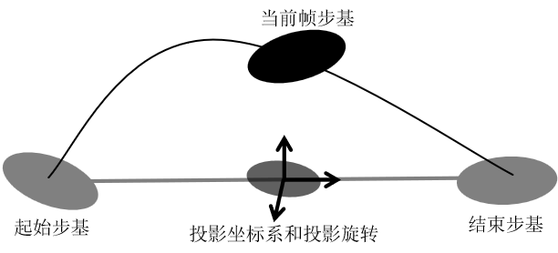

# 骨骼动画技术美术

## 第一章	综述

### 1.1 背景知识

#### 1.1.1 图形学背景知识

##### 渲染流水线概述

渲染流水线描述的是在GPU中由三维空间的几何信息生成屏幕二维空间的像素信息的过程。

渲染流水线分为应用阶段(渲染控制)、几何阶段、光栅化阶段和像素阶段，在某些书籍中将光栅化阶段和像素阶段合称为光栅化阶段。渲染流水线的目的是最终将运算结果送到显示器的缓冲区中。几何阶段分为顶点着色器->曲面细分着色器->几何着色器->裁剪->屏幕映射五个步骤。目前，英伟达推出了网格着色器的概念，这个着色器将替代传统渲染流水线中的顶点、曲面细分和几何着色器。光栅化阶段分为三角形设置->三角形遍历->片元着色器->逐片元操作四个步骤，其中三角形设置和三角形遍历阶段可以合称为光栅化阶段。

我们重点关注应用阶段和顶点着色器，简单介绍片元着色器，因为只有这几个阶段与骨骼动画技术有直接关系。

在应用阶段中，构成物体的网格顶点，以及物体在场景中的变换信息，如平移、旋转和缩放等信息被从CPU传输到GPU中。负责传输顶点数据的数据结构被称为顶点数组，它由顶点坐标数组、索引数组、属性数组和属性指针等成分组成，这些数据的数量级是顶点级，也就是对于每个顶点都在顶点数组中有一份单独的数据。负责传输变换信息的数据结构被称为常量数组，这些变换信息是以矩阵的格式被存储在常量数组中，并在流水线中的剩余环节中被访问的，常量数组中的数据通常是由整个网格共享的。包括顶点数组和常量数组，以及一些GPU渲染控制数据和着色器文件在内的这些由CPU送往GPU的数据包，被称为一个批(Batch)。

在几何阶段中，GPU访问顶点数组中的索引数组和顶点坐标等信息，以及常量数组中的变化矩阵等信息，经过一系列的空间变化，以将顶点的坐标变化到标准设备坐标空间^[1]^。为了将输入的顶点数据由模型坐标空间转移到齐次裁剪空间，顶点着色器应该经过模型空间变换(从模型坐标转移到世界坐标)**→**观察空间变换(从世界坐标转移到摄像机坐标)**→**投影空间变换(从摄像机坐标转移到齐次裁剪空间坐标)。这三个步骤使用的矩阵分别被称为Model矩阵，View矩阵和Projection矩阵。它们的复合矩阵，也就是从模型坐标直接转移到齐次裁剪空间坐标的矩阵，被称为MVP矩阵。在这个过程中，三维模型的坐标最终变化为了我们看到的二维屏幕上的坐标，为之后流水线中在屏幕上填充片元和像素提供了几何依据。在几何阶段中，也可能会产生顶点的增加和删除。

在光栅化阶段中，GPU获得了三角形网格每条边的顶点信息，光栅化引擎通过读取索引数组理清顶点和顶点间的关系，并组织成三角形边界数据。GPU会对这些三角形边界数据编号，并利用它们计算所覆盖的片元。然后三角形网格会被进行扫描变换，在这个阶段中计算哪些像素被哪些三角形覆盖，并在被三角形覆盖的区域生成片元，在生成片元的过程中，还会对一些顶点属性进行插值，比如已知三角形三个顶点的法线数据，在光栅化阶段中会通过线性插值填充对应位置的片元的法线数据。在这个阶段同时还会进行裁剪、背面剔除、抗锯齿和早期深度测试等操作。

在像素阶段中，片元着色器会根据片元中的数据，比如前面提到的线性插值后的法线数据，计算像素的颜色。在这之后，还会经过模板测试、深度测试和深度混合等，才在屏幕上显示出颜色。

##### 顶点数组概述

这里以OpenGL的格式为例简单的介绍顶点数组的结构^[2]^。

顶点数组的核心是顶点缓冲区VBO，它是在显卡中开辟出的一块内存缓冲区，用于储存顶点的各类属性信息，如顶点坐标，顶点法向量，顶点颜色数据等。顶点缓冲区可以被理解为一个没有指定数据类型的超级数组，和顶点有关的所有数据都密集的排列在VBO中：


顶点数组允许我们指定任何形式的顶点数据作为输入，这使得图形学编程具有更强的灵活性，但也意味着我们必须使用一个额外的数据结构来定义输入数据的哪一个部分对应着哪个顶点的哪种顶点属性。这个数据结构是顶点属性指针VAP，VAP会告知硬件在尝试获得某个属性时的寻址方式。这个数据结构是通过图形学API在GPU中定义的，所以没有常规语言的类型定义，这里使用伪代码尝试解释其结构：

~~~
public class VertexAttributePointer<T>
{
	public string attributeName;	//属性的名词，如
	public int baseAddr;			//VAP的起始字节数
	//每次取完数据后，需要跳过的字节数，用来跳过无关的属性，比如在两种属性交替存放时跳过另一种属性，若属性紧密排列，则stepSize == sizeof(T)
	public int stepSize;		
	
									//取第i个顶点的属性时，从baseAddr+i*stepSize的位置开始，取和T相等的字节数
	public T this[int index] => VBO[baseAddr + i*stepSize, baseAddr + i*stepSize + sizeof(T)] as T;
}
~~~

例如，在顶点缓冲区中存在顶点坐标和顶点法线两种属性，那么我们就需要定义两个VAP，分别用于读取坐标和法线。由于顶点缓冲区中排列数据的方式是多样的，所以我们需要根据顶点缓冲区的排列规则来定制VAP：


在上图中展示了两种不同的属性排列规则下，定义的不同VAP。

顶点数组则是顶点缓冲区和顶点属性指针的结合体，在OpenGL中使用顶点数组对象VAO来进行封装，其结构大致如下图所示：


与顶点数组一起使用的还有索引数组EBO。这是一种用于复用顶点数据的结构，由于我们需要明确顶点和顶点之间的关系，具体来说就是需要明确哪三个顶点共用一个三角形，在定义相邻三角形时我们自然会重复定义两个三角形共用的顶点。但我们不希望将各种顶点属性都重复定义一次，因为顶点属性很多时候都是比较长的浮点数向量，所以我们使用一个索引数组来实现属性的复用，当遇到属性的值相同时，只需要使用同一个整数索引。

在引入索引数组后，需要对VAP的结构进行调整，VAP现在可以指向EBO，然后由EBO中的索引值来指向VBO中的值：


##### GPU硬件架构概述

GPU主要由显存、GPU和接口、电源等组成。

从显存的角度，可以将显卡分为集成显卡和独立显卡。其中，集成显卡指的是显卡使用CPU的一部分内存作为显存，GPU和CPU用不同的虚拟地址对CPU中的同一个物理地址寻址。使用集成显卡时，CPU和GPU共享总线。在渲染时，CPU将顶点等数据存入主存，然后GPU可以通过UMA来进行数据传输。所以相比独立显卡，在使用集成显卡时CPU可以更快速的访问显存。对独立显卡来说，GPU可以使用专门的显存条，并使用显存条的物理地址进行寻址，这是最常见的显卡类型。在独立显卡结构中，GPU可以直接从显存中读写信息。而CPU访问显存条中的储存空间时，需要映射一部分GPU储存空间到CPU地址空间，典型大小为256MB或512MB。

GPU是显卡上最重要的核心处理芯片。虽然GPU和CPU一样是主力计算元件，但CPU重在实时响应，对单任务速度要求高，需要针对延迟优化，所以晶体管数量和能耗都需要用在分支预测、乱序执行、低延迟缓存等控制部分；GPU主要使用于具有极高可预测性和大量相似运算的批处理，以及高延迟、高吞吐的架构运算，对缓存的要求相对很低，顺序运算效率很高，同时相对的乱序处理效率很低。

CPU除了负责浮点和整型运算，还有很多其它的指令集的负载，如多媒体解码和硬件解码，CPU注重单线程性能，保证指令流不中断，需要消耗更多晶体管和能耗用在控制部分，于是CPU分配在浮点运算的功耗会减少；GPU基本只进行浮点运算，设计结构简单，效率更高，GPU注重吞吐率，单指令能驱动更多的计算，相比较GPU消耗在控制的能耗就少得多，因此可以将资源留给浮点运算使用。GPU的浮点运算能力比CPU高10~12倍。

GPU的最小计算单元被称为流处理器(SP)，有时也被称为核心(Core)。在GPU诞生初期，其运算单元被分为顶点处理单元和像素处理单元，顾名思义，早期GPU的结构中使用了两个不同的硬件单元来分别处理顶点着色器和像素着色器，这种分离渲染架构存在严重的资源分配不均的问题，两种单元渲染任务量不同，效率低下。从DirectX10开始，两种处理单元被统一为了流处理器，在这两个阶段中的运算都是在流处理器中进行的，这种将顶点处理单元和像素处理单元合并的概念又被称作统一着色器架构。

因为渲染过程中以三维空间运算为主，而三维空间运算又基本都是浮点数运算，所以流处理器早期仅支持浮点数运算，但现在由于GPU开始进入人工智能领域发挥作用，最新的GPU也开始使用支持浮点数运算的SP。

根据显卡厂商的不同，SP的大小也不同。英伟达生产的显卡使用的SP通常是对1D数据(也就是浮点数或整数)进行计算的，而AMD的显卡中的SP通常是一些向量计算单元，通常可以一次对一个4D或4D+1D数据进行计算。A卡的理论计算能力远超N卡，但实际执行效率并不高，一旦进入GPU的图形信息是1D或3D形式这一的非标准数据形式，A卡的执行效率最低可降至25%至20%。N卡在软件上具有明显优势，包括微软在内的软件商都为N卡开发优化，使得大量工具软件和游戏在N卡环境下有更好的表现。

将大约16个、32个或64个SP分为一组，它们并行的执行一次任务，被称为执行一个GPU线程束。线程束是被一个称为流多重处理器(SM)的硬件结构进行管理的，如下图所示：


目前的SM采用单指令多线程(SIMT)架构，也就是说，在同一个SM中的一组SP会共用一个指令。SM中存在一个很大的寄存器空间，在RTX 3080中这个寄存器的空间为16384×32-bit。在分配指令时，这个寄存器会被均分给每个SP，每个SP会获得一块连续的寄存器空间，就好像每个SP拥有一个自己的寄存器那样。

在GPU执行并行任务时，每个最小的并行计算任务被称为一个线程。如在进行蒙皮解算时，这个最小的计算单元就是对一个顶点的解算，而在渲染时最小计算单元则是对一个片元的光照计算。整个并行任务，如解算整个网格上所有的顶点，被分配给一个或多个SM进行计算，SM接受的这些线程被称为线程组。

在SM接受一个线程组后，由束管理器来将线程组分配成若干线程束，如一个100个线程的浮点数运算线程组会被分为4个线程束，前三个线程束有32个线程，而最后一个只有4个线程。一个SM中可能包括若干个线程束，如在上图的架构中，这个SM就可以一次执行4个线程束。在运行时，指令分派单元会同时向所有SP发送同一个指令，而SP则同时进行运算。其中，当遇到寻址或取址指令时，指令分派单元要向不同SP发送不同的地址。如果单个线程需要的寄存器空间过大，可能使每束的最多线程数减少，影响并行性。

在一个线程束中，如果线程中不存在动态分支语句，那么它们的所有行为都是可预测相同的。但一旦存在动态分支语句，因为SIMT架构中所有SP必须执行同一指令的特性，但凡有一个线程执行另一个分支，那么整个线程束就不得不被执行两遍，将两个分支的结果都运行一次，并让每个线程扔掉它们各自不需要的结果。如果在GPU编程中出现嵌套的分支语句或复杂的循环语句，每个线程束的执行次数可能呈指数级递增，这个效应被称为线程分歧。可见，使用循环语句运行多次来读取某常量数组中的信息并不会导致线程分歧，线程分歧的严重与否关键在于相邻的元素通过动态分支语句能否得到基本相似的分支。最近的一些GPU厂商已经开始着手实现在SP中执行动态分支语句的功能，但由于旧的硬件设备还没有彻底离开市场，所以无限制的使用动态分支语句还存在较高的风险。

同一束中不同线程间可以通过本地缓存共享通道LDS(Local Data Share)进行通信，这也给了GPU对同一组值进行并行读写操作的可能性。在LDS上的通信根据显卡厂商和其使用的架构不同，可能是有锁的或无锁的。

在执行每束的计算过程中，还具有一些辅助计算单元，比如Nvidia架构中专门用于矩阵运算的TENSOR Core，以及用于进行三角函数和指对数运算的特殊运算单元SFU。

除此之外，SM还具有供整个线程组使用的L1缓存和纹理缓存。GPU通常采用大带宽的缓存策略，也就是一次缓存更多的数据，这使得SP缓存命中的概率大大增加，但同时任何一次缓存丢失都需要更高的代价。以纹理采样为例，由于纹理数据储存在显存中，在每次遇到采样语句时，为了将显存中的数据块调入纹理缓存(与纹理在GPU中的压缩方式有关，因为与本书关联不大，所以在此不详解)，可能需要使处理器阻塞几百上千个时钟周期。为了缓解这样的问题，GPU使用换入换出操作来隐藏延迟。每当有一批片元在等待采样纹理数据时，可以将此时SP组的上下文备份保存在寄存器中，然后导入下一批片元进行处理，这个操作被称为换出。换出使得核心不需要空等采样结果，可以继续执行更多的片元。当显存中的数据被拷贝到纹理缓冲时，SM可以将SP上下文从寄存中拷贝回SP中，继续进行这个片元采样之后的运算，直到它再次被换出，这个操作被称为换入。计算本身占用的寄存器越多，换入换出能进行的最大次数也就越少，如果寄存器已经达到储存上线后再遇到采样丢失，就只能让线程空转来等待采样结果。

在Nvidia的Ampere架构中，由两个SM组成的纹理处理簇TPC是最小的任务分配单位，而每六个TPC组成的图形处理簇GPC是一次渲染中的最小任务分配单位。RTX 3080芯片中则由六个这样的GPC组成。如下图所示：


在GPC中存在光栅化引擎，其作用是在顶点阶段结束像素阶段开始前对所有顶点属性，包括坐标和其他顶点属性，进行扫描变换和属性插值。在顶点阶段结束后，需要插值的顶点属性会按照指定格式储存到L1缓存中，然后经过光栅化引擎生成片元后，重新送回L1缓存中。

TPC中存在多边形引擎，其作用是实现顶点裁剪、曲面细分和属性装配等，在外界传入的顶点属性或片元属性会经过多边形引擎装配到指定的寄存器或缓存中。


#### 1.1.2 计算机动画背景知识

##### 人类视觉的运动感知原理

从十九世纪开始人们就发现了学名为“独立静态正后像”这一现象，该现象后来被广泛地称为"视觉残留"，即在显示对象消失后人眼仍然能在短时间内保持对这一视觉元素的映像，使人能关联起时域上串行接收的图像信号^[3][4]^。这种现象一直以来用于指导电影、动画、游戏行业的发展，尤其是在刷新率和刷新方式上的创新。

如果图片刷新间隔长于人眼视觉暂留时间，或者称图片刷新率低于人眼视觉刷新率，人眼就难以生成连续的视觉画面感，结果会呈现为闪烁状态，大脑会将影像解读为离散的静态图片序列。由于不同个体视觉暂留能力不同，单纯选取一个临界刷新率可能会导致部分人群无法接受视频信息，所以通常媒体的刷新率都需要远高于视觉刷新率。但这并不绝对，在特定的室内光照(包括亮度和闪烁频率等)和观察距离下，个体视觉的图像回放能力可以得到加强，这个理论有时被用于在专业电影院中播放电影时适当降低视频素材的刷新率，以降低成本^[5]^。

我们会使用刷新率(或称回放率)和采样率(或称更新率)来描述一个由图片序列组成的运动片段的规格。其中，刷新率代表的是每秒显示图像的数量，而采样率代表的是每秒显示的不同的图像的数量。刷新率高的视频能避免闪烁现象，而采样率的高低则定义了片段呈现的运动质量。通常来说，决定刷新率的是多媒体播放器软硬件，如显示器；而决定采样率的是录制器软硬件，比如摄像机和游戏程序。

通常来说，24Hz是一般群众可以接受的最低刷新率，观察低于这个刷新率的视频时大部分人就可以感受到闪烁。目前的显示设备通常都能支持60Hz或120Hz的刷新率。在电影录制时，经常会使用采样率仅为24FPS的多媒体源文件，但会使用48Hz或96Hz的刷新率来避免闪烁。采样率并不总是低于刷新率，比如在使用隔行扫描技术时，即使刷新率仅为30FPS，也需要采用60FPS的采样率来保证平滑的运动效果。一般来说，使用逐行扫描时的刷新率要求总是比使用隔行扫描时更高。

视觉残留现象能让人眼识别不同画面之间的关联，但这种关联体现在时域上或空域上却需要另一种生理机制。举例为，一个光源在快速旋转时，由于视觉残留现象，人眼会将其识别成一个光环，但并不会认为该光环正在运动^[6]^。

##### 经典帧动画原理

使用计算机辅助或者完全主导动画创作是当下动画创作技术的主流，其中，关键帧技术和帧间插值计算成为计算机动画领域的基本技术。包括骨骼动画在内，使用关键帧技术或思想的动画技术统称帧动画，帧动画又可以按存储方式分为序列帧动画和关键帧动画。

帧动画的思想可以追溯到早期动画时期。早期较著名的动画装置如西洋镜(Thaumatrope)便是序列帧动画的代表之一，通过在圆柱体内壁上绘制一系列图案，观察者可以在旋转圆柱体时观察到运动的画面。与此类似的还有手翻书，书中每一页都绘制了一个静态的图像，而观察者可以在快速翻阅纸张时感受到运动画面。手绘动画也是一种帧动画，早期手绘动画就是通过手绘每一帧静态图像，然后通过对图像拍照的方式记录图片，最后播出。除了早期手绘动画外，同一时间也涌现出了各种类型的定格动画。所谓定格动画就是将粘土、折纸或其它材料制成的模型摆成需要的姿态，然后通过拍照记录下来，最后连贯的将照片连续的播放形成的动画。

包括手绘动画在内的经典动画的共同特点是，每一帧的静态图案都是固定而不可复用的，换句话说就是在每一帧，画面场景中的所有物体都必须被重新绘制一次，无论它们有没有发生形态上的实质改变。这种动画被分类为非矢量动画，相对应的，便出现了矢量动画。矢量动画的代表之一是皮影戏，通过操纵皮影人物，将场景和人物等每个部件进行了分离，这样在人物移动时不再需要重复的绘制相同的背景。迪士尼发明的多平面相机录制法是矢量动画的又一突破，它们将场景按照远近分成了若干个动画平面分别绘制，而每个平面(包括相机)又可以按照需求沿任意方向运动，这样便实现了在早期技术不成熟的情况下对三维场景的模拟。这种将人物、物体、场景分离分层，分别运动然后统一拍摄的思路，也指导了后来计算机动画领域的发展。目前计算机动画领域将单个可运动图层称为精灵(Sprite)，正是迪斯尼多平面相机录制法的历史传承。

计算机动画是一种经典的矢量动画，随着Alpha通道的发明^[7]^，通过计算机辅助组织场景和角色，艺术家可以节省大量的重复工作时间。早期的二维计算机动画属于序列帧和关键帧混合的动画，其中，大部分人物和场景元素的动作都需要使用序列帧。在早期的电子游戏中，很多人物都使用16幅或32幅的动画表记录动画，出于节省空间的考虑，每个动作(如走、跑、跳等)仅能容纳1~3帧的序列帧信息。在运行时，计算机会负责将动画表中指定位置的图案拷贝到场景中。在次世代的二维电子游戏开发中，帧动画仍然承担着大量的作用，随着硬件的进步，目前的一段帧动画已经可以容许包含超过20帧的图片序列。而对于人物在场景中的移动、旋转、缩放，则体现出了关键帧动画的特点。由于人物的移动通常呈直线或曲线，所以不必记录人物每一帧的位置，而只需要记录沿曲线运动的开始时刻和结束时刻，然后在这段时间内让物体沿指定轨迹运动即可。

在主流三维动画领域，传统的序列帧动画依然有一席之地，其主要应用场景是特效和粒子动画。如很多火焰效果就是在粒子上播放序列帧动画实现的。而很多场景的运动，如门的开关等，也是通过三维矢量关键帧动画实现的。

##### 顶点动画原理

骨骼动画本质上是一种顶点动画。顶点动画除骨骼动画外的常见应用包括流体动画和粒子动画。

所谓顶点动画，是区别于刚体动画的一种三维动画类型。顶点动画的含义是在渲染过程中，在渲染流水线中的网格顶点产生了直接变化的动画，其特点是对于一个多边形网格，其顶点间的相对位置随时间发生改变，表现为多边形的形状发生了改变。相对的，刚体动画是一种在渲染过程中，输入渲染流水线的网格顶点不产生变化，转而是相关变换矩阵产生变化的动画，其特点是对于一个多边形网格，其顶点的相对位置是不变的，表现为多边形的位置和旋转发生了改变。

根据实现顶点动画的方式，通常将顶点动画分为CPU顶点动画和GPU顶点动画；对于骨骼动画来说，使用CPU顶点动画还是GPU顶点动画也将引出CPU蒙皮和GPU蒙皮两种策略。CPU顶点动画，顾名思义，顶点的位置是在应用阶段发生变化的，从数据流的角度上看，是CPU输入GPU的顶点数组随着时间变化。而对于GPU顶点动画，其顶点的位置则是在渲染流水线的几何阶段发生变化的，从数据流的角度上看，其顶点数组不变，但是顶点着色器的输出随时间变化。以粒子动画为例，CPU粒子动画的特点是在CPU中计算粒子的网格顶点，并生成顶点数组；而在GPU粒子动画中，CPU会将粒子的初速度和受力情况等信息传入顶点数组或常量数组，然后由GPU在运行时计算粒子的位置，并修改粒子系统的网格。

顶点动画的另一个常见应用是变形动画，也被称为Blend Shape或Morph动画，这是一种帧动画和顶点动画思路的融合。在制作形状变形动画时，需要提供几个关键帧的网格信息，然后在运行时通过顶点的线性差值来改变顶点的位置。以制作面部混合动画为例，假如提供了欢快的面部网格和愤怒的面部表格，就可以通过对应顶点的混合来实现由欢快转换到愤怒的变化过程。当然，在实际工程中，不可能在每个关键帧都保存完整的网格信息，这会产生很多的冗余，我们可以使用“动作基”来对数据集进行压缩，即只储存动画中涉及到的顶点，对于没有变化或变化极小的顶点坐标不进行储存，以使其能默认使用初始状态下的位置。

变形动画和骨骼动画是不同的，如果使用变形动画的思路来实现骨骼动画，就难以保证角色肢体的刚性，比如使用变形动画时就难以避免手臂和腿的外形弯曲。

##### 骨骼动画原理

骨骼动画本质上是一种压缩算法，是对网格顶点动画的一种压缩。这是由角色动画的特点决定的：

第一，骨骼动画必然会导致顶点位置的变化，这种变化不能在成本允许的前提下由光栅化阶段和片元阶段的渲染策略实现。

第二，骨骼动画所控制的模型不会整个一起运动，而是其身体的各个组成部分分别进行变换，这使得角色动画中不能在整个角色的层次上实施刚体动画。

第三，身体的各个组成部分是互相紧密连接的，在旋转和移动时不能出现断裂，其互相之间的连接处，如膝盖、手肘等位置的顶点需要进行一个平滑的排布，否则就会显得生硬，这使得骨骼动画很难将身体的组成部分拆成若干个不同的网格分别进行刚体动画。

综上所述，顶点动画是骨骼动画的唯一选择。

但是，骨骼动画和流体动画这类其它顶点动画的区别在于，在流体动画中，单凭流体表面的顶点本身、以及其相邻的顶点的几何信息，结合时间和相关函数，就能低成本的计算出其运动轨迹。而对骨骼动画来说，顶点的运动是由更高层的抽象：骨骼节点控制的，在同一根骨骼上的顶点彼此之间需要像刚体那样保持相对位置，在若干骨骼之间的顶点需要主动进行平滑，而顶点的大题形状又必须严格的接受骨骼制约。所以相比其它定点动画，在实现骨骼动画时，还必须而外维护每个骨骼的数据，并将顶点与骨骼联系到一起。

在目前主流的实现方案中，骨骼本身被视为近似刚体，它们的变换矩阵被以一定的顺序安排在了常量数组中，每个骨骼都包含一个特有的编号，用来查找其对应的变换矩阵。接下来，每个顶点需要知道与它相关的骨骼的编号，以保证它能够跟随骨骼运动。因为顶点数量原超过骨骼数量，所以顶点与骨骼的对应关系只能被存在顶点数组中。在实际应用时，为了使关节交接处的顶点变化更平滑，通常使用权重组代替单一的索引。这种让顶点使用权重数组来引用变换矩阵，并通过插值实现顶点运动的动画技术被称为矩阵调色板蒙皮技术(Matrix Palette Skinning)。通常来说，影响同一顶点的关节数不会超过4个，这可以有效防止顶点数组的长度变得过于夸张。

其中，这些被共用的变换矩阵就被形象化的称为"骨骼"，根据为每个顶点设置针对不同变换矩阵的权值的过程，则被形象化的称为“蒙皮”。

具体来说，顶点数组中对每个顶点储存了一个四维向量，用于记录与这个顶点关联的四个骨骼的编号。同时，顶点数组中另外存储了一个四维向量，用于记录这个顶点关联的四个骨骼分别对该顶点的权重。在计算顶点位置时，会综合这四个骨骼的变换，结合权重进行插值，以此尽可能地保持骨骼交界处的顶点位置是平滑的。这个权重向量的四个分量之和应当为1，这样才能保证顶点的位置不会相对于骨骼超前或滞后。

在关键帧骨骼动画中，每一个关键帧被称为一个“姿势”，CPU通过在姿势之间插值来获得每一帧骨骼的位置和它们的组合变换矩阵，然后将它们输入到常量数组中；而GPU则在几何阶段实时的计算网格上所有顶点的位置，使其大体上围绕骨骼进行运动，最终呈现出角色在运动的效果。

#### 1.1.3 艺用解剖学背景知识

##### 关节分类概述

骨骼由软骨和硬骨组成。硬骨包裹在一系列内脏之外为柔软的组织提供保护，同时在肌肉和韧带的作用下为身体提供支撑，还可以在肌肉的牵引下发挥杠杆作用进行运动。关节位于骨与骨的连接处，人体具有大量的关节，关节面上覆盖有一层起润滑作用的软骨。韧带是纤维状的无弹性条带状组织，用于连接骨骼与骨骼，同时肌腱则连接了骨骼与肌肉。

关节允许骨骼运动的范围在动画领域中被称为自由度(DOF)，可以绕单个轴旋转的被称为单自由度、可以绕两个轴旋转的被称为双自由度，可以在所有轴向上允许旋转的被称为三自由度或全自由度。同理，如果关节允许骨骼间发生相对位移，那么还可以将它称为四个、五个或六个自由度。具体到对三个旋转自由度的命名上，我们将关节绕骨骼的长轴旋转的运动称为旋转、将关节绕关节轴旋转且骨骼间角度变大的运动称为伸展、反之称为屈曲、绕与关节轴和骨骼长轴垂直的轴且向身体前外侧旋转的运动称为外展、反之称为内收。

人体的关节可以被分为三类：纤维关节、软骨关节和滑膜关节。在动画领域中，我们主要关注的是被称为滑膜关节的关节，如肩关节、膝关节等，这些关节相比纤维状关节和软骨质关节具有更高的可移动性，也是表现人物姿态时最重要的关节类型。

我们可以将滑膜关节大体分为八种类型：

+ 滑车关节：滑车关节又称曲戍关节，这种关节一个骨的关节盂包裹着另一个骨的圆柱形关节头组成，仅存在一个自由度，也就是仅允许骨骼进行屈曲和伸展。最典型的曲戍关节是连接肱骨和尺骨的肘关节以及连接股骨和胫骨的膝关节。
+ 蜗状关节：蜗状关节是滑车关节的变形，它也仅有一个自由度，但它的运动轴与骨的长轴不成直角，如踝关节。通常我们也可以将蜗状关节归入滑车关节一类。
+ 车轴关节：车轴关节也仅存在一个自由度，它由一个圆柱形的骨骼头和包裹它的环形韧带组成，在韧带的限制下被包裹的骨骼仅能绕其半径旋转。寰枢关节是最典型的车轴关节，桡骨和尺骨之间也存在两个典型的车轴关节，桡骨根部的关节头被韧带绑定在尺骨根部的凹槽状关节盂上，在旋转小臂时，桡骨根部绕着尺骨旋转；对应的，尺骨末端的关节被韧带绑定在桡骨末端的关节盂上。
+ 球窝关节：球窝关节由一个球形的关节头和一个与其对应的球壳形关节盂组成，存在三个自由度，即能同时允许骨骼进行伸展、屈曲、外展、内收和旋转，人体的球窝关节中最典型的是肩关节。由于球窝关节的关节盂相对较浅，肩关节也是人体最容易脱臼的关节之一，但同时，球窝关节也是人体自由度最高的关节之一。
+ 杵臼关节：杵臼关节和球窝关节类似，由球形关节头和一个球壳形关节盂组成，也能同时允许骨骼进行伸展、屈曲、外展、内收和旋转。但相比球窝关节，杵臼关节的球形关节头具有一个较细长的骨柄，这使得杵臼关节具有比球窝关节更深的关节盂，同时也一定程度上限制了球窝关节的自由度。人体最典型的杵臼关节是髋关节。通常我们也可以将杵臼关节归入球窝关节一类。
+ 椭球关节：椭球关节又称踝状关节。椭球关节与球窝关节类似，但由于它由椭圆形的骨盖和骨窝组成，使其仅存在两个自由度，即允许骨骼进行伸展、屈曲、外展、内收，但不允许旋转。典型的椭球关节是桡腕关节，俗称腕关节。
+ 鞍状关节：鞍状关节由一对互相嵌合的马鞍状骨头组成，鞍状关节的自由度与椭球关节，但在伸展、屈曲、外展、内收外，还允许进行非常有限的旋转。典型的鞍状关节是拇指掌腕关节。
+ 平面关节：平面关节是由韧带包裹的一对表面平滑的关节面，它允许关节之间的相对滑动和旋转，而不允许故那就的伸展、屈曲、外展和内收。典型的平面关节有附骨之间的关节、指骨之间的关节以及肩锁关节。

##### 骨骼关节系统概述

人的骨骼可以主要被分为三个部分：头、躯干、四肢。

躯干可以被分为胸腔、骨盆和脊柱。其中，人的躯干以脊柱为中心，脊柱由24块可活动的椎骨和9块固定的假柱组成，是骨盆、胸腔和头骨的连接。其中，椎骨由7块颈椎，12块胸椎和5块腰椎组成，假柱由5块融合为骶骨的骶椎和4块半融合为尾骨的尾椎组成，每个椎骨都在人体背侧方向上存在一个棘突，不同的椎骨就是通过棘突的形态不同进行分类的。

椎骨间由软骨关节连接，允许椎骨带动骨盆、胸腔和头运动。由于人体通常处于直立状态，脊柱形成了4段生理弧度。其中，颈椎和腰椎形成了两个前凸的弧度，胸椎形成了一个后凸的弧度，而骶骨和尾骨形成了最后一个后凸的弧度，骶骨和尾骨合成的弧度也被称为骨盆曲线。这其中，颈部的生理曲线是最平直的，而骨盆则最屈曲。脊柱的不同段具有不同的自由度：腰椎主要提供向前后左右弯曲的自由度，却几乎不能旋转，其中向前后弯曲的角度高于向左右弯曲的角度，这是因为第四、五腰椎被韧带连接在尾椎上；胸椎则主要提供旋转的自由度，而并不能进行大幅度的弯曲；颈椎的自由度最多，它支持前屈、后屈、左右弯曲和旋转，但以左右弯曲为主；第一节和第二节颈椎分别被称为寰椎和枢椎，枢椎有一个垂直的圆柱结构插入寰椎形成的车轴关节，摇头时头部发生的旋转主要依靠的就是寰椎绕枢椎的运动，而点头时头部的前屈和后弯主要依靠的则是寰椎和头骨间的关节，这表明头可以在颈部不运动的状态下实现前屈、后屈和左右旋转，但头必须在颈部的带动下实现左右弯曲。

人的头部主要由颅骨、舌骨和下颌骨组成。颅骨具体由许多块骨、主要是脑颅骨和面颅骨组成，但颅骨上大部分骨骼间是由骨缝牢固的连接的，这种连接结构不存在任何自由度，所以在动画领域中可以将它们忽略。下颌骨和颅骨由一个车轴-滑车复合关节连接，它是人体最复杂的关节之一，表现出极高的自由度，能控制下颌的张开、闭合、左右磨合、前后磨合、以及它们的复合运动。在正常放松时，下颌骨的位置并不使上下牙齿贴合。在下颌骨闭合时，后牙的咀嚼面恰好上下贴合，而嘴前侧的上排牙齿会稍微盖过下排牙齿。舌骨是一个悬浮骨，位于人喉结上方约一指处，在人体吞咽运动时能够看到舌骨的运动，由于舌骨在动画领域中重要性不强，此处不做介绍。

人的骨盆由一对髋骨围绕在骶骨和尾骨两侧组成。髋骨由髂骨、耻骨、坐骨融合而成，它们在出生时是相互分离的，在青春期时则融合成一个，这三个骨骼的融合点在髋臼中央，髋臼是一个很深的球形关节盂，它和股骨组成了一个自由度极高的杵臼关节，这使得骨盆在运动时会带动双腿大腿根部进行运动。整个骨盆通常不会发生相对运动，在动画领域中我们将骨盆抽象为一个刚体进行控制。

人的胸腔由12对肋骨、肋软骨、胸骨和胸椎组成，上端较窄，下端较宽。胸腔的前平面以胸骨为中心，胸骨是一个匕首形的骨骼，其上端较粗的部分被称为胸骨柄，与锁骨相关节；胸骨中段被称为胸骨体，是胸骨主要与肋软骨相连的部分；胸骨下段较细的部分被称为剑突。胸腔的后平面以胸椎为中心，肋骨由胸椎两侧伸展向前，在身体前侧通过肋软骨与胸骨相连。整个胸部几乎不存在相对运动，在动画领域中可以将胸部抽象为仅受胸骨控制的刚体。

肩是连接前肢和胸腔的结构，主要由锁骨、肩胛骨和喙状骨组成。锁骨俗称琵琶骨，形状长而弯曲，外侧连接肩胛骨，内侧连接胸骨柄，它与胸骨柄组成的胸锁关节是前肢与躯干间唯一的骨性连接，也是肩膀的起点，这使得锁骨在运动时会带动双臂大臂根部进行运动。与骨盆不同，两根锁骨并没有相连，所以我们可以在不影响另一肩膀的情况下驱动单肩的运动，而却不能单独驱动一侧跨。肩胛骨是主要位于身体背侧的一对三角形骨，在侧面与锁骨通过肩锁关节相连，肩胛骨外上方存在一个梨形浅窝与肱骨头相关节，在动画中我们经常将肩胛骨和锁骨抽象成一根骨骼，用于驱动肩膀的运动。

人的双臂从根端到末端主要分为肱骨、桡骨、尺骨和手骨。人的大臂由肱骨组成，它向上通过半球形的肱骨头与肩胛骨相关节、向下通过线轴形的肱骨滑车与桡骨和尺骨相关节，肱骨比桡骨和尺骨略长。人的小臂由桡骨和尺骨组成，其中末端靠近拇指一侧的是桡骨、末端靠近小指一侧的是尺骨，在小臂根部桡骨围绕尺骨旋转，在小臂末端尺骨绕桡骨旋转。尺骨与肱骨通过滑车关节连接，尺骨的运动仅限于肘部的屈伸；桡骨在小臂末端存在一个三角形凹面，构成腕关节的窝臼。手骨主要由腕骨、掌骨、指骨组成，其中，指骨长于掌骨，而掌骨长于腕骨。

人的双腿从根端到末端主要分为股骨、髌骨、胫骨、腓骨和足骨。人的大腿由股骨组成，股骨是人体最长的骨，它上方通过股骨头与骨盆相关节，下方通过。足骨主要由跟骨、距骨、跖骨、趾骨和一些其他小骨组成，与手骨的对应部分恰好相反，趾骨的长度是足骨中最短的，其次是与掌骨对应的跖骨，最长的是与腕骨对应的根骨和距骨。

##### 骨骼肌肉系统概述

人体的肌肉分为许多种，但在讨论骨肌系统时，我们主要指的是骨骼肌，又称横纹肌。骨骼肌可以通过自身的收缩牵引骨骼，进而牵引身体的运动。骨骼肌的中部名为肌腹，由细长的肌细胞，又称肌纤维组成。这些纤维有些会直接附着在骨或软骨上，而另一些则通过肌腱或腱膜与骨骼间接相连。有一些肌肉也会直接附着于另一些肌肉表面，或者附着在肌群形成的片状肌间隔上。面部肌肉比较特殊，它们会嵌入皮肤，或者与其他面肌纤维融合在一起。

根据纤维的分部情况，我们可以将肌肉分类为几种发力模式不同的类型，包括平行肌、梭形肌、半羽肌、多羽肌、辐射状肌和三角肌。

##### 人体比例概述

正常成年人的身长比例为7.5至8个头长，双手张开的长度大约是全身的长度。小臂约是1.1个头长，大臂约1.5个头长，双肩宽度约两个头长。在绘画领域常提到这样的口诀：“站七坐五盘三半”，意思是站立时身高大约是7个头长、正坐时高度大约是5个头长、蹲下时高度大约是3个头长。

根据对人体的研究论文^[8][9]^，我们可以获取质量在人体上的几种基本分布模型：

+ 按百分比的质量分布：

.png)

+ 按典型数值统计的质量分布：

.png)

* 更适合刚体关节系统的细分质量分布：

.png)

### 1.2 动作技术概述

#### 1.2.1 离线动作开发概述

##### 动作设计

动作设计主要是由艺术人员针对动作应用的场景对动作进行设计的过程。这个过程直接决定了整个动作开发流程的方向和最终的动作演出效果。


##### 动作片段制作

这是离线动作的开发过程，这个步骤通常由艺术人员主导，但有时也需要硬件和软件技术人员的辅助。这个过程产出的动作片段会成为后续开发流程中的主干，用户绝大部分时间接触的都将是离线开发的动作片段。


#### 1.2.2 实时动作开发概述

##### 动作流数据组织

动作流数据组织主要是由技术人员开发的决策机实现的，这个系统将离线开发的动作片段按照指定的顺序、时间、相位进行播放，并按照某个规则对多个片段进行混合。这个过程主要体现的是角色对输入的实时响应，或角色对固定动画流程的演绎。


##### 运动学数据

运动学数据主要是由技术人员通过运动学约束控制器提供的，这个系统将超出离线动作片段的限制实时的生成动作。这个过程主要体现的是角色对虚拟场景的主动响应。


##### 物理学数据

物理学数据主要是由技术人员通过物理学约束提供的，这个系统将实时审视动画播放的物理属性，并对场景中的物理信息进行响应。这个过程主要体现的是角色对虚拟场景的被动响应。


### 参考文献

[1] Akenine-Moller T, Haines E, Hoffman N. Real-time rendering[M]. AK Peters/crc Press, 2019: 14-22.

[2] Joey D V. Hello Triangle[EB/OL]. URL: https://learnopengl.com/Getting-started/Hello-Triangle.

[3] Roget P M. V. Explanation of an Optical Deception in the Appearance of the Spokes of a Wheel Seen through Vertical Apertures[J]. Philosophical Transactions of the Royal Society of London, 1825 (115): 131-140.

[4] Burns P T. The complete history of the discovery of cinematography[J]. 2000.

[5] Conrac Corporation, Conrac Corporation. Conrac Division. Raster graphics handbook[M]. Van Nostrand Reinhold Company, 1985.

[6] Ehrenstein W H. Basics of seeing motion[J]. Arquivos brasileiros de oftalmologia, 2003, 66(5): 44-52.

[7] Smith A R. Alpha and the history of digital compositing[J]. URL: http://www.alvyray.com/Memos/7_alpha.pdf, zuletzt abgerufen am, 1995, 24: 2010.

[8] Clauser C E, McConville J T, Young J W. Weight, volume, and center of mass of segments of the human body[R]. Antioch Coll Yellow Springs OH, 1969.

[9] Dempster W T, Gaughran G R L. Properties of body segments based on size and weight[J]. American journal of anatomy, 1967, 120(1): 33-54.


## 第二章	动作定义

### 2.1 空域表达

#### 2.1.1 骨骼层次结构

##### 笛卡尔坐标系

三维软件中的坐标系是一个老生常谈的问题，其中我们最常使用的坐标系是三维笛卡尔坐标系，也叫作三维直角坐标系。

三维直角坐标系由三维空间中的一个原点和三个互相正交的基向量组成，通常我们用$O$来表示这个元点，用$X$、$Y$和$Z$来表示者三个基向量，一个三位直角坐标系也可以被写成坐标系$OXYZ$。

空间中任一点在一个坐标系中具有一个坐标。对于在坐标系$OXYZ$中的坐标$P(a,b,c)$，它所表示的位置相当于$O+aX+bY+cZ$。

空间中任意两点间的差在一个坐标系中可以表示为一个向量。对于在坐标系$OXYZ$中的向量$V(m,n,l)$，它所表示的方向相当于从原点指向坐标$(m,n,l)$的方向。

三维直角坐标系可以被分为左手坐标系或右手坐标系，一个坐标系属于左手坐标系还是右手坐标系可以称为坐标系的手性。沿着$Z$轴正方向看向坐标系，若$X$轴逆时针旋转90°后与$Y$轴重合，则坐标系属于左手坐标系；若$X$轴顺时针旋转90°后与$Y$轴重合，则坐标系属于右手坐标系。坐标系手性同时定义了旋转的方向。在左手坐标系中，绕某轴旋转的正方向由左手法则定义，即从该轴正方向向负方向看去的顺时针方向；而右手坐标系中，绕某轴旋转的正方向由右手法则定义，即从该轴正方向向负方向看去的拟时针方向。判断叉积结果方向时也会用到左手或右手定则。

在常用的三维软件中，Unity、UE、ZBrush和Cinema4D都是左手坐标系，而Maya、Houdini、Godot、3DsMAX、Blender和AutoCAD都是右手坐标系。

##### 世界空间和本地空间

世界空间坐标系是一个全局通用的坐标系，我们需要用到世界空间中的坐标和向量来定义其它坐标系的原点和基向量。

世界空间的基向量方向本身没有意义，但为了方便开发人员理解，主流的物理引擎通常会人为规定世界空间中的$-Y$向量或$-Z$向量作为重力的方向，这便形成了Y-up坐标系和Z-up坐标系。

在常用的三维软件中，Unity、ZBrush、Cinema4D、Maya、Houdini、Godot都是Y-up坐标系，而UE、3DsMAX、Blender和AutoCAD都是Z-up坐标系。

由于在骨骼动画中，我们通常不关心关节在世界坐标系中的状态，而更关心关节相对于另一个关节的位置，如肘关节相对于肩关节、腕关节相对于肘关节等。因此我们在定义物体位置时通常不希望使用世界坐标，而是希望使用物体相对于那个相邻物体的状态。

显然，我们可以以每个物体的中心定义为一个坐标系的原点，以物体的右方向为$X$轴、物体前方向为$Z$轴、物体上方向为$Y$轴构建坐标系(这里仅以Unity的坐标系类型为例)。这样，忽略物体所代表的其它信息，仅考虑其几何关系，我们将每个物体都抽象为了一个坐标系。这样，在考察B物体相对于A物体的几何关系时，我们可以计算B物体在A物体的抽象坐标系下的坐标。我们将物体抽象出的坐标系称为一个物体的本地坐标系。

在这种将物体抽象为坐标系的模式下，为了在A物体运动时能继续保持B物体和A物体的相对关系不变(比如在大臂运动时使其带动小臂)，我们将B物体的本地坐标系直接定义在A物体的本地坐标系之下。这样在A物体运动时，由于B物体的坐标系已经定义在了A物体之下，所以B物体相对于A物体的位置并不会改变。同时，定义在B物体的本地坐标系之下的其它物体也会随着B物体一起被A物体带动。在这种模式下，我们将A物体的本地坐标系称为B物体的局部空间坐标系，将A物体称为B物体的父物体，将B物体称为A物体的子物体，B物体在A物体的本地坐标系下的坐标被称为B物体的局部空间坐标。

以此类推，根据这种坐标系之间的嵌套关系，我们可以将场景中所有物体的关系定义为一棵坐标嵌套树，我们称之为空间树，这颗树的根节点是世界空间坐标系，那些不会被动跟随任何其他物体的运动而运动的物体(如骨盆骨骼)会以世界空间坐标系为父结点。

显然，顺着这个坐标系的嵌套关系向根节点搜索，每个物体都可以获取到自己的世界空间坐标，且每个物体在世界空间中的最终位置都会受到它所有的父结点和祖先结点的影响，这种影响同样也会顺着这棵树传递到它的所有子结点当中去。不止是位置，旋转和缩放等几何变换也会顺着坐标系树传递到所有子结点中去。

接下来我们定义一棵简单的双向树来储存这个空间中的所有物体的几何信息：

~~~C#
public class CoordinateTreeNode
{
    CoordinateTreeNode parent; 		//树的父结点
    CoordinateTreeNode[] childs;	//树的子结点
    
    Vector3 origin;		//物体本地坐标系定义在父坐标系下的原点
    Vector3 axisX;		//物体本地坐标系定义在父坐标系下的X轴
    Vector3 axisY;		//物体本地坐标系定义在父坐标系下的Y轴
    Vector3 axisZ;		//物体本地坐标系定义在父坐标系下的Z轴
}

public class WorldCoordinate
{
    CoordinateTreeNode[] childs;	//世界空间是空间树的根节点，它没有父结点，也不需要定义原点和基向量
}
~~~

由于物体本地坐标系的定义可以理解为一次在父坐标系下的几何变换，具体来说是将原点与基向量从与父坐标系重合的状态变换到指定的状态的几何变换，所以我们也可以将树的节点定义更新为：

~~~C#
public class CoordinateTreeNode
{
    CoordinateTreeNode parent;		    //树的父结点
    CoordinateTreeNode[] childs;	    //树的子结点
    
    TransformMatrix transform;		   //物体本地坐标系相对于父坐标系的几何变换矩阵，同时也是从本地坐标转换到局部坐标的空间变换矩阵
}

public class TransformMatrix
{
    public float[,] = new float[3,4];   //由于变换矩阵的最后一行一定是(0,0,0,1)，所以我们可以只储存三行数据
}
~~~

根据对空间变换矩阵的理解，我们注意到在变换矩阵中的这四列，事实上正是本地坐标系的原点和三个基向量，所以上面给出的两种表示方式是完全等价的。

##### 面向蒙皮的层次数据结构

很显然，对于空间树中的任意一个结点，只需要沿着空间树不断向根追溯，就可以计算出物体在世界空间中的状态，而这一世界空间中的状态是最终被用于渲染的状态。为了能实现蒙皮解算，也就是在渲染过程中获取到物体顶点的世界空间坐标，我们必须将顶点从物体的本地空间转换到世界空间，也就是需要获得从本地空间转换到世界空间的变换矩阵。

由于在结点中已经储存了本地坐标到局部坐标的空间变换矩阵，我们只需要在此基础上沿着空间树按顺序左乘每个祖先结点储存的变换矩阵，即可得到从本地空间转换到世界空间的变换矩阵。我们将本地坐标到局部坐标的空间变换矩阵称为本地变换矩阵，将得到的本地空间到世界空间的空间变换矩阵称为组合变换矩阵。

由于一个物体的所有顶点共用同一个结点，所以它们当然共用同一个组合变换矩阵，我们当然不希望在计算每个顶点时都重新使用本地变换矩阵计算组合变换矩阵，所以自然可以将组合变换矩阵也暂存到结点的数据结构当中：

~~~C#
public class CoordinateTreeNode
{
    CoordinateTreeNode parent;		    //树的父结点
    CoordinateTreeNode[] childs;	    //树的子结点
    
    TransformMatrix localTransform;     //物体本地坐标系到局部坐标系的变换矩阵，也就是本地变换矩阵
	TransformMatrix combinedTransform;  //物体本地坐标系到世界坐标系的变换矩阵，也就是组合变换矩阵
}

public class TransformMatrix
{
    public float[,] = new float[3,4];   //由于变换矩阵的最后一行一定是(0,0,0,1)，所以我们可以只储存三行数据
}
~~~

在骨骼动画当中，我们希望记录物体在局部空间的运动，而非世界空间的运动，也就是说虽然我们在蒙皮解算阶段使用的是组合变换矩阵，但在进行插值时是对本低变换矩阵进行插值的。在每一帧更新时，我们会根据关键帧中每个节点的本地变换矩阵，插值计算得到当前帧的本地变换矩阵，然后再更新得到每个节点的组合变换矩阵。

关键帧之间的插值是关键帧骨骼动画的重要课题，因为变换矩阵中的每一项并不能正交分解，所以就不能被独立插值，这就导致了直接对整个变换矩阵进行线性插值一定会产生错误的结果。所以，我们必须将变换矩阵正交分解成若干个可以独立插值的项，然后分别进行插值。通常来说，是将矩阵拆分成平移、旋转和缩放项进行分别插值。其中，旋转矩阵是不能直接进行线性插值的，所以我们需要找到一个可以线性插值的旋转表达方案，在对其插值后再变换回矩阵格式。

鉴于此，主流引擎中空间树结点通常会包含平移、旋转、缩放和本地变换矩阵、组合变换矩阵一共五个主要数据类型：

~~~C#
public class CoordinateTreeNode
{
    CoordinateTreeNode parent;		    //树的父结点
    CoordinateTreeNode[] childs;	    //树的子结点
    
    Vector3 Position;					//物体本地坐标向量
    Quaternion Rotation;				//物体本地旋转四元数
    Vector3 Scale;						//物体本地缩放向量
    
    bool IsDirty;						//脏位
    
    TransformMatrix localTransform；	   //物体本地坐标系到局部坐标系的变换矩阵，也就是本地变换矩阵
	TransformMatrix combinedTransform;  //物体本地坐标系到世界坐标系的变换矩阵，也就是组合变换矩阵   
}
~~~

坐标树需要维护一个脏位，在任意一个节点被更新时，都需要更新它和它的所有子节点的脏位，因为这些节点的矩阵全部都需要重算。为了降低重算的次数，我们可以尽可能的延后更新脏位的时间。如果在修改坐标树之后不再发生任何对变换矩阵的访问，那么这些矩阵都可以在渲染发生前进行自顶向下的更新。如果在渲染之前发生了对变换矩阵的访问，比如尝试获取节点的世界坐标参数时，也可以额外触发一次更新，在这种情况下更新时，为了降低额外更新的矩阵个数，我们只要延坐标树向根节点搜索，然后自顶向下的更新所有脏节点即可：

~~~C#
public class CoordinateTreeNode
{
    public void SetLocalMatrix(TransformMatrix newLocalTransform)
    {
        localTransform = newLocalTransform;
        if(parent.IsDirty) parent.UpdateMatrixRandomly();
        combinedTransform = parent.Transform * this.localTransform;
        SetDirty(true);
    }
    
    public void SetDirty(bool dirty)
    {
        IsDirty = dirty;
        if(dirty)
        {
            foreach(var child in childs)
            {
                child.SetDirty(dirty);
			}
        }
    }
    
    //在渲染前调用的更新函数
 	public void UpdateMatrixFinally()
    {
        localTransform = new TransformMatrix(Position, Rotation, Scale);
        combinedTransform = parent.Transform * this.localTransform;
        
        foreach(var child in childs)
        {
            child.UpdateMatrixFinally();
		}
	}
    
    //在读取变换矩阵时调用的更新函数
    public void UpdateMatrixRandomly()
    {
        //如果节点本身不是脏节点，则父节点也必然不是脏节点
        if(IsDirty)
        {
            parent.UpdateMatrixRandomly();  
            
            localTransform = new TransformMatrix(Position, Rotation, Scale);
        	combinedTransform = parent.Transform * this.localTransform;
        }        
	}
}
~~~

##### 骨骼树

骨骼是由一系列坐标组成的，骨骼树是一棵坐标树，它是整个场景坐标树的一棵子树。

通常来说，场景中包含大量的物体，其中有物理物体，也有动画物体，也包括一些空物体，这些空物体的作用通常是记录一些坐标，或者担任类似“文件夹”的功能，即将一些相关的物体储存在同一个节点之下，以方便通过坐标树来访问这些子节点。

骨骼树的根节点通常并不位于角色的任何一个骨架之上，这个根节点一般来说是一个空物体，它同时具有坐标标签和文件夹的双重功能，即既标记了角色的大致位置，又将与角色动画相关的一些其他物体囊括在其中，比如用于标记摄像机位置的节点就会作为骨骼树的子孙物体。根节点通常位于角色质心在水平面上的投影，即与地面的高度齐平，这方便了根节点实施它的标记功能，根节点所标记的位置能够方便代码逻辑判断角色是否位于地面，以及它大概位于场景中的什么地方。根节点可以被动画驱动，也可以被代码逻辑驱动，由于整个角色的骨骼都是根节点的子物体，在修改根节点的位置时整个角色都会随之运动。所以根节点自然的是控制角色在场景中移动的关键节点。在动作重采样的过程中，我们可以使用名为Root Motion的技术来控制根节点。

骨骼树的更新逻辑和坐标树是有区别的：我们知道，坐标树需要维护组合变换矩阵和本地变换矩阵，而坐标树的子节点的组合变换矩阵会受到父节点更新的影响，这很可能频繁的触发矩阵的更新逻辑。而对骨骼树而言，由于我们知道所有骨骼都会被动画系统更新，所以我们可以在动画更新时关闭这个脏逻辑，来节省性能，为此，需要从动画需要影响的根节点开始(通常是骨盆结点或“Root”结点)深度调用OnAnimated函数，以保证父物体的localTransform矩阵总是先于子物体被更新：

~~~C#
public class SkeletalTreeNode : CoordinateTreeNode
{
	public OnAnimated(CoordinateTreeNode Key0, CoordinateTreeNode Key1, float t) //对关键帧进行插值
    {
        Position = Vector3.Lerp(Key0.Position, Key1.Position, t);
        Rotation = Quaternion.Lerp(Key0.Rotation, Key2.Rotation, t);
        Scale = Vector3.Lerp(Key0.Scale, Key1.Scale, t);
        
        localTransform = new TransformMatrix(Position, Rotation, Scale);
        combinedTransform = parent.Transform * this.localTransform;
    }
}
~~~

角色的骨盆通常是角色骨架树的最上层子节点，也就是骨骼树根节点的直接子节点。选择角色骨盆作为最上层子节点有两个好处：其一，由于在角色运动的过程中，骨盆是相对匀速的，所以以骨盆作为参照系来控制其他的肢体会相对更方便；其二：骨盆在人身体上的位置也比较居中，使用骨盆作为最上层子节点可以避免整个骨骼树深度过大。

如果是在非人动画中，最上层子节点通常也会选择靠近角色重心的节点，因为这些节点在运动过程中应当会更加平稳和均匀，能更好的作为其他骨骼位置的参考。这一规定有一个特例，就是当动画体的某个位置是被设计为固定在场景中时，比如对机器臂的建模中，机器臂被固定在地面上的那一节骨骼会被作为骨骼树的最上层子节点。

最常见的建模软件通常都针对人形生物有一套现成的骨骼方案。从骨盆往下，是大腿骨、小腿骨、足跟和足尖，根据动画细节的需要，有些绑定方案会令五个脚趾共用一个骨骼，有些绑定方案会给每个脚趾分别绑定两节骨骼，还有的绑定方案会直接忽略脚趾，让整个脚面共用同一个骨骼。从骨盆往上，通常会包括若干根脊椎骨作为对躯干的模拟，一般来说使用两到三节骨骼模拟类人生物躯干是足够的，但对于某些体态更长的生物则需要更多的脊椎骨。脊椎骨的根节点通常是颈骨和肩骨。颈骨可以是一节也可以是多节，这一支的叶子节点是头骨。肩骨的子节点通常是大臂、小臂和手掌节点。根据动画细节的需要，有些绑定方案会绑定所有的手指关节，也有的会将拇指单独绑定两根骨骼，而令另外的四根手指共用三根骨骼。

在骨骼树中还有一种特殊的骨骼被称为捻度骨骼，也就是Twist Bone，它们通常是大腿骨、小腿骨、大臂骨、小臂骨的子物体。在生理学上，控制诸如小臂这样的肢体运动的骨骼实际上是并排的两条，这使得在肘关节不动时，手掌仍然可以旋转。为了能模拟这样的旋转，Twist Bone控制了手臂中间的一段网格，这段网格会通过一种逆向动力学的算法控制，以模拟两个关节间肢体的均匀旋转。

#### 2.1.2 变换矩阵

##### 齐次坐标

变换是按照某种规则，将顶点或向量进行有针对性的修改的过程。简单来说，将一个坐标从一个坐标系转换到另一个坐标系，已经将一个顶点移动到另一个位置就是最基础的变换。

变换分为线性变换和非线性变换，所谓线性变换，就是可以通过一个变换矩阵来对顶点的坐标进行可逆的修改，也就是满足以下公式的变换：
$$
f(x)+f(y)=f(x+y)
$$

$$
kf(x)=f(kx)
$$

旋转和缩放都属于线性变换，但平移不属于线性变换。

在线性代数中我们知道，n×n的矩阵是可以用于实现n维线性变换的。由于平移不属于线性变换，所以我们没办法用3×3的矩阵来处理平移。于是我们引入了仿射变换(affine transform)，通过将三维顶点坐标引入四维空间，我们就可以通过4×4的矩阵来解决平移问题了。而为了实现仿射变换而引入的四维空间，就被称为齐次坐标空间(homogeneous space)。

在齐次坐标空间中，坐标的第四个分量w被用于实现平移，设为常量1。而向量是不需要平移的，所以分量w被设为常量0。

在实际工作中，要先保证顶点处于其次坐标空间下，再对其进行变换。由于三维向量左乘四维矩阵时，第四个维度会被默认为0，这导致对三维的顶点进行变换时，会用应用向量变换的效果，而非顶点变换的效果。换而言之，会保留旋转和缩放变换而丢弃平移变换。这可能不符合开发者的意图，而导致一个异常。

##### 平移变换

平移矩阵定义：
$$
M_T=\begin{bmatrix}
1&0&0&t_x\\0&1&0&t_y\\0&0&1&t_z\\0&0&0&1
\end{bmatrix}
$$
其中t<sub>x</sub>、t<sub>y</sub>、t<sub>z</sub>分别表示在x、y、z轴上平移的长度。

平移矩阵作用在顶点(w分量为1)上时：
$$
\begin{bmatrix}
1&0&0&t_x\\0&1&0&t_y\\0&0&1&t_z\\0&0&0&1
\end{bmatrix}
\begin{bmatrix}
x\\y\\z\\1
\end{bmatrix}=
\begin{bmatrix}
x+t_x\\y+t_y\\z+t_z\\1
\end{bmatrix}
$$
平移矩阵作用在向量(w分量为0)上时：
$$
\begin{bmatrix}
1&0&0&t_x\\0&1&0&t_y\\0&0&1&t_z\\0&0&0&1
\end{bmatrix}
\begin{bmatrix}
x\\y\\z\\0
\end{bmatrix}=
\begin{bmatrix}
x\\y\\z\\0
\end{bmatrix}
$$

##### 旋转变换

绕过点(a,b,c)方向为(x,y,z)的轴旋转角度θ的旋转矩阵定义如下：
$$
M_R=\begin{bmatrix}
x^2+(y^2+z^2)cos\theta&xy(1-cos\theta)-zsin\theta&
xz(1-cos\theta)+ysin\theta&(a(y^2+z^2)-x(by+cz))(1-cos\theta)+(bz-cy)sin\theta\\
xy(1-cos\theta)+zsin\theta&y^2+(x^2+z^2)cos\theta&
yz(1-cos\theta)-xsin\theta&(b(x^2+z^2)-y(ax+cz))(1-cos\theta)+(cx-az)sin\theta\\
xz(1-cos\theta)-ysin\theta&yz(1-cos\theta)+xsin\theta&
z^2+(x^2+y^2)cos\theta&(c(x^2+y^2)-z(ax+by))(1-cos\theta)+(ay-bx)sin\theta\\
0&0&0&1
\end{bmatrix}
$$
这个矩阵很难记忆，但几乎每个图形学相关的类库中都会含有这个矩阵。推导过程略过。

作为旋转矩阵的特例，绕x、y、z轴旋转角度θ的旋转矩阵分别是：
$$
M_{Rx}=\begin{bmatrix}
1&0&0&0\\0&cos\theta&-sin\theta&0\\0&sin\theta&cos\theta&0\\0&0&0&1
\end{bmatrix}
$$

$$
M_{Ry}=\begin{bmatrix}
cos\theta&0&sin\theta&0\\0&1&0&0\\-sin\theta&0&cos\theta&0\\0&0&0&1
\end{bmatrix}
$$

$$
M_{Rz}=\begin{bmatrix}
cos\theta&-sin\theta&0&0\\sin\theta&cos\theta&0&0\\0&0&1&0\\0&0&0&1
\end{bmatrix}
$$

##### 缩放变换

缩放矩阵定义：
$$
M_S=\begin{bmatrix}k_x&0&0&0\\0&k_y&0&0\\0&0&k_z&0\\0&0&0&1
\end{bmatrix}
$$
其中k<sub>x</sub>、k<sub>y</sub>、k<sub>z</sub>分别表示在x、y、z轴上缩放的比例。

缩放矩阵作用在顶点上时：
$$
\begin{bmatrix}k_x&0&0&0\\0&k_y&0&0\\0&0&k_z&0\\0&0&0&1
\end{bmatrix}\begin{bmatrix}x\\y\\z\\1
\end{bmatrix}=\begin{bmatrix}k_xx\\k_yy\\k_zz\\1
\end{bmatrix}
$$

##### 复合变换

一般来说，我们会使用一个变换矩阵表达一个物体在场景中的状态，即位置、旋转状态和缩放状态。这个变换矩阵象征着物体从局部坐标中心(在坐标系中与坐标轴重合，保持默认旋转和默认缩放)变换到目标状态(应被渲染的平移、旋转、缩放)的复合变换矩阵。我们必须保证复合变换的结果符合人的直观预期，所以必须保证复合变换的顺序。

复合变换的顺序是：**先缩放、再旋转、最后平移**，这个变换顺序是基于几何变换的应用场景的。

+ 若先进行平移再进行缩放，则缩放会计算平移后的顶点坐标，导致平移的距离随缩放的倍率变化，不复合人的直观预期。
+ 若先进行平移再进行旋转，则旋转会计算平移后的顶点坐标，导致平移的方向被改变，不符合人的直观预期。
+ 若先进行旋转再进行缩放，则缩放时使用的是旋转后的顶点坐标，导致物体不是沿模型空间的XYZ轴进行缩放，而是沿世界坐标轴方向缩放，这在大部分场合下都不符合人的直观预期。

复合变换矩阵等于子变换的连续乘积，由于我们使用的是列矩阵，所以阅读顺序是从右向左，如下：
$$
P_{new}=M_TM_RM_SP_{old}
$$

##### 手性变换

在跨软件的开发过程中，经常遇到两个软件对手性的定义不一致的情况，此时我们需要在拷贝变换数据时对手性取反以保证物体在两个软件中的表现一致。

对于平移矩阵，在手性取反时应将其中一个维度的平移方向取反，例如将本应向$(X,Y,Z)$平移的矩阵，改为向$(X,Y,-Z)$方向平移。选择具体使用哪一个维度并没有影响，但需要确保场景中所有需要手性取反的物体应用同一个维度。

对于旋转矩阵，在手性取反时需要对旋转矩阵的一整行取反。注意，这一行应当与平移矩阵选择的取反维度相同。比如平移矩阵在手性取反时选择了取反Z轴，那么在使用绕X轴旋转的和绕Y轴旋转的旋转矩阵时，应当取反旋转矩阵第三行。

缩放矩阵不会受到手性的影响。

综上所述，对于任意一个几何变换或空间变换矩阵，如果需要对手性进行取反，只需要选择一个轴，将矩阵的对应一行全部取反。

##### 坐标空间变换

假设有父坐标系$P$和子坐标系$C$，我们已知子坐标系$C$在父坐标系$P$中的坐标$P_C$，子坐标系$C$在父坐标系P中的旋转$R_C$，子坐标系$C$在父坐标$P$中的缩放$S_C$，试求子坐标系$C$下坐标$A_C$所表示的点，转换到父坐标系$P$中之后的坐标$A_P$，并反过来求父坐标系$P$下坐标$B_P$所表示的点，转换到子坐标系$C$中之后的坐标$B_C$。我们知道，矩阵具有变换的功能，所以我们列出下列的式子：
$$
A_p=M_{c-p}A_c
$$

$$
B_c=M_{p-c}B_p
$$

由于父子坐标空间变换是一对反向变换，所以显然矩阵M<sub>c-p</sub>和矩阵M<sub>p-c</sub>是一对逆矩阵，这样我们只需要解出其中一个矩阵即可，现在我们来求解由子坐标向父坐标转换的变换矩阵$M_{c-p}$。我们设$A_c=(a,b,c)$。

在子坐标系C中，C的原点坐标为O(0,0,0)，C的三条基向量分别为$V_{cx}$、$V_{cy}$、$V_{cz}$，则：
$$
\vec{A_C}=\vec{O}+a\vec{V_{cx}}+\vec{bV_{cy}}+\vec{cV_{cz}}
$$
将其中的所有坐标和矢量转换到父坐标P下，设在父坐标系P中，子坐标系C的三条基向量分别为$V_{px}$、$V_{py}$、$V_{pz}$，则：
$$
\vec{A_P} = \vec{P_c}+a\vec{V_{px}}+b\vec{V_{py}}+c\vec{V_{pz}}
$$
将这个算式写成矩阵的格式，就会变成这样：
$$
A_P=\vec{P_c} + \begin{bmatrix}||&||&||\\
\vec{V_{px}}&\vec{V_{py}}&\vec{V_{pz}}\\
||&||&||\end{bmatrix}\begin{bmatrix}a\\b\\c\end{bmatrix}
$$
将这个算式扩展到齐次坐标空间中，就会变成：
$$
A_P=\begin{bmatrix}||&||&||&||\\
\vec{V_{px}}&\vec{V_{py}}&\vec{V_{pz}}&\vec{P_c}\\
||&||&||&||\\0&0&0&1
\end{bmatrix}\begin{bmatrix}a\\b\\c\\1\end{bmatrix}
$$
接下来我们考虑、$V_{py}$、$V_{pz}$的求法：我们已经知道子坐标系$C$在父坐标系$P$中的旋转$R_C$和$C$在$P$中的缩放$S_C$，对C的基向量$V_{cx}$在$P$中的表示$V_{px}$来说，$V_{px}$相当于父坐标系P的x轴基向量先经过缩放$S_x$再经过旋转$R_C$的结果，以此类推的分析子坐标系$C$的另外两个基向量，可以得到：
$$
A_p=\begin{bmatrix}1&0&0&||\\0&1&0&\vec{P_c}\\0&0&1&||\\0&0&0&1\end{bmatrix}M_{R}(R_C)M_S(S_C)\begin{bmatrix}
1&0&0&0\\0&1&0&0\\0&0&1&0\\0&0&0&1
\end{bmatrix}\begin{bmatrix}a\\b\\c\\1\end{bmatrix}
$$

$$
A_p=\begin{bmatrix}1&0&0&||\\0&1&0&\vec{P_c}\\0&0&1&||\\0&0&0&1\end{bmatrix}M_{R}(R_C)
\begin{bmatrix}
S_x&0&0&0\\0&S_y&0&0\\0&0&S_z&0\\0&0&0&1
\end{bmatrix}\begin{bmatrix}a\\b\\c\\1\end{bmatrix}
$$

所以：
$$
M_{c-p}=\begin{bmatrix}||&||&||&||\\
\vec{V_{px}}&\vec{V_{py}}&\vec{V_{pz}}&\vec{P_c}\\
||&||&||&||\\0&0&0&1
\end{bmatrix}=\begin{bmatrix}1&0&0&||\\0&1&0&\vec{P_c}\\0&0&1&||\\0&0&0&1\end{bmatrix}M_{Eular}(R_C)
\begin{bmatrix}
S_x&0&0&0\\0&S_y&0&0\\0&0&S_z&0\\0&0&0&1
\end{bmatrix}
$$
综上所述，一个从空间B转换到空间A的空间变换矩阵，相当于将空间A的坐标系通过几何变换转移到空间B的几何变换矩阵，相当于空间B的坐标系在空间A的几何变换矩阵，相当于空间A的坐标系在空间B的几何变换矩阵的逆矩阵。

#### 2.1.3 旋转表达

##### 双向量法

双向量法是直接基于骨骼层次结构的一种旋转表达方式。

根据我们对坐标系嵌套关系的阐述，旋转本质上代表的是子坐标系的三个基向量在父坐标系中的方向。所以一个旋转显然可以通过三个互相正交的向量来表示。

我们继续对表示旋转所需的数据进行压缩，根据三个基向量的正交性，我们可以在保证旋转数据不丢失的情况下只记录三个基向量中的两个，这便是双向量法的来历。通常来说我们记录的会是表示上方向的基向量和表示前方向的基向量，因为这两个方向更方便开发人员进行理解，相对更加直观。

由于在表示旋转时，基向量的长度没有价值，我们可以使用单位向量来表示双向量。再进一步，由于单位向量已经位于一个球的表面，我们可以使用球坐标系$(\phi,\theta)$来表示一个单位向量，所以我们可以使用一个四维浮点向量$(\phi_1,\theta_1,\phi_2,\theta_2)$来表示一个旋转。

但双向量法在计算几何中难以被广泛应用，是因为存在两个致命的问题：

+ 在修改旋转时，双向量法必须使用额外的合法性判断来确保两个输入向量正交。
+ 在对两个旋转进行插值时，双向量法不适用于线性插值，并且很难保证插值结果的合法性。

难以实现插值是动画领域无法容忍的硬伤，因为动画工作流的几乎每个部分都需要用到大量的插值计算。

##### 欧拉角与顺规

与双向量不同，欧拉角表达的是一种过程量而非结果量。

欧拉角是一种直观的利用三维向量表达旋转的方法。它源于刚体动能计算，后来广泛用于航空业，随后被计算机领域引入描述旋转。欧拉角最大的特点在于它表达的是一种旋转的过程而非旋转的最终状态。欧拉角$(x,y,z)$将子坐标系的基向量与父坐标系的基向量方向重合的状态作为初始状态，记录了它沿父坐标系的X轴旋转$x$弧度，沿Y轴旋转$y$弧度，沿Z轴旋转$z$弧度后的结果。

我们引入航空领域的一种定义来更形象的解释欧拉角：在航空领域中，将Y轴作为上方向，X轴作为右方向，Z轴作为前方向。我们将欧拉角中的$x$分量称为俯仰角(Pitch)，因为绕X轴旋转会使物体的面向方向朝上或下旋转；将欧拉角中的$y$分量称为偏航角(Yaw)，因为绕Y轴旋转会使物体的面向方向朝左或右旋转；将欧拉角中的$z$分量称为桶滚角(Roll)，因为绕Z轴旋转不会改变物体面向的方向，而是绕面向的方向滚动。

注意，欧拉角的旋转需要明确旋转轴和旋转顺序，欧拉角的旋转顺序也被称为顺规。在三维空间中，我们把旋转分为内旋(又称局部旋转或动轴旋转)和外旋(又称惯性旋转或静轴旋转)。其中内旋指的是绕自己当前的虚拟坐标轴旋转，每次旋转的旋转轴在上一次旋转中改变，内旋通常在顺规中记为小写字母xyz；外旋指的是绕固定轴，通常是父坐标系或世界坐标系的坐标轴旋转，旋转轴不因为上一次旋转改变，通常在顺规中记位大写字母XYZ。航空领域的顺规被记为ZXY，这同时也是Unity的顺规。

欧拉角也存在三个主要的问题：

+ 欧拉角没有统一的行业标准。同一个欧拉角向量在使用不同顺规时表达完全不同的旋转。甚至有些平台会使用刚体物理中对欧拉角的定义，这使得在跨平台时不得不重新计算欧拉向量的值，其跨平台性非常差。
+ 欧拉角的三个分量在某些顺规下并不总是正交的，非正交性导致动态欧拉变换存在俗称万向节死锁的问题，这使得欧拉变换的结果具有不可预见性，程序员很难准确的预测通过某个欧拉变换后物体的新朝向。
+ 欧拉角仍然不适用于插值计算，对两个欧拉角插值得到的并不是两个旋转的中间量。

给定一个欧拉变换(α，β，γ)，其旋转矩阵如下：
$$
M_{Eular}(\alpha,\beta,\gamma)=M_{Ry}(\gamma)M_{Rx}(\alpha)M_{Rz}(\beta)s
$$
内旋在旋转时对应的是旋转矩阵的右乘，而外旋对应的是旋转矩阵的左乘。显然，从旋转矩阵的角度上看，外旋的ZXY和内旋的yxz没有区别。

##### 轴角向量

轴角也是一种旋转过程量。轴角$(x,y,z,w)$表达的是沿轴$(x,y,z)$旋转弧度$w$的结果。由于轴向量可以是单位向量，所以很多时候可以将弧度值$w$乘在单位化的轴向量上，得到被压缩的三维轴角向量$(wx',wy',wz')$，其中$(x',y',z')={(x,y,z)}/\sqrt{x^2+y^2+z^2}$。

轴角相比欧拉角更加直观，这使得轴角被更深入的应用在了物理领域。角速度和角动量的计算通常都基于轴角，且在计算角速度和角动量时，可以直接使用三维轴角的向量和或向量差作为角速度和角动量的变化量，就像线速度和线动量的计算方式那样。这是由于，物理系统中的旋转量不是单纯对旋转状态的累积，而是对旋转趋势的累积。

轴角存在插值算法，即对轴向量和旋转弧度分别进行插值。

##### 四元数基本运算

四元数是一种基于轴角思想但由于轴角的旋转表示法^[1]^，从数学角度讲四元数$(x,y,z,w)$是一种超复数，它有一个实部和三个虚部，其所在的数域被称为$H$。若存在四元数$q\in H$，有$q=w+xi+yj+zk=s+\vec{v}$，其中，$s=w$，$\vec v=(x,y,z)$。有$i^2=j^2=k^2=-1$，$ij=-ji=k$，$jk=-kj=i$，$ki=ik=j$。

四元数的叉乘，$q_1\times q_2$的几何意义是在旋转$q_2$的基础上应用旋转$q_1$，四元数符合乘法结合律，而不符合乘法交换律：
$$
设q_1=s_1+\vec{v_1},\ q_2=s_2+\vec{v_2},则
$$

$$
\begin{split}q_1\times q_2
&=s_1s_2+s_1\vec{v_2}+s_2\vec{v_1}+[(x_1i+y_1j+z_1k)\cdot(x_2i+y_2j+z_2k)]\\
&=s_1s_2+s_1\vec{v_2}+s_2\vec{v_1}+[(y_1z_2-y_2z_1)i+(x_2z_1-x_1z_2)j+(x_1y_2-x_2y_1)k-x_1x_2-y_1y_2-z_1z_2]\\
&=s_1s_2+s_1\vec{v_2}+s_2\vec{v_1}+(\vec{v_1}\times\vec{v_2}-\vec{v_1}\cdot\vec{v_2})\\
&=(s_1s_2-\vec{v_1}\cdot\vec{v_2})+(s_1\vec{v_2}+s_2\vec{v_1}+\vec{v_1}\times\vec{v_2})
\end{split}
\tag{1}
$$

四元数的幂，因为四元数的叉积表示四元数的叠加，所以四元数的幂可以表达四元数的缩放：
$$
q^2=q\times q
$$
四元数的点积，其几何意义为两个旋转之间的夹角的余弦值：
$$
p\cdot q=s_1s_2+\vec v_1\cdot\vec v_2=\cos<p,q>\tag 2
$$
四元数的共轭，在计算四元数的旋转时会使用到，与原四元数表达恰好相反的旋转：
$$
若q = s+\vec{v},\, 则{q}^* = s - \vec{v}\tag3
$$
四元数的逆，与原四元数的积为1：
$$
q^{-1}=\frac{{q}^*}{||q||}\tag4
$$

$$
qq^{-1}=q^{-1}q=1\tag5
$$

$$
(q^{-1})^{-1}=q\tag6
$$

显然，当使用单位四元数时，四元数的共轭和四元数的逆恰好是相等的。

##### 四元数与轴角的关系

接下来我们推导使用四元数旋转一个向量的公式。使用四元数旋转一个向量可以被理解为一个函数$Φ：R^3\to R^3$(从R<sup>3</sup>到R<sup>3</sup>的映射)，以将向量$P_1$旋转到$P_2$。要想表达一个旋转，必须在旋转过程中保证向量长度、向量夹角和手性不变，即：
$$
|| \Phi(\vec{P})|| = ||\vec{P}||\tag{1}
$$

$$
\Phi(\vec{P_1})\cdot\Phi(\vec{P_2})=\vec{P_1}\cdot \vec{P_2}\tag{2}
$$

$$
\Phi(\vec{P_1})\times \Phi(\vec{P_2})=\Phi(\vec{P_1}\times \vec{P_2})\tag{3}
$$

扩展$\Phi$为一个$H\to H$的映射，要求$\Phi(s + V) = s + \Phi(V)$，于是我们可以重写公式(2)：
$$
\Phi(\vec{P_1})\cdot \Phi(\vec{P_2})=\Phi(\vec{P_1}\cdot \vec{P_2})\tag{4}
$$
把$P_1$和$P_2$当作标量部分为0的四元数，使$P_1,P_2,\Phi(P_1),\Phi(P_2)\in H$，将$s_1=s_2=0$代入四元数叉乘公式得：
$$
\Phi(\vec{P_1})\Phi(\vec{P_2})=-\Phi(\vec{P_1})\cdot \Phi(\vec{P_2})+\Phi(\vec{P_1})\times \Phi(\vec{P_2})\\
\vec{P_1}\vec{P_2}=-\vec{P_1}\cdot \vec{P_2}+\vec{P_1}\times \vec{P_2}
$$
因此我们可以(3)和(4)合成成新的公式：
$$
\begin{split}
\Phi(\vec{P_1})\Phi(\vec{P_2})&=-\Phi(\vec{P_1})\cdot\Phi(\vec{P_2})+\Phi(\vec{P_1})\times\Phi(\vec{P_2})
\\&=-\vec{P_1}\cdot \vec{P_2}+\Phi(\vec{P_1} \times \vec{P_2})
\\&=\Phi(-\vec{P_1}\cdot \vec{P_2}+\vec{P_1}\times \vec{P_2})
\\&=\Phi(\vec{P_1}\vec{P_2})
\\\end{split}
\tag{5}
$$
我们给出一个满足(1)和(5)的函数作为使用四元数旋转向量的公式：
$$
\Phi_{q}(\vec{P})={q}\vec{P}{q}^{-1},\,\,{q}\in H\tag{6}
$$
先证明(6)满足(1)：
$$
||\Phi_{q}(\vec{P})||=|| {q}\vec{P}{q}^{*}||=|| {q}||*|| \vec{P}||*|| {q}^{-1}||=||\vec{P}||
$$
再证明(6)满足(5)：
$$
\Phi_q(\vec{P_1})\Phi_q(\vec{P_2})=q\vec{P_1}q^{-1}q\vec{P_2}q^{-1}=q\vec{P_1}\vec{P_2}q^{-1}=\Phi_q(\vec{P_1}\vec{P_2})
$$
易证明对任意$a\in R(a\ne 0)$，$\Phi_{aq}=\Phi_q$，所以不妨设q为单位四元数，则：
$$
{q}^{-1} ={{q}}^*=s-\vec{v}\tag{7}
$$
在此我们补充一个定理，对于任意$P,Q\in R^3$，有：
$$
\vec{P}\times (q \times \vec{P}) = \vec{P}\times q\times \vec{P}=\vec{P}^2q-(\vec{P}\cdot q)\vec{P}\tag {8}
$$
于是我们得到：
$$
\begin{split}q\vec{P}q^{-1}&=(s+\vec{v})\vec{P}(s-\vec{v})\\
&=(-\vec{v}\cdot \vec{P}+s\vec{P}+\vec{v}\times \vec{P})(s-\vec v)\\
&=-s\vec v\cdot \vec{P}+s^2\vec{P}+s\vec v\times \vec{P}+(\vec v\cdot \vec{P})\vec v-s\vec{P}\vec v-(\vec v\times \vec{P})\times\vec v\\
&=s^2\vec{P}+2s\vec v\times \vec{P}+(\vec v\cdot \vec{P})\vec v-\vec v\times \vec{P}\times \vec v\\
&=(s^2-\vec v^2)\vec{P}+2s\vec v\times \vec{P}+2(\vec v\cdot \vec{P})\vec v
\end{split}\tag{9}
$$
设$\vec v=t\vec A$，其中$t$是非0常数，$\vec A$是旋转轴所在的单位向量，重写(9)为：
$$
q\vec{P}q^{-1}=(s^2-t^2)\vec{P}+2st\vec A\times \vec{P}+2t^2(\vec A\cdot \vec{P})\vec A\tag{10}
$$
我们引入向量$P$绕轴$A$旋转$\theta$度的公式：
$$
\vec{P'} =\vec{P}cos\theta+(\vec{A}\times\vec{P})sin\theta+\vec{A}(\vec{A}\cdot\vec{P})(1-cos\theta)\tag{11}
$$
比较(11)与(12)可以得到：
$$
\left \{ \begin{array}{c}
s^2-t^2=cos\theta\\2st=sin\theta\\2t^2 =1-cos\theta
\end{array}\right.\tag{12}
$$
解方程组得：
$$
\left \{ \begin{array}{c}
t=sin\frac{\theta}{2}\\s=cos\frac{\theta}{2}
\end{array}\right.\tag{13}
$$
于是我们解得：
$$
\begin{split} q&=s+\vec v\\
&=s+t\vec{A}\\&=cos\frac{\theta}{2}+\vec{A}sin\frac{\theta}{2}
\end{split}\tag{14}
$$
在此我们可以形象的理解四元数$q=cos\frac{\theta}{2}+\vec{A}sin\frac{\theta}{2}$，即绕着$\vec A$旋转角度$\theta$的旋转，这一点将四元数和轴角重新联系了起来。通常来说，使用欧拉角向量为$(0,0,0)$的旋转状态为默认状态，则在默认状态上叠加一个旋转，就可以表达一个物体的唯一旋转状态。同时，根据这一特性，我们也可以推导得知，四元数$q(x,y,z,w)$和它的相反数$-q(-x,-y,-z,-w)$表达同一个旋转。

##### 旋转分量

接下来，我们设存在旋转前的点$\vec v$，那么经过四元数转换后的顶点$\vec v'=q\vec vq^{-1}$。假设四元数$q=\cos\frac\alpha2+\vec u\sin\frac\alpha2$，可得：
$$
\begin{equation}\begin{split} 
\vec v'&=q\vec v q^{-1}\\
&=(\cos\frac\alpha2+\vec u\sin\frac\alpha2)\vec v(\cos\frac\alpha2-\vec u\sin\frac\alpha2)\\
&=\vec v\cos^2\frac\alpha2+2(\vec u\times\vec v)\sin\frac\alpha2\cos\frac\alpha2-(\vec v(\vec u\cdot\vec u)-2\vec u(\vec u\cdot\vec v))\sin^2\frac\alpha2\\
&=\vec v(\cos^2\frac\alpha2-\sin^2\frac\alpha2)+(\vec u\times\vec v)(2\sin\frac\alpha2\cos\frac\alpha2)+\vec u(\vec u\cdot\vec v)(2\sin^2\frac\alpha2)\\
&=\vec v\cos\alpha+(\vec u\times \vec v)\sin\alpha+\vec u(\vec u\cdot\vec v)(1-\cos\alpha)\\
&=(\vec v-\vec u(\vec u\cdot\vec v))\cos\alpha+(\vec u\times\vec v)\sin\alpha+\vec u(\vec u\cdot\vec v)\\
&=\vec v_\perp\cos\alpha+(\vec u\times\vec v_\parallel)\sin\alpha+\vec v_\parallel
\end{split}\end{equation}\tag{1}
$$
在上面的推导中，我们得出了点$\vec v$旋转时的平行分量$\vec v_\parallel$和垂直分量$\vec v_\perp$。

##### 旋转模型间的转换

运用四元数实现旋转比旋转矩阵更便捷，两个四元数相乘只需要16次乘加，而两个4×4的矩阵需要64次乘加。

接下来求解四元数$q=w+xi+yj+zk$对应的旋转矩阵，首先将旋转公式用矩阵形式表现：
$$
q\vec Pq^{-1}=\begin{bmatrix}s^2-t^2&0&0\\0&s^2-t^2&0\\0&0&s^2-t^2
\end{bmatrix}\vec P+\begin{bmatrix}0&-2stA_z&2stA_y\\2stA_z&0&-2stA_x\\-2stA_y&2stA_x&0
\end{bmatrix}\vec P+\begin{bmatrix}2t^2A_x^2&2t^2A_xA_y&2t^2A_xA_z\\2t^2A_xA_y&2t^2A_y^2&2t^2A_yA_z\\2t^2A_xA_z&2t^2A_yA_z&2t^2A_z^2
\end{bmatrix}\vec P\tag{1}
$$
用$x、y、z、w$来重现上面的矩阵：
$$
q\vec Pq^{-1}=\begin{bmatrix}w^2-x^2-y^2-z^2&0&0\\0&w^2-x^2-y^2-z^2&0\\0&0&w^2-x^2-y^2-z^2
\end{bmatrix}\vec P
+\begin{bmatrix}0&-2wz&2wy\\2wz&0&-2wx\\-2wy&2wx&0
\end{bmatrix}\vec P+\begin{bmatrix}2x^2&2xy&2xz\\2xy&2y^2&2yz\\2xz&2yz&2z^2
\end{bmatrix}\vec P\tag{2}
$$
若令$q$是单位四元数，可得：
$$
w^2-x^2-y^2-z^2=(1-x^2-y^2-z^2)-x^2-y^2-z^2=1-2x^2-2y^2-2z^2\tag{3}
$$
得到$q$对应的旋转矩阵$R_q$为：
$$
R_q=\begin{bmatrix}1-2y^2-2z^2&2xy-2wz&2xz+2wy\\2xy+2wz&1-2x^2-2z^2&2yz-2wx\\
2xz-2wy&2yz+2wx&1-2x^2-2y^2
\end{bmatrix}\tag{4}
$$

由欧拉角转化成四元数的公式如下：
$$
q=\begin{bmatrix}w\\x\\y\\z\end{bmatrix}=
\begin{bmatrix}
\cos(\phi/2)\cos(\theta/2)\cos(\psi/2)+\sin(\phi/2)\sin(\theta/2)\sin(\psi/2)\\
\sin(\phi/2)\cos(\theta/2)\cos(\psi/2)-\cos(\phi/2)\sin(\theta/2)\sin(\psi/2)\\
\cos(\phi/2)\sin(\theta/2)\cos(\psi/2)+\sin(\phi/2)\cos(\theta/2)\sin(\psi/2)\\
\cos(\phi/2)\cos(\theta/2)\sin(\psi/2)-\sin(\phi/2)\sin(\theta/2)\cos(\psi/2)\\
\end{bmatrix}\tag{5}
$$
由四元数转化成欧拉角的公式如下：
$$
\begin{bmatrix}\phi\\\theta\\\psi\end{bmatrix}=\begin{bmatrix}
\arctan\frac{2(wx+yz)}{1-2(x^2+y^2)}\\\arcsin(2(wy-zx))\\\arctan(\frac{2(wz+yz)}{1-2(y^2+z^2)})
\end{bmatrix}\tag{6}
$$

由四元数和旋转的对应关系可知，既然旋转矩阵是不遵循乘法交换律的，那么四元数自然也不遵循乘法交换律。和欧拉角的顺规类似，四元数的乘法顺序与旋转轴所在的坐标系有关：右乘对应内旋，即绕本地坐标轴旋转；而左乘对应外旋，即绕世界坐标轴旋转。

##### 对偶四元数

对偶四元数是使用对偶数构建的四元数，几十年来在蒙皮解算中起到了关键作用^[2]^。

对偶数是一种类似于复数的特殊的数，其数域用$\hat{\mathbb{R}}$表示。假设有对偶数$\hat a\in\hat{\mathbb{R}}$，那么$\hat a=a_0+\epsilon a_\epsilon$，其中$\epsilon$是对偶数单位，满足$\epsilon^2=0$。

对偶数的共轭记为${\hat a}^*=a_0-\epsilon a_\epsilon$，两个对偶数的积为$(a_0+\epsilon a_\epsilon)(b_0+\epsilon b_\epsilon)=a_0b_0+\epsilon(a_0b_\epsilon+a_\epsilon b_0)$，对偶数的逆记为$\frac1{a_0+\epsilon a_\epsilon}=\frac1{a_0}-\epsilon\frac{a_\epsilon}{a_0^2}$，对偶数的模记为$||\hat q||=||q_0||+\epsilon\frac{<q_0,q_\epsilon>}{||q_0||}$。对偶数的三角函数定义为：$\sin({\hat a})=\sin(a_0)+\epsilon a_\epsilon\cos(a_0)$，$\cos({\hat{a}})=\cos(a_0)-\epsilon a_\epsilon\sin(a_0)$。

对偶四元数的定义为$\hat q=\hat w+\hat xi+\hat yj+\hat z k$，其中$\hat w,\hat x,\hat y,\hat z\in\hat{\mathbb R}$。对偶四元数的另一种表示方式是$\hat q=q_0+\epsilon q_\epsilon$。一个对偶四元数使用八个浮点数进行储存。

对于一种特殊的满足模为1的对偶四元数称其为单位对偶四元数，用$\mathbb Q_1$表示。易证明，如果一个对偶四元数是单位四元数，那么它必然满足$<q_0,q_\epsilon>=0$。

我们考虑向量$\vec v(v_0,v_1,v_2)$，将它表示为单位对偶四元数$\hat v=1+\epsilon v$，我们将普通四元数$q_0$以对偶四元数的格式(对偶分量为0的对偶四元数)作用于它有：
$$
q_0\hat vq_0^{*}=1+\epsilon q_0vq_0^{*}\tag1
$$
显然，这样和普通四元数作用一致，实现了对向量$\vec v$的旋转。

我们再考虑一个向量$\vec t(t_0,t_1,t_2)$，我们将他写成对偶四元数的形式$\hat t=1+\frac12\epsilon(t_0i+t_1j+t_2k)$，将它作用于$\hat v$，有：
$$
\hat t\vec v{\hat t}^{*}=1+\epsilon((t_0+v_0)i+(t_1+v_1)j+(t_2+v_2)k)\tag2
$$
显然，$\hat t$实现了对$\vec v$的平移。

现在，我们将旋转和平移整合到一起即：
$$
q_0\hat t=q_0+\frac12\epsilon(t_0i+t_1j+t_2k)q_0\tag3
$$
可以得到一个单位对偶四元数，这个单位对偶四元数可以实现对顶点的直接刚体变换(也就是除了缩放以外的几何变换)。

接下来我们进一步深入阐述对偶四元数与刚体变换之间的关系。任意一个刚体变换，都可以被视为是一种绕着某个轴进行的螺旋运动^[3]^。简单来说就是，对于任意一个刚体变换，都必然可以找到一个轴A(不一定要穿过坐标系原点)，将物体的旋转抽象为绕着轴A进行的旋转，将物体的位移在柱坐标系中分解为沿着轴A的运动、靠近或远离轴A的运动以及绕着轴A的旋转。而对偶四元数则恰好实现了对这样的一种螺旋运动的表达。

如果我们将对偶四元数写成这样的形式：
$$
\hat q = \cos\frac{\hat\theta}2+\hat s\sin\frac{\hat\theta}2
\tag4
$$

其中，$\theta_0/2$是旋转的角度，单位向量$s_0$是旋转所绕的轴。而$\theta_\epsilon/2$是垂直与轴$s_0$发生的位移大小，$s_\epsilon=p\times s_0$是对轴的位置的描述，其中$p$是轴$s_0$上的任意一点。

对偶四元数反应了四元数的“对映”特征，即虽然我们有$q_0=-q_0$，但$q_0^t\ne (-q_0)^t$。

#### 2.1.4 融合变形模型


#### 2.1.5 隐式表面模型

##### SMPL参数模型


### 2.2 时域表达

#### 2.2.1 参数曲线基础

##### 埃尔米特曲线

埃尔米特曲线，特别是三次埃尔米特曲线，是动画领域使用频率最高的曲线。

埃尔米特曲线给定曲线两个端点的位置矢量$P_0$、$P_1$和切线矢量$T_0$、$T_1$，通过插值获得曲线在定义域[0,1]上的三次参数方程。其中埃尔米特曲线可以直观调整切线的特性是一个非常重要的特征。一些典型的埃尔米特曲线如图所示：


我们设目标参数方程为$P(t)=at^3+bt^2+ct+d$，则有$P'(t)=3at^2+2bt+c$，将0和1代入t易得：
$$
\left \{ \begin{array}{c}
\ P(0)&=&d\\\ P(1)&=&a+b+c+d\\\ P'(0)&=&c\\\ P'(1)&=&3a+2b+c
\end{array}\right.\tag{1}
$$
现在我们设$h_0=P(0),h_1=P(1),h_2=P'(0),h_3=P'(1)$，则有：
$$
\begin{bmatrix} 
h_0\\h_1\\h_2\\h_3
\end{bmatrix}=\begin{bmatrix} 
0&0&0&1\\1&1&1&1\\0&0&1&0\\3&2&1&0
\end{bmatrix}\begin{bmatrix} 
a\\b\\c\\d
\end{bmatrix}\tag2
$$
$$
\begin{bmatrix} 
a\\b\\c\\d
\end{bmatrix}=\begin{bmatrix} 
2&-2&1&1\\-3&3&-2&-1\\0&0&1&0\\1&0&0&0
\end{bmatrix}\begin{bmatrix} 
h_0\\h_1\\h_2\\h_3
\end{bmatrix}\tag3
$$

我们将参数方程$P(t)=at^3+bt^2+ct+d$写成矩阵形式：
$$
P(t)=\begin{bmatrix} 
a&b&c&d
\end{bmatrix}\begin{bmatrix} 
t^3\\t^2\\t\\1
\end{bmatrix}\tag4
$$
将式(3)转置，代入式(4)，得到：
$$
P(t)=\begin{bmatrix} 
h_0&h_1&h_2&h_3
\end{bmatrix}\begin{bmatrix} 
2&-3&0&1\\-2&3&0&0\\1&-2&1&0\\1&-1&0&0
\end{bmatrix}\begin{bmatrix} 
t^3\\t^2\\t\\1
\end{bmatrix}\tag5
$$
将后两项乘起来可以得到：


$$
P(t)=\sum h_iH_i(t)\tag{6}
$$
类似的，我们可以引入加速度，进一步推导出五次埃尔米特曲线，超过五阶的埃尔米特曲线在实践中则没有必要考虑。

我们设目标参数方程为：
$$
P(t)=at^5+bt^4+ct^3+dt^2+et+f\tag7
$$
将0和1代入式(1)可得：
$$
\left \{ \begin{array}{c}
\ P(0)&=&f\\
\ P(1)&=&a+b+c+d+e+f\\
\ P'(0)&=&e\\
\ P'(1)&=&5a+4b+3c+2d+e\\
\ P''(0)&=&2d\\
\ P''(1)&=&20a+12b+6c+2d
\end{array}\right.\tag{8}
$$
设$h_0=P(0)$、$h_1=P(1)$、$h_2=P'(0)$、$h_3=P'(1)$、$h_4=P''(0)$、$h_5=P''(1)$：
$$
\begin{bmatrix} 
h_0\\h_1\\h_2\\h_3\\h_4\\h_5
\end{bmatrix}=\begin{bmatrix} 
0&0&0&0&0&1\\1&1&1&1&1&1\\0&0&0&0&1&0\\5&4&3&2&1&0\\0&0&0&2&0&0\\20&12&6&2&0&0
\end{bmatrix}\begin{bmatrix} 
a\\b\\c\\d\\e\\f
\end{bmatrix}\tag9
$$

$$
\begin{bmatrix} 
a\\b\\c\\d\\e\\f
\end{bmatrix}=\begin{bmatrix} 
-6&6&-3&-3&-1/2&1/2\\15&-15&8&7&3/2&-1\\-10&10&-6&-4&-3/2&1/2\\0&0&0&0&1/2&0\\0&0&1&0&0&0\\1&0&0&0&0&0
\end{bmatrix}\begin{bmatrix} 
h_0\\h_1\\h_2\\h_3\\h_4\\h_5
\end{bmatrix}\tag{10}
$$

将参数方程$P(t)=at^5+bt^4+ct^3+dt^2+et+f$写成矩阵形式：
$$
P(t)=\begin{bmatrix}a&b&c&d&e&f\end{bmatrix}\begin{bmatrix}t^5\\t^4\\t^3\\t^2\\t\\1\end{bmatrix}\tag{11}
$$
将式(4)转职，代入式(5)，得到：
$$
P(t)=\begin{bmatrix}
h_0&h_1&h_2&h_3&h_4&h_5
\end{bmatrix}
\begin{bmatrix}
-6&15&-10&0&0&1\\6&-15&10&0&0&0\\-3&8&-6&0&1&0\\-3&7&-4&0&0&0\\-1/2&3/2&-3/2&1/2&0&0\\1/2&-1&1/2&0&0&0
\end{bmatrix}\begin{bmatrix}
t^5\\t^4\\t^3\\t^2\\t\\1
\end{bmatrix}\tag{12}
$$
也就是我们得到了：
$$
\left \{ \begin{array}{c}
H_0(t)&=&-6t^5+15t^4-10t^3+1\\
H_1(t)&=&6t^5-15t^4+10t^3\\
H_2(t)&=&-3t^5+8t^4-6t^3+t\\
H_3(t)&=&-3t^5+7t^4-4t^3\\
H_4(t)&=&-\frac12t^5+\frac32t^4-\frac32t^3+\frac12t^2\\
H_5(t)&=&\frac12t^5-t^4+\frac12t^3
\end{array}\right.\tag{13}
$$

$$
P(t)=\sum h_iH_i(t)\tag{14}
$$

##### 贝塞尔曲线

贝塞尔曲线B(t)也是参数格式的曲线，n阶贝塞尔曲线是n次参数方程，一个四阶贝塞尔曲线的参数t在不同取值下的原理图如下，将t从0到1时B(t)返回的点连接起来，就可以得到贝塞尔曲线的图像：


贝塞尔曲线完全由其控制点决定其形状，n个控制点对应着n-1阶的贝塞尔曲线，并且可以通过递归的方式来绘制。贝塞尔曲线是典型的递归法曲线。

一阶贝塞尔曲线就是对两个控制点进行线性插值，其参数方程为：
$$
B_1(t)=P_0+(P_1-P_0)t=(1-t)P_0+tP_1,t\in[0,1]\tag1
$$
二阶贝塞尔曲线由三个控制点组成，假设三个控制点依次为P~0~、P~1~、P~2~，先分别对P~0~P~1~和P~1~P~2~两段进行线性插值得到两个新控制点P~0~'、P~1~'，将二阶贝塞尔曲线降为一阶：
$$
P'_0=(1-t)P_0+tP_1\tag2
$$
$$
P'_1=(1-t)P_1+tP_2\tag3
$$

然后再对P~0~'P~1~'求线性插值：
$$
B_2(t)=(1-t)P'_0+tP'_1=(1-t)^2P_0+2t(1-t)P_1+t^2P_2\tag4
$$
三阶贝塞尔曲线由四个控制点组成，假设四个控制点依次为P~0~、P~1~、P~2~、P~3~，先分别对P~0~P~1~、P~1~P~2~和P~2~P~3~三段求线性插值得到三个新控制点P~0~'、P~1~'、P~2~'，将三阶贝塞尔曲线降为二阶：
$$
P'_0=(1-t)P_0+tP_1\tag5
$$
$$
P'_1=(1-t)P_1+tP_2\tag6
$$

$$
\
P'_2=(1-t)P_2+tP_3\tag7
$$

然后再利用新控制点求二阶贝塞尔曲线：
$$
P''_0=(1-t)P'_0+tP'_1\tag8
$$
$$
P''_1=(1-t)P'_1+tP'_2\tag9
$$

最后对P~0~''和P~1~''进行线性插值：
$$
B_3(t)=(1-t)P''_0+tP''_1=(1-t)^3P_0+3t(1-t)^2P_1+3t^2(1-t)P_2+t^3P_3\tag{10}
$$
不难发现，n阶贝塞尔曲线展开式系数是n阶二项式展开系数，可以得到n阶贝塞尔曲线的通项公式：
$$
B_n(t)=\sum_{i=0}^n\frac{n!}{i!(n-i)!}t^i(1-t)^{n-i}P_i,\ t\in[0,1]\tag{11}
$$
其中，n阶贝塞尔曲线的第i项系数B~i,n~(t)又被记作**Bernstein基函数**。
$$
B_{i,n}(t)=\frac{n!}{i!(n-i)!}t^i(1-t)^{n-1}\tag{12}
$$
$$
B_n(t)=\sum_{i=0}^nB_{i,n}(t)P_i,\ t\in[0,1]\tag{13}
$$

对n阶贝塞尔曲线进行求导可得：
$$
B'_n(t)=\sum_{i=0}^{n-1}B_{i,n-1}(t)[n(P_{i+1}-P_i)],\ t\in[0,1]\tag{14}
$$
经观察，n阶贝塞尔曲线的导数显然是n-1阶贝塞尔曲线，其控制点为原曲线控制点的组合。

贝塞尔曲线具有**端点性质**：第一个控制点和最后一个控制点恰好是曲线的起点和重点。

贝塞尔曲线具有**凸包性质**：贝塞尔曲线始终位于**包含了所有控制点的最小凸多边形**中。注意，不是按控制点顺序围成的凸多边形。

贝塞尔曲线具有**端点导数性质**：贝塞尔曲线在P~0~和P~n~处的斜率分别等于直线P~0~P~1~和直线P~n-1~P~n~的斜率，即贝塞尔曲线端点的一阶导数仅同其相邻的一条边向量有关，与更远的各边无关。推广的，贝塞尔曲线端点的r阶导数仅同其相邻的r条边向量有关，与更远的各边无关。

贝塞尔曲线最大的问题在于，高阶贝塞尔曲线的路径不够直观，很难让美术人员利用高阶贝塞尔曲线进行设计。但我们注意到，由于贝塞尔曲线具有端点性质和端点导数性质，二阶和三阶贝塞尔曲线的形状相对直观。所以在实际使用中我们会讨论到将多个贝塞尔曲线尤其是二、三阶贝塞尔曲线拼接成直观曲线的算法。

##### 拼接贝塞尔曲线

我们先聊聊什么是**连续性**。

在讨论曲线连续性时，我们经常见到**C^n^连续(参数连续性)**和**G^n^连续(几何连续性)**的说法。如果不 同曲线都用参数方程来描述，那么在连接点处n阶导数连续，就被称为C^n^连续。在图形学中，一般最高只要求C^2^连续，因为更高阶的连续已经超出了人眼视觉能识别的层次。但C^n^连续有一个致命的缺陷，那就是连续性会随参数的选取而变化，这使得C^n^连续不具备普适性，不能用于广泛的学术交流。

为了避免这个缺陷，人们引入了几何连续性和自然参数方程，定义曲线的弧长s作为自然参数，这样任何参数方程都可以转换为自然参数方程，在连接点处自然参数方程的n阶导数连续，就称为G^n^连续。在图形学中，一般最高也只要求G^2^连续。

考察G^0^，G^1^，G^2^连续的几何意义。G^0^就是满足位置连续，即两曲线端点重合。G^1^满足两曲线在端点上具有相同的切线方向。G^2^满足曲线在端点上具有相同的自然参数二阶导矢，也就是对一般参数方程具有相同的曲率矢量。

曲率矢量的求法：
$$
k=\frac{r'(t)\times r''(t)}{||r'(t)||^3}\tag1
$$
设两条贝塞尔曲线P和Q的参数方程P(t)和Q(t)，它们的控制点序列分别是P~0~、P~1~……P~n~和Q~0~、Q~1~……Q~m~，则：

+ 满足C^0^和G^0^的连续条件是P(1)=Q(0)，即P~n~=Q~0~。

+ 满足G^1^的连续条件是P~n-1~、P~n~=Q~0~、Q~1~这**三点共线且顺序排列**。

+ 满足C^1^连续的条件是在满足G^1^连续的基础上，有**$|P_{n-1}P_n|=|Q_0Q_1|$**。

接下来进一步讨论满足C^2^和G^2^连续的条件。

根据端点导数性质，C^2^和G^2^的达成与P~n-2~和Q~2~有关。记a~i~=P~i~-P~i-1~，b~i~=Q~i~-Q~i-1~，则对曲线P和Q的端点求其曲率，也就是曲率矢量的模，得：
$$
K_P(1)=\frac{(n-1)||a_{n-1}\times a_n||}{n||a_n||^3}\tag2
$$
$$
K_Q(0)=\frac{(m-1)||b_1\times b_2||}{m||b_1||^3}\tag3
$$

将P~n-1~、P~n~=Q~0~、Q~1~所在的公切线记为直线l，a~n-1~与a~n~之间的夹角记为θ，b~1~与b~2~之间的夹角记为φ，P~n-2~到l的距离记为h~1~，Q~2~到l的距离记为h~2~。根据几何关系可知：
$$
||a_{n-1}\times a_n||= ||a_{n-1}||\times||a_n||\times\sin\theta
=||a_{n-1}||\times||a_n||\times\frac{h_1}{||a_{n-1}||}=||a_n||h_1\tag4
$$
$$
||b_1\times b_2||= ||b_1||\times||b_2||\times\sin\theta
=||b_1||\times||b_2||\times\frac{h_2}{||b_1||}=||b_1||h_2\tag5
$$


过端点P~n~=Q~0~作公切线l的垂线v，过端点P~n-2~和Q~2~分别作l的平行线交v于点A、B。连接AP~n-1~、BQ~1~，过点P~n-1~作线端AP~n-1~的垂线CP~n-1~交v于C，过点Q~1~作线端BQ~1~的垂线DQ~1~交v于D。记C到l的距离为g~1~，D到l的距离为g~2~。

在直角三角形ACP~n-1~和直角三角形BDQ~1~中，有：
$$
a_n^2=h_1g_1\tag6
$$
$$
b_1^2=h_2g_2\tag7
$$

于是将曲率变形为：
$$
K_P(1)=\frac{n-1}{n}\frac{||a_n||h_1}{||a_n||^3}=\frac{n-1}{n}\frac1{g_1}\tag8
$$
$$
K_Q(0)=\frac{m-1}{m}\frac{||b_1||h_2}{||b_1||^3}=\frac{m-1}{m}\frac1{g_2}\tag9
$$

满足G^2^的条件是K~Q~(0)=βK~P~(1)，此时：
$$
\beta=\frac{n(m-1)}{m(n-1)}\frac{g_1}{g_2}\tag{10}
$$
满足C^2^的条件是β=1且两曲线具有公共的切平面，要满足β=1即：
$$
g_1=\frac{m(n-1)}{n(m-1)}g_2\tag{11}
$$
在特殊条件下，若m=n，则满足β=1的条件是g~1~=g~2~。

要满足两曲线具有公共切平面，则点P~n-2~、P~n-1~、P~n~=Q~0~、Q~1~、Q~2~五点必须共面，并且点P~n-2~和点Q~2~应位于另三个顶点所在公切线的同侧。

##### 自然参数贝塞尔曲线

我们已经得到了贝塞尔曲线的参数方程，但显然，如果将参数t作为时间变量，将物体沿曲线运动，我们很难得到一个匀速的运动效果。事实上，在靠近控制点处运动的较慢，而在曲线中段则运行的较快。同时，我们也很难在贝塞尔曲线的拼接处获得良好的平滑速度。

我们可以先求得B(t)相对于t的速度公式，我们先将t看作时间变量，在单个方向上对t求导就可以得到
$$
v(t)=\sqrt{B_x'(t)^2+B_y'(t)^2+B_z'(t)^2}\tag1
$$
现在我们以二阶贝塞尔曲线为例，记$B_x'(t)^2+B_y'(t)^2+B_z'(t)^2 = At^2+Bt+C$，将左式展开：
$$
\left \{ \begin{split}
A&=&\sum_m^{m\in \{x,y,z\}}4[m_0^2+4m_1^2+m_2^2-4m_0m_1+2m_0m_2-4m_1m_2]\\
B&=&\sum_m^{m\in \{x,y,z\}}4[-2m_0^2-4m_1^2+6m_0m_1-2m_0m_2+2m_1m_2]\\
C&=&\sum_m^{m\in \{x,y,z\}}4[m_0^2+m_1^2-2m_0m_1]
\end{split}\right.\tag2
$$
注意到，A为完全平方式，我们设$\alpha = 2P_0-4P_1+2P_2$，则$A=\alpha_x^2+\alpha_y^2+\alpha_x^2$。同理我们记$\beta=2P_0-2P_1$，则有$C=\beta_x^2+\beta_y^2+\beta_z^2$，$B=-2(\alpha_x\beta_x+\alpha_z\beta_y+\alpha_z\beta_z)$。经整理得：
$$
\left \{ \begin{split}
\alpha &= 2P_0-4P_1+2P_2\\
\beta&=2P_0-2P_1\\
A&=\alpha_x^2+\alpha_y^2+\alpha_x^2\\
B&=-2(\alpha_x\beta_x+\alpha_z\beta_y+\alpha_z\beta_z)\\
C&=\beta_x^2+\beta_y^2+\beta_z^2
\end{split}\right.\tag3
$$
写成向量形式即：
$$
\left \{ \begin{split}
\vec v_1&=2(\vec P_0-2\vec P_1+\vec P_2)\\
\vec v_2&=2(\vec P_0-\vec P_1)\\
A&=\vec v_1\cdot\vec v_2\\
B&=-2\vec v_1\cdot\vec v_2\\
C&=\vec v_2\cdot\vec v_2
\end{split}\right.\tag4
$$
根据这个公式得出贝塞尔曲线的长度公式$L(t)$：
$$
\begin{equation}\begin{split} 
L(t)&=\int_0^tv(t)dt=\int_0^t\sqrt{At^2+Bt+C}dt\\
&=\frac1{8A^{\frac32}}(2\sqrt A(2Atv(t)+B(v(t)-\sqrt C))+(B^2-4AC)(\ln(B+2\sqrt{AC}-\ln(B+2AT+2\sqrt A v(t)))))
\end{split}\end{equation}\tag5
$$
显然，整条曲线的长度为L(1)，我们求变量t的函数$T(t)$，使得$L(T(t))=L(1)*t$，则$T(t)=L^{-1}[L(1)*t]$。由于对L(t)求逆函数几乎不可能，在这里我们利用L(t)的导数v(t)，使用牛顿切线法求出离散的近似解：
$$
T_{n+1}=T_n+\frac{\Delta L}{v(T_n)}\tag6
$$
其中$\Delta L$是每次前进的长度，如果按$t\in [0,1]$来计算前进的长度则：
$$
\Delta L = L(1)\times t -T_n\tag7
$$
有了上面的经验，我们再来求三阶贝塞尔曲线的$T_n$，记$B_x'(t)^2+B_y'(t)^2+B_z'(t)^2 = At^4+Bt^3+Ct^2+Dt+E$，将左式展开得：
$$
\left \{ \begin{split}
A&=\sum_m^{m\in \{x,y,z\}}9[m_0^2+9m_1^2+9m_2^2+m_3^2-6m_0m_1+6m_0m_2-2m_0m_3-18m_1m_2+6m_1m_3-6m_2m_3]\\
B&=\sum_m^{m\in \{x,y,z\}}36[-m_0^2-6m_1^2-3m_2^2+5m_0m_1-4m_0m_2+m_0m_3+9m_1m_2-2m_1m_3+m_2m_3]\\
C&=\sum_m^{m\in \{x,y,z\}}18[3m_0^2+11m_1^2+2m_2^2-12m_0m_1+7m_0m_2-m_0m_3-11m_1m_2+m_1m_3]\\
D&=\sum_m^{m\in \{x,y,z\}}36[-m_0^2-2m_1^2+3m_0m_1-m_0m_2+m_1m_2]\\
E&=\sum_m^{m\in \{x,y,z\}}9[m_0^2+m_1^2-2m_0m_1]
\end{split}\right.\tag8
$$
观察到，A和E为完全平方式，我们取$\alpha=3P_0-9P_1+9P_2-3P_3$，则$A=\alpha_x^2+\alpha_y^2+\alpha_z^2$。取$\beta=3P_0-3P_1$，则$E=\beta_x^2+\beta_y^2+\beta_z^2$。注意到，D是β的倍数，我们取$\gamma=3P_0-6P_1+3P_2$，有$D=-4(\beta_x\gamma_x+\beta_y\gamma_y+\beta_z\gamma_z)$。类似的，又得到$B=-4(\alpha_x\gamma_x+\alpha_y\gamma_y+\alpha_z\gamma_z)$。

C的推导过程比较繁琐，但核心思路如下：设$a=m_3-m_2,b=m_2-m_1,c=m_1-m_0$，将C配方得到与a、b、c、a+b、b+c、a+b+c有关得表达式，然后展开得到$C=18[2b^2+3c^2+ac-6bc]$，易得：
$$
C=\sum_m^{m\in \{x,y,z\}}4\gamma_m^2+2\alpha_m\beta_m\tag9
$$
最后整理整个公式：
$$
\left \{ \begin{split}
\alpha &= 3P_0-9P_1+9P_2-3P_3\\
\gamma &= 3P_0-6P_1+3P_2\\
\beta &=3P_0-3P_1\\
A&=\alpha_x^2+\alpha_y^2+\alpha_x^2\\
B&=-4(\alpha_x\gamma_x+\alpha_y\gamma_y+\alpha_z\gamma_z)\\
C&=4(\gamma_x^2+\gamma_y^2+\gamma_y^2)+2(\alpha_x\beta_x+\alpha_y\beta_y+\alpha_z\beta_z)\\
D&=-4(\beta_x\gamma_x+\beta_y\gamma_y+\beta_z\gamma_z)\\
E&=\beta_x^2+\beta_y^2+\beta_z^2\\
\end{split}\right.\tag{10}
$$
写成向量形式即：
$$
\left \{ \begin{split}
\vec v_1&=3(\vec P_0-3\vec P_1+3\vec P_2-\vec P_3)\\
\vec v_2&=3(\vec P_0-2\vec P_1+\vec P_2)\\
\vec v_3&=3(\vec P_0-\vec P_1)\\
A&=\vec v_1\cdot\vec v_1\\
B&=-4\vec v_1\cdot\vec v_2\\
C&=4\vec v_2\cdot\vec v_2+2\vec v_1\cdot\vec v_3\\
D&=-4\vec v_2\cdot\vec v_3\\
E&=\vec v_3\cdot\vec v_3\\
\end{split}\right.\tag{11}
$$

根据以上公式，我们可以通过一个数据结构Segment来保存一段3D三阶贝塞尔曲线：

~~~C#
public class Segment
{
    public float Length => GetLength();
    public Vector3[] controllers = new Vector3[4];

    public Vector3 this[uint i]
    {
        get
        {
            return controllers[i];
        }
        set
        {
            controllers[i] = value;
        }
    }

    public Vector3 Value(float t)
    {
        return (1 - t) * (1 - t) * (1 - t) * controllers[0] + 3 * t * (1 - t) * (1 - t) * controllers[1] + 3 * t * t * (1 - t) * controllers[2] + t * t * t * controllers[3];
    }

    public float Iterate(ref float t, float delta)
    {
        t = t + delta / Derive(t);
        if (t > 1) return t - 1;
        else return 0;
    }

    float GetLength()
    {
        float sum = 0;
        for(float f = 0.01f; f < 1; f++)
        {
            sum += 0.01f * Derive(f);
        }
        return sum;
    }

    float Derive(float t)
    {
        Vector3 v1 = 3 * (controllers[0] - 3 * controllers[1] + 3 * controllers[2] - controllers[3]);
        Vector3 v2 = 3 * (controllers[0] - 2 * controllers[1] + controllers[2]);
        Vector3 v3 = 3 * (controllers[0] - controllers[1]);
        float A = Vector3.Dot(v1, v1);
        float B = -4 * Vector3.Dot(v1, v2);
        float C = 4 * Vector3.Dot(v2, v2) + 2 * Vector3.Dot(v1, v3);
        float D = -4 * Vector3.Dot(v2, v3);
        float E = Vector3.Dot(v3, v3);
        return Mathf.Sqrt(A * t*t*t*t + B * t*t*t + C * t*t + D * t + E);
    }
}
~~~

通过对多个三阶贝塞尔曲线进行拼接，可以实现一个均匀三阶贝塞尔曲线：

~~~C#
public class Bezier 
{
    public float length;
    public List<Transform> points = new List<Transform>();
    public Segment[] segments;

    public Segment[] GetSegments()
    {
        if (points.Count <= 1) return null;
        Segment[] seg = new Segment[points.Count - 1];
        for(int i = 0; i < points.Count - 1; i++)
        {
            Segment s = new Segment();
            s.controllers = new Vector3[4];
            s[0] = points[i].position;
            s[1] = points[i].position + points[i].forward * points[i].lossyScale.z;
            s[2] = points[i + 1].position - points[i + 1].forward * points[i + 1].lossyScale.z;
            s[3] = points[i + 1].position;
            seg[i] = s;
        }
        segments = seg;
        return seg;
    }

    public Vector3[] GetLine(float freq)
    {
        List<Vector3> line = new List<Vector3>();
        int i = 0;
        float t = 0;
        for(; i < segments.Length; )
        {
            line.Add(segments[i].Value(t));
            Iterate(ref i, ref t, freq);
        }
        return line.ToArray();
    }

    public void Iterate(ref int i, ref float t, float delta)
    {
        for(; delta != 0; )
        {
            if (i >= segments.Length) return;
            delta = segments[i].Iterate(ref t, delta);
            if (delta == 0) break;
            i++;
            t = 0;
        }
    }

    public Vector3 Value(int i, float t)
    {
        return segments[i].Value(t);
    }

}
~~~

在此基础上增加Lengths数组还可以进一步增加通过长度查找顶点坐标的功能。

#### 2.2.2 关键帧动画

##### 通用动画曲线

通用动画曲线是一种混合曲线，这是因为为了压缩曲线，我们应尽可能的选择使用更简单的曲线来储存动画信息。一般来说，通用动画曲线使用常量→折线(线性曲线)→埃尔米特曲线来递进地储存需要保留不同细节的曲线。最常用的曲线是埃尔米特曲线，但我们可以使用算法将埃尔米特曲线信息拟合为折线或常量信息，这个拟合算法将在动作数据压缩章节中详细介绍。

一个典型的三次埃尔米特动画曲线，是一个由若干关键帧组成的序列，其中，关键帧可以被理解为埃尔米特曲线的控制点，关键帧的数据结构定义可以被描述为：

~~~C#
public struct Keyframe
{
    public float time { get; set; }
    public float value { get; set; }
    
    public float inTangent { get; set; }
    public float outTangent { get; set; }
    
    public static float Evaluate(Keyframe k1, Keyframe k2, float time)
    {
        float dt = k2.time - k1.time;
    	
        float t = 0, m1 = 0, m1 = 0;
        if(dt != 0)
        {
            t = (time - k1.time) / dt;
            m1 = k1.outTangent * dt;
            m2 =  k2.inTangent * dt;
        }
        
        float t2 = t * t;
        float t3 = t2 * t;
        
        float h1 =  2*t3 - 3*t2 + 1;
        float h2 = -2*t3 + 3*t2;
        float h3 =    t3 - 2*t2 + t;
        float h4 =    t3 -   t2;
        
        return h1 * k1.value + h2 * k2.value + h3 * m1 + h4 * m2;
    }
}
~~~

由关键帧组成的曲线可以被定义为：

~~~C#
public class AnimationCurve
{
	public List<Keyframe> keyframes;
    
    public float duration => keyframes[keyframes.Count - 1].time;
    
    private int BinarySearch(float time)
    {
        int length = keyframes.Count;
        int half, middle, first = 0;
        
        while(length > 0)
        {
            half = length >> 1;
            middle = first + half;
            
            if(time < keyframes[middle].time)
            {
                length = half;
            }
            else
            {
				first = middle;
                first++;
                length = length - half - 1;
            }
		}
        
        return first - 1;
	}
    public float Evaluate(float time)
    {
        if(keyframes.Count == 0)
        {
            return 0;
        }
        else if(keyframes.Count == 1 || time <= keyframes[0].time)
        {
			return keyframes[0].value;
        }
        else if(time >= duration)
        {
            return keyframes[keyframes.Count - 1].value;
        }
        
        int index = BinarySearch(time);
        return Keyframe.Evaluate(keyframes[index], keyframes[index + 1], time);
    }
}
~~~

##### 曲线缓存

在对曲线进行采样时，我们需要获取相邻的两个关键帧的信息来进行埃尔米特插值。显然，由于我们在采样曲线时一般都会连续采样同一个区段的数据，所以我们可以缓存对这个片段的采样信息，来加快这个查找的速度，并且，对于大部分曲线来说，我们都会按照时间顺序采样，因此相比二分查找，顺序的查找更可能找到我们想要的一对关键帧。在上述思想的指导下，我们可以写出这样的曲线采样函数：

~~~C#
public class AnimationCurve
{
    public Keyframe[] keyframes;
    public float duration => keyframes[keyframes.Count - 1].time;
    
    private int cachedIndex = 0;   
    public float Evaluate(float time)
    {      
        if(keyframes.Count == 0)
        {
            return 0;
        }
        else if(keyframes.Count == 1 || time <= keyframes[0].time)
        {
			return keyframes[0].value;
        }
        else if(time >= duration)
        {
            return keyframes[keyframes.Count - 1].value;
        }
        
        for(int i = cachedIndex; i != cachedIndex; i = (i+1) % (keyframes.Length - 1))
        {
            if(time < keyframes[i].time)
            {
                i = -1;
            }
            else if(time < keyframes[i+1].time)
            {
                cachedIndex = i;
            	return Keyframe.Evaluate(keyframes[i], keyframes[i+1], time);
            }
        }
        
        return keyframes[keyframes.Count - 1].value;
    }
}
~~~

上面的缓存虽然实现了在搜索关键帧时的缓存，但在进行插值曲线的解算时仍然要重复的计算插值系数。所以我们再抽象出一个更好用的AnimationCurveCache来进一步优化曲线采样。这里介绍Unity的曲线缓存格式：

~~~C#
public struct AnimationCurveCache
{
    public int index;
    public float lhsTime;
    public float rhsTime;
    
    public float e1;
    public float e2;
    public float e3;
    public float e4;
    
    public float Evaluate(float time)
    {
        float t = (time - lhsTime) / (rhsTime - lhsTime);
        float output = (t * (t * (t * e1 + e2) + e3)) + e4;
    }
}
~~~

这四个参数的推导过程如下：
$$
\begin{align}
O&=(2t^3-3t^2+1)V_1+(-2t^3+3t^2)V2+(t^3-2t^2+t)T_1+(t^3-t^2)T_2\\
&=(2V_1-2V_2+T_1+T_2)t^3+(-3V_1+3V_2-2T_1-T_2)t^2+T_1t+V_1
\end{align}
$$
我们可以根据此写出Cache的生成逻辑：

~~~C#
public class AnimationCurve
{
    public Keyframe[] keyframes;
    public float duration => keyframes[keyframes.Count - 1].time;
    
    private AnimationCurveCache cache;  
    public float Evaluate(float time)
    {      
        if(time <= keyframes[0].time)
        {
            return keyframes[0].value;
        }
        else if(time >= duration)
        {
            return keyframes[keyframes.Count - 1].value;
        }
        
        if (time >= cache.lhsTime && time <= cache.rhsTime)
        {
            return cache.Evaluate(time);
		}
        else
        {
            for(int i = cache.index; i != cache.index; i = (i+1) % (keyframes.Length - 1))
        	{
            	if(time < keyframes[i].time)
            	{
                	i = -1;
            	}
            	else if(time < keyframes[i+1].time)
            	{
                	cache.index = i;
            		cache.lhsTime = keyframes[i].time;
                    cache.rhsTime = keyframes[i+1].time;
                    
                    float dt = cache.lhsTime - cache.rhsTime;
                    float v1 = keyframes[i].value;
                	float v2 = keyframes[i+1].value;
                    float t1 = keyframes[i].outTangent * dt;
                    float t2 = keyframes[i+1].inTangnet * dt;
                    
                    cache.e1 =  2 * v1 - 2 * v2 + t1 + t2;
                    cache.e2 = -3 * v1 + 3 * v2 - 2 * t1 - t2;
                    cache.e3 = t1;
                    cache.e4 = v1;
                    
                    return cache.Evaluate(time);
            	}
        	}
            return keyframes[keyframes.Count - 1].value;
        }       
    }
}
~~~

上面我们提到使用曲线缓存来加速曲线的采样，但是在缓存未命中的情况下，我们还要再执行一遍由关键帧生成Cache的逻辑。但是鉴于多数情况下我们不会在运行时修改关键帧，所以我们完全可以仅储存这些Cache来代替储存关键帧，这样就不存在缓存未命中了，进而能大幅提高运行时效率，这样的AnimationCurve定义就变成了：

~~~ C#
public class AnimationCurveRuntime
{
	public AnimationCurveCache[] caches;
    public float duration => caches[caches.Count - 1].rhsTime;
    
    private int cacheIndex;
    
    //两个函数的逻辑已经在前面提供了，此处仅给出定义
    public AnimationCurveRuntime(AnimationCurve keyframeCurve);
    public float Evaluate(float time);
}
~~~

##### 效果曲线

效果曲线是一类用于控制其他曲线的曲线，它们本身不控制任何和动画相关的参数，如骨骼的变换参数，而是在控制其他动画曲线的播放时使用的曲线，如用于控制一组动画的播放速度的曲线。

从纯数学的角度解释效果曲线，如果我们将一个曲线理解为一个函数的话，使用效果曲线可以被理解为一种复合函数，即如果一个动画曲线被标记为$A(t)$，效果曲线被标记为$E(t)$，那么使用效果曲线来修饰这个动画曲线通常可以被标记为$A(E(t))$。有时候我们也会遇见类似于$A(t)\cdot E(t)$格式的效果曲线，但这种效果并不多见，因为大多数时候使用效果曲线来放大和缩小曲线的值并不如直接微调曲线本身。

可见，一个效果曲线类似一个通用动画曲线，但为了实现它的修饰功能，效果曲线通常应当满足以下三个约束条件：

- 效果曲线在时间上呈现单调性，即途径曲线时不应发生回退(如果正想实现时间回退效果时则可以忽略这个要求)
- 效果曲线应保持连续性，即曲线上不应存在跳跃现象
- 为了能实现效果曲线的复用，以使其能应用在更多的曲线上，效果曲线的第一个关键帧应以$(0,0)$开始，最后一个关键帧应以$(1，1)$结束，这样便可以通过归一化来对不同长度的曲线进行修饰

最常用的效果曲线是渐入渐出曲线(在速度上的渐入渐出)，我们有多种方法实现它，如正弦插值函数$E(t)=\frac12\sin(\pi t-\frac12)+\frac12$、反比插值函数$E(t)=t/(kt+1-k)$和三次插值函数$E(t)=-2t^3+3t^2$等。

上述这几种渐入渐出曲线都会影响动画的全程，但有时我们仅希望在动画的开始和结尾叠加渐入渐出，而在动画中段的大部分时间都使用正常的动画速度，我们可以组合三次埃尔米特函数和直线得到分段插值曲线，用户可以定义曲线的加速部分位于$[0,k_1]$，匀速部分位于$[k_1,k_2]$，减速部分位于$[k_2,1]$：
$$
E(t) = \left \{ \begin{array}{c}
(1-2k_1)t^3-(1-3k_1)t^2&0\le t\lt k_1
\\
t&k_1\le t\le k_2
\\
(2k_2-1)t^3+(1-3k_2)t^2+t+k_2&k_2\lt t\le1
\end{array}\right.\tag{12}
$$

这里我们再提供一些经典的效果曲线：

```C#
float EffectCurve(float x, EffectCurveType curveType)
{
    switch (curveType)
    {
    	case EffectCurveType.Linear:
        	return x;
    	case EffectCurveType.EaseInSine:
        	return 1 - Mathf.Cos((x * Mathf.PI) / 2);
    	case EffectCurveType.EaseOutSine:
        	return Mathf.Sin((x * Mathf.PI) / 2);
    	case EffectCurveTypeEaseInOutSine:
        	return -(Mathf.Cos(x * Mathf.PI) - 1) / 2;
    	case EffectCurveType.EaseInQuad:
        	return x * x;
    	case EffectCurveType.EaseOutQuad:
        	return 1 - (1 - x) * (1 - x);
    	case EffectCurveType.EaseInOutQuad:
        	return x < 0.5 ? 2 * x * x : 1 - Mathf.Pow(-2 * x + 2, 2) / 2;
    	case EffectCurveType.EaseInCubic:
        	return x * x * x;
    	case EffectCurveType.EaseOutCubic:
        	return 1 - Mathf.Pow(1 - x, 3);
    	case EffectCurveType.EaseInOutCubic:
        	return x < 0.5 ? 4 * x * x * x : 1 - Mathf.Pow(-2 * x + 2, 3) / 2;
    	case kTransitionCurveTypeEaseInCirc:
        	return 1 - Mathf.Sqrt(1 - Mathf.Pow(x, 2));
    	case kTransitionCurveTypeEaseOutCirc:
        	return Mathf.Sqrt(1 - Mathf.Pow(x - 1, 2));
    	case kTransitionCurveTypeEaseInOutCirc:
        	return x < 0.5 ? (1 - Mathf.Sqrt(1 - Mathf.Pow(2 * x, 2))) / 2 : 
                             (Mathf.Sqrt(1 - Mathf.Pow(-2 * x + 2, 2)) + 1) / 2;
    	default:
        	return x;
    }
}
```

##### 动画曲线组

一个动作是由一组通用动画曲线组成的，其中每条曲线被称为一个轨道，通常用于记录一个骨骼的一个属性，比如骨骼的局部空间旋转属性；如果使用了基于逆向动学的动作储存方案，则储存控制器的世界空间位移和旋转属性。

一个动作除了直接记录骨骼的变换属性外，在实际应用场合下，动作中不仅有骨骼的变换属性轨道，还会有其他用于标识动作特点和作用的轨道，比如说标记了动作的朝向、跳跃的距离、脚的位置、脚当前位置距离动作下一次落脚点的位置等，这些轨道通常是出于剪辑或行为优化的目的被插入到动作中的。它们有些是由美术开发者在动作片段制作时标记的，有些是由批处理程序在导入引擎时标记的，有些则是根据动画技术团队的需要在搭建状态机或搭建行为树时处理的。

我们将记录骨骼的变换属性的曲线称为变换轨道或变换曲线(Transform)，而将用于记录除骨骼变换属性之外的多功能轨道通常被称为标记轨道或者标记曲线(Markup/Annotation)。

一个曲线组中的所有曲线在时间轴上的长度应当与这个曲线组中最长的一条曲线的长度相等，但每个曲线的关键帧个数却并不一定一致。所以虽然我们通常会一次性采样曲线组中所有的曲线，但我们并不会在曲线组层次对曲线的采样位置进行缓存。

#### 2.2.3 插值技术

##### 基础特征值插值

值得注意的是，插值是一个不遵循交换律和结合律的运算符，即：
$$
\mathrm{Lerp}(\mathrm{Lerp}(a,b,t_1),b,t_2)\ne\mathrm{Lerp}(\mathrm{Lerp}(a,b,t_2),b,t_1)
$$

$$
\mathrm{Lerp}(a,b,t)\ne\mathrm{Lerp}(\mathrm{Lerp}(a,b,\frac2t),b,\frac2t)
$$

强调这么简单的特性看起来似乎有些多此一举，但在隐式欧拉迭代中这样的误差经常被开发者错误的忽略掉以至于导致结果的错误。

##### 四元数插值

四元数的插值方法主要有三种，分别记作Lerp(线性插值)、SLerp(球面线性插值)和Squad(球状三次样条插值)。

Lerp是对四元数套用四元矢量的线性插值方法。Lerp方法相比普通向量的线性插值^[4]^，需要额外进行一次归一化：
$$
\mathrm{Lerp}(q_A,q_b,t)=\frac{(1-t)q_A+t q_B}{||(1-t)q_A+t q_B||}\tag1
$$
Lerp的问题在于，他没有考虑四元数作为四维超球面(hypershpere)的点的特性。Lerp是沿超球的弦插值的，而不是在球面上插值，这样会导致当β以恒定速度改变时，旋转动画不能以恒定角度进行。旋转在两端看起来较慢，而在动画中间就会较快。

解决此问题的方法是，引入正弦函数以在四维超球面的球上进行插值，即SLerp^[5]^：
$$
\mathrm{SLerp}(q_A,q_B,t)=\frac{q_A\sin((1-t)\theta)+q_B\sin(t\theta)}{\sin\theta}\tag2
$$
其中$\theta$是四元数$q_A$和$q_B$的夹角，可以通过点乘来获得：
$$
\cos\theta=q_A\cdot q_B\tag3
$$

我们也可以将SLerp记为这种格式：
$$
\mathrm{SLerp}(q_A,q_b,t)=q_A\times(q_A^*\times q_B)^t
$$
在球面插值的过程中需要注意两个特殊情况：

+ 如果$q_A\cdot q_B<0$，则有$\theta > \frac\pi2$。由于$q$和$-q$实际上表达同一旋转，所以需要考虑是否有必要对$q_A$或$q_B$取反，使其进行插值的差值最小化，避免不必要的自旋转。
+ 如果$||q_A\cdot q_B||\approx1$，则可以使用线性差值来进行优化，因为此时$\sin\theta\approx\theta$。可以在进行球面插值前先运算$q_A\cdot q_B$以判断能否使用线性插值进行优化。

实际上，线性插值方法是球面插值方法的一种近似。根据Kavan的统计，线性插值和球面插值在相同输入参数下的误差会严格小于8.5°，在大多数情况下可以忽略。所以线性插值仍然是大部分动画运算当中的优先算法。

球状三次样条插值可以用于平滑关键帧动画当中的旋转，这个插值算法通过预测四元数序列的切线方向，形成了四个控制点，并对其进行了三次样条插值。这可以避免在动画中在控制点处产生角度的突变^[2]^：
$$
f_{squad}(q_i,q_{i+1},t)=f_{slerp}(f_{slerp}(q_i,q_{i+1},t),f_{slerp}(a_i,a_{i+1},t), 2t(1-t))\tag5
$$

$$
a_i=q_i\exp[-\frac{\log(q_i^{-1}q_{i-1})+\log(q_i^{-1}q_{i+1})}{4}]\tag6
$$

##### 对偶四元数插值

对偶四元数可以同步对位移和旋转信息实现线性插值，相比四元数插值，使用对偶四元数控制动画和蒙皮兼顾了准确和高效^[6]^。

对偶四元数的线性插值思路和四元数的线性插值类似：
$$
\mathrm{Lerp}(\hat {q_A},\hat{q_B},t)=\frac{(1-t)\hat{q_A}+t\hat {q_B}}{||(1-t)\hat{q_A}+t\hat {q_B}||}\tag 1
$$
对偶四元数具有一种名为双不变性的性质^[7]^，即对于任意单位对偶四元数$\hat r$，有：
$$
\mathrm{Lerp}(\hat r\hat {q_A},\hat r\hat{q_B},t)=\hat r\mathrm{Lerp}(\hat {q_A},\hat{q_B},t)\tag2
$$

$$
\mathrm{Lerp}(\hat {q_A}\hat r,\hat{q_B}\hat r,t)=\mathrm{Lerp}(\hat {q_A},\hat{q_B},t)\tag3\hat r
$$

对偶四元数的球面插值：
$$
\mathrm{SLerp}(\hat {q_A},\hat{q_B},t)=\hat{q_A}(\hat{q_A}^*\hat{q_B})^t\tag 4
$$
对偶四元数的线性插值和球面插值之间的误差不超过15%。

##### 惯性插值

惯性插值(Inertialization)是一种在混合时考虑曲线导数的混合思路，它的主要效果是故意抛弃一些不必要的细节，比如线性产值可能产生的错误姿势，来保持曲线相对平滑：


惯性插值可以被应用在所有数据类型的插值上，但以位置和旋转插值为主要应用场景。

Bollo提出的惯性插值算法中使用了五阶埃尔米特曲线，并且使用了相对位置和相对速度来简化计算^[8]^：


在Bollo提出的惯性插值方案中考虑了速度跃变的问题，因为在实际应用时我们会缩放$t$的大小来改变混合发生的时间，所以最终我们使用的曲线结尾处的$t\ne1$，当需要的混合时间$t_1>1$时，我们会减慢播放的速度，使值的变化速度慢于原动画速度，所以我们需要在生成曲线时多预测速度的大小；当需要的混合时间$t_1<1$时，我们会加快播放的速度，使值的变化速度快于原动画速度，所以我们需要在生成曲线时少预测速度的大小。即：
$$
v(t)\approx\frac{x(t)-x(t-\Delta t)}{\Delta t}t_1\tag9
$$
接下来是加速度的大小：
$$
a(t)\approx\frac{v(t)-v(t-\Delta t)}{\Delta t}\tag{10}
$$
在对旋转进行惯性插值时，将旋转转换为轴角向量，分别对旋转轴和旋转角度进行插值，因为这恰好符合刚体物理中的角速度和角加速度的原理。

惯性插值的实现方案在实现三次埃尔米特曲线或五次埃尔米特曲线的基础上，还需要考虑去除曲线中的过冲和反过冲。简单来说，过冲是由于初速度或初加速度相比末速度过高，反过冲是由于初速度和初加速度的方向指向远离末位置的方向，这两种情况都会导致曲线导数两次改变符号，表现在动画上就是弹簧感太强，角色对动作的控制力变弱：


Bollo提供的方案中，在速度方向或加速度方向与目标位置相悖的时候，将初速度或初加速度置零，目标速度、目标加速度以及起止位置应该保持不变。

##### 平滑最值插值

平滑最值混合指使用平滑最小值或平滑最大值函数进行曲线混合，平滑最值混合函数的要求是，为了能在实现平滑的同时保证最值计算的准确性，对于平滑最小值来说，最终输出的值必须小于普通最小值的结果，而对于最大值来说，最终输出的值必须大于普通最大值的结果。如下图所示：


平滑最值有很多种实现思路，下面以平滑最小值为例介绍平滑最值函数的推到过程^[9]^：

~~~ C#
float polynomialSmin(float a, float b, float k)
{
    h = Mathf.Max(k - Mathf.Abs(a - b), 0) / k;
    return Mathf.Min(a, b) - h * h * h * k * (1.0f / 6.0f);
}

float polynomialSmax(float a, float b, float k)
{
    h = Mathf.Max(k - Mathf.Abs(a - b), 0) / k;
    return Mathf.Max(a, b) + h * h * h * k * (1.0f / 6.0f);
}
~~~

为了实现平滑的过度，我们可以先将SmoothMin函数抽象为以下的格式：
$$
\mathrm{smin}(f(x),g(x),k)=\min(f(x),g(x))-w(x, k)\tag{11}
$$
其中，$k$是平滑区间的大小，$w(x,k)$是一个待求的矫正函数，用于在实现最值的基础上对最值的结果进行平滑。为了能在$f(x)$与$g(x)$的差小于$k$时，应用平滑，而当两者的差大于$k$时，不应用平滑，我们可以列出：

+ 当$f(x)-g(x)\le -k$，$w(x,k)=0$，我们记存在临界值$a$，使得$f(a)-g(a)=-k$
+ 当$f(x)-g(x)\ge k$，$w(x,k)=0$，我们记存在临界值$b$，使得$f(b)-g(b)=k$

+ 当$-k\lt f(x)-g(x)\lt k$，$0\lt w(x,k)\lt k$，我们记存在临界值$c$和临时参数$s$，当$f(c)=g(c)$时，$w(c,k)=s$

为了保证smin函数总的结果平滑，我们还要对smin的导数进行限制：

- 当$x=a$，$\mathrm{smin}$与$\min(f(a),g(a))=f(a)$相切，可知$f'(a)=f'(a)-w'(a,k)$，即$w'(a,k)=0$
- 当$x=b$，$\mathrm{smin}$与$\min(f(b),g(b))=g(b)$相切，可知$g'(b)=g'(b)-w'(b,k)$，即$w'(b,k)=0$

我们设$h(x)=1-|f(x)-g(x)|/k$，这个函数的值域为$[0,1]$，其中当$x=c$时为1，当$x=a$或$x=b$时为0，如此我们通过$h(x)$将我们关心的自变量$x$归一化了。接下来我们设$w(x)=s\cdot h^n(x)$，其中$s$为前面提到的临界参数。于是我们构成了一个多项函数，接下来我们考虑其在$x=c$上的连续性，即：
$$
f'(c)+wl'(c)=g'(c)+wr'(c) \tag{12}
$$
其中，$wl'(c)=ns/k\cdot [f'(c)-g'(c)]$，$wr'(c)=ns/k\cdot[g'(c)-f'(c)]$，分别为函数$w(x)$在$x=c$左右两侧的导数。

将式(12)展开得：
$$
f'(c)+ns/k\cdot[f'(c)-g'(c)]=g'(c)-ns/k\cdot[f'(c)-g'(c)]\tag{13}
$$
整理可得：
$$
(2ns/k+1)\cdot[f'(c)-g'(c)]=0\tag{14}
$$
由于我们无法控制$f'(c)$和$g’(c)$的值，所以我们必须控制$s=-k/2n$来满足连续性。

如果我们希望达到二阶几何连续性，继续考虑在点$c$处的二阶导数：
$$
f''(c)+wl''(c)=g''(c)+wr''(c)\tag{15}
$$
展开得：
$$
f''(c)+ns/k\cdot[f''(c)-g''(c)]=g''(c)-ns/k\cdot[f''(c)-g''(c)]\tag{16}
$$
显然，我们可以得到和之前一致得结论，即令$s=-k/2n$，可保证在点$c$处的二阶连续性。以此类推，在$s=-k/2n$，我们可以得到满足任意阶几何连续性的$\mathrm{smin}(x)$函数。

$\mathrm{smax}(x)$函数的推导过程与$\mathrm{smin}(x)$完全一致，固略去。


### 参考文献

[1] Hanson A J. Visualizing quaternions[M]//ACM SIGGRAPH 2005 Courses. 2005: 1-es.

[2] Jüttler B. Visualization of moving objects using dual quaternion curves[J]. Computers & Graphics, 1994, 18(3): 315-326.

[3] Daniilidis K. Hand-eye calibration using dual quaternions[J]. The International Journal of Robotics Research, 1999, 18(3): 286-298.

[4] Kavan L, Žára J. Spherical blend skinning: a real-time deformation of articulated models[C]//Proceedings of the 2005 symposium on Interactive 3D graphics and games. 2005: 9-16.

[5] Buss S R, Fillmore J P. Spherical averages and applications to spherical splines and interpolation[J]. ACM Transactions on Graphics (TOG), 2001, 20(2): 95-126.

[6] Kavan, L., Collins S, O’Sullivan C, et al. Dual quaternions for rigid transformation blending[J]. Technical report, 2006. 

[7] Moakher M. Means and averaging in the group of rotations[J]. SIAM journal on matrix analysis and applications, 2002, 24(1): 1-16.

[8] Bollo D. Inertialization: High-Performance Animation Transitions in’Gears of War’[J]. Proc. of GDC 2018, 2016.

[9] Inigo Q. Smooth Minimun[EB/OL] 2013. URL: https://iquilezles.org/articles/smin/.

## 第三章	动作约束

### 3.1 空间约束(运动学)

#### 3.1.1 前向运动学

##### 朝向约束解算

这个约束主要用于控制角色头部，以使其朝向正确的方向，通常会与捻度约束一起工作，其中捻度约束用于控制颈部骨骼。这个约束的主要解算难点是重新定义上向量和朝向向量。


##### 动态范围约束解算


#### 3.1.2 逆向运动学

##### 双骨骼IK的算法实现

这个约束解算主要用在大臂-小臂约束和大腿-小腿约束中，其描述如下：

输入：

+ 当前大臂(大腿)骨骼坐标$A$，小臂(小腿)骨骼坐标$B$，手掌(脚踝)骨骼坐标$C$
+ 目标控制点坐标T(新的C坐标)，辅助控制点坐标H(ATH决定了新ABC所在平面)
+ 关节$AB$距离$L_1$，关节$BC$距离$L_2$

约束解算：

+ 当$AT>L_1+L_2$，限制$C$的位置，使得$AC\le L_1+L_2$
+ 当$AT\le L_1+L_2$，通过修改骨骼的旋转属性限制$B$的位置，使得$AB=L_1$，$BC=L_2$

实现流程：

+ 第一步，根据$L_1$、$L_2$和坐标$A$、$T$，求出$∠ABT$的值，**旋转骨骼B**，使$∠ABC=∠ABT$，然后计算出新的点C坐标$C'$
+ 第二步，对比坐标$T$和坐标$C'$，**旋转骨骼A**，使$AC$与$AT$共线，然后计算出新的点$B'$、$C''$
+ 第三步，对比坐标$B'$和坐标$H$，**绕轴$AC$旋转骨骼A**，使$\triangle ABC$与$\triangle AHT$共面
+ 第四步，**旋转骨骼C**，使其与控制点T朝向一致


第一步旋转骨骼B，确定$∠ABC$的大小，在这之后骨骼B的旋转不会再受影响。根据$AB$、$BC$(这两段长度由骨骼本身决定，不会变化)和$AT$(AC的目标长度)使用余弦定理确定目标角度，通过当前的$∠ABC$(可以用余弦定理求得，也可以记录上一帧的角度保存下来)和目标角度的差求出旋转的度数。旋转轴为垂直于AB和BC的向量，这是为了保证关节方向固定。这一步我们需要避免由于AB和BC完全共线导致旋转轴Axis失效，可以借用AHT平面来确定旋转轴。

接下来连续两次修改骨骼A。对A的第一次旋转能保证C的位置准确。第二次对A的旋转需要作用在轴AC上，这可以保证C的位置不因这次旋转而改变。旋转的目的是让$\Delta ABC$与$\Delta AHT$共面，由于这时T已经和C重合了，所以实际上就是将B旋转到平面$AHC$。这里通过投影公式获得从AC指向B的垂线与从AC指向H的垂线，通过这两条垂线的夹角就可以获得旋转度数。

最后一步是修改骨骼C，使其与控制点T的朝向一致。

在整个解算过程中插入权重weight，则对T生效的权重posWeight和rotWeight应当影响T的输入。我们将C和T的位置对posWeight进行插值，这个权重将影响将影响第一次和第二次旋转。我们将C和T的旋转对rotWeight进行插值，这个权重将影响第四次旋转。对H生效的权重hintWeight应当影响第三步旋转，这里不是简单的将H和B对hintWeight进行插值，而是在旋转时对旋转度数进行缩放。

算法核心代码如下：

~~~C#
public static void SolveTwoBoneIK(Transform root, Transform mid, Transform tip, Transform target, Transform hint, 
                                  float posWeight, float rotWeight, float hintWeight)
{
    Vector3 PA = root.position;
    Vector3 PB = mid.position;
    Vector3 PC = tip.position;
    Vector3 PT = Vector3.Lerp(PC, target.position, posWeight);
    Vector3 PH = hint.position;
    Quaternion RT = Quaternion.Lerp(tip.rotation, target.rotation, rotWeight);
    
    Vector3 AB = PB - PA;
    Vector3 BC = PC - PB;
    Vector3 AC = PC - PA;
    Vector3 AT = PT - PA;
    Vecotr3 AH = PH - PA;
    float oldAngleABC = TriangleAngle(AC, AB, BC);
    float newAngleABC = TriangleAngle(AT, AB, BC);
    Vector3 axis = Vector3.Cross(AB, BC);
    if(axis.sqrMagnitude < 1e-6)
    {
        axis = Cross(AH, BC);
        if(axis.sqrMagnitude < 1e-6) 
            axis = Vector3.Cross(AT, BC);
        if(axis.sqrMagnitude < 1e-6)
            axis = Vector3.up;
    }
    axis = Vector3.Normalize(axis);
    Quaternion midR = Quaternion.AxisAngle(axis, oldAngleABC - newAngleABC);
    mid.rotation = midR * mid.rotation;
    PC = tip.position;
    AC = PC - PA;
    
    root.rotation = FromToRotation(AC, AT) * root.rotation;
    PB = mid.position;
    PC = tip.position;
    AB = PB - PA;
    AC = PC - PA;
    
    Vector3 ACNorm = AC.normalized;
    Vector3 ABProj = AB - ACNorm * Vector3.Dot(AB, ACNorm);
    Vector3 AHProj = AH - ACNorm * Vector3.Dot(AH, ACNorm);
    float maxReach = AB.magnitude + BC.magnitude;
    if(ABProj.sqrMagnitude > (maxReach * maxReach * 0.001f) && AHProj.sqrManitude > 0f)
    {
        Quaternion hintR = FromToRotation(ABProj, AHProj);
        hintR.ToAngleAxis(out float hintAngle, out Vector3 hintAxis);
        hintR = Quaternion.AngleAxis(hintAngle * hintWeight, hintAxis);
        root.rotation = hintR * root.rotation
    }
    
    tip.rotation = RT;
}

static float TriangleAngle(Vector3 AC, Vector3 AB, Vector3 BC)
{
    float lenAC = AC.magnitude;
    float lenAB = AB.magnitude;
    float lenBC = BC.magnitude;
    float c = (lenAB * lenAB + lenBC * lenBC - lenAC * lenAC) / (lenAB * lenBC) * 0.5f;
	c = Mathf.Clamp(c, -1.0f, 1.0f);
	return Mathf.Acos(c);
}

static Quaternion FromToRotation(Vector3 from, Vector3 to)
{
    float theta = Vector3.Dot(from.normalized, to.normalized);
    if (theta >= 1f)
    return Quaternion.identity;

    if (theta <= -1f)
    {
        Vector3 axis = Vector3.Cross(from, Vector3.right);
    	if (axis.sqrMagnitude == 0f)
        	axis = Vector3.Cross(from, Vector3.up);

        return Quaternion.AngleAxis(180f, axis);
    }

    return Quaternion.AngleAxis(Mathf.Acos(theta) * Mathf.Rad2Deg, Vector3.Cross(from, to).normalized);
}
~~~

##### 双骨骼IK的解析解


##### 捻度校正

Twist Bone约束解算主要用在小臂和大腿的Twist Bone上，有时在大臂和小腿上也会出现。其描述如下：

输入：

- 受约束Twist Bone，简称T
- 参考骨骼S(通常是相对受约束Twist Bone更靠近末端的正常骨骼)的旋转$R$
- Twist Bone允许旋转的旋转轴$A$
- Twist Bone受参考骨骼的影响权重$w$

约束解算：

- 当参考骨骼S绕轴$A$旋转度数$\theta$时，使Twist Bone沿$A$轴旋转度数$w\theta$

实现流程：

- 在初始化时预存S和T的初始旋转$O$和$Q$，然后实时用当前S的旋转$R$左乘初始旋转矩阵的逆旋转$O^{-1}$，得到骨骼S相对初始情况的旋转程度$D=O^{-1}R$
- 根据$D$和旋转轴$A$得到参考骨骼S绕轴$A$的旋转分量$P$
- 对受约束骨骼的初始旋转$Q$应用旋转$P$，按照权重$w$修改应用的比例，设置T的旋转为$P^{w}Q$

整个算法的主要难点是获取旋转分量这一步，可以将它理解为旋转域的“投影”算法。为了能获取到旋转在任意轴上的投影，可以虚构两个点，通过计算两点对轴线的垂线的夹角来计算出投影值，其描述如下：

输入：

- 归一化的原四元数$Q$
- 归一化的投影轴$A$

输出：

- 求出$Q$在$A$上的旋转分量$Q'$

实现流程：

- 虚构一个视点$V_1$，保证$V_1$不在投影轴$A$上，这是为了避免后续步骤中求出的垂线长度为0
- 对视点$V_1$应用旋转$Q$，得到新视点$V_2$
- 从$V_1$和$V_2$分别向轴$A$做垂线$H_1$、$H_2$，这两条垂线的夹角就是$Q$在$A$上的旋转分量

算法核心代码如下：

~~~C#
private Quaternion originRot, invSrcOriginRot;    
private Transform source;    

private void Init()
{
    originRot = transform.localRotation;
    srcOriginRot = Quaternion.Inverse(source.localRotation);
}

public static void SolveTwist(Transform twistBone, float weight, Vector3 axis)
{
    Quaternion deltaRot = invSrcOriginRot * source.localRotation;
    
    Vector3 axisNorm = axis.normalized;

    Vector3 fromDir = axisNorm == Vector3.forward ? Vector3.right : Vector3.forward;
    Vector3 toDir = Matrix4x4.Rotate(ori).MultiplyPoint(fromDir).normalized;

    Vector3 fromProj = fromDir - axisNorm * Vector3.Dot(fromDir, axisNorm);
    Vector3 toProj = toDir - axisNorm * Vector3.Dot(toDir, axisNorm);
    Quaternion twistRot = FromToRotation(fromPorj, toProj);
    
    twistRot.ToAngleAxis(out float twistAngle, out Vector3 twistAxis);
    twistRot = Quaternion.AngleAxis(twistAngle * weight, twistAxis);
    transform.localRotation = twistRot * originRot;
}

static Quaternion FromToRotation(Vector3 from, Vector3 to)
{
    float theta = Vector3.Dot(from.normalized, to.normalized);
    if (theta >= 1f)
    return Quaternion.identity;

    if (theta <= -1f)
    {
        Vector3 axis = Vector3.Cross(from, Vector3.right);
    	if (axis.sqrMagnitude == 0f)
        	axis = Vector3.Cross(from, Vector3.up);

        return Quaternion.AngleAxis(180f, axis);
    }

    return Quaternion.AngleAxis(Mathf.Acos(theta) * Mathf.Rad2Deg, Vector3.Cross(from, to).normalized);
}
~~~

##### 朝向约束

这个约束主要用于让角色的上半身和头部自然的朝向一个开发者指向的位置，比如第三人称射击游戏中的角色需要将上半身朝向准星的方向。

##### 多骨骼IK-循环坐标下降法


##### 逆向动力学烘焙

这里讨论将IK动作烘焙为FK曲线，以及将FK动作烘焙为IK曲线的方式。

参考Unity AnimationRigging BakeUtils


##### 逆向动力学混合空间约束


#### 3.1.3 运动学应用理论

##### 运动学解算顺序


##### 基于任务的控制器管理


##### 混合树中的控制器管理


### 3.2 时空约束(物理学)

#### 3.2.1 刚体物理基础

##### 经典刚体力学


##### 基于位置的物理

基于位置的物理解算(Position Based Dynamic)，接下来简称PBD，是一种能与运动学混合使用的物理约束，也是各大游戏引擎使用的主流物理算法，这出于动画行业和仿真行业的需求差异，在机器人领域中通常希望使用不含任何运动学的物理仿真算法来保证真实性，而在动画领域中通常希望物理能在具有更强可控性的运动学框架之下进行解算。


##### 基于粒子的物理

Shin H, Leadbeater M, Merrick B. A ragdoll-less approach to physical animations of characters in vehicles[M]//ACM SIGGRAPH 2019 Talks. 2019: 1-2.

##### 物理API应用基础


#### 3.2.2 刚体关节系统

##### 关节链接


##### 减化坐标

减化坐标是通过Articulation Body引入的一种在骨骼物理动画中非常常用的工具^[1][2]^。


##### 刚体关节系统稳定性

Unity官方提出了一些用于提高关节系统稳定性，并能减少其抖动的建议：

+ 避免使用小角度的关节约束，在不同的环境下，关节能承受的最小角度范围在5°至15°之间，低于最小角度的关节约束会产生剧烈的抖动。如果关节的运动范围极小，最好直接关闭对应的自由度。
+ 如果刚体预处理

#### 3.2.3 刚体碰撞


#### 3.2.4 控制理论

##### 伪运动学控制模型

在所有通过物理引擎驱动刚体按照目标参考值运动的控制学系统中，伪运动学控制模型是其中较为朴素的一种。Bartlomij在GDC的演讲^[3]^表明了这个模型在实际工程中也能起到和更复杂的控制学模型一样好的效果：

~~~C#
void UpdatePosition()
{
    Vector3 desiredVelocity = (targetPosition - currentPosition) / deltaTime;
	Vector3 currentVelocity = physx.velocity;
	Vector3 finalVelocity = Vector3.Lerp(currentVelocity, desiredVelocity, t);
	physx.velocity = finalVelocity;
}
~~~

这个方法与运动学方法相比增加了一些在时域上的平滑以尽可能地模拟惯性插值的效果，在重要的部分节点上应用伪运动学控制可以保证部分重要的节点尽可能稳定以避免抖动。为了保证伪运动学算法修改的速度不受到其它关节的影响，这个控制模型必须应用在基于位置的动力学系统中。

##### PID控制模型

PID控制算法是应用非常广泛的一种控制算法^[4]^。PID是比例(Proportion)、积分(integration)、微分(Differentiation)控制器的统合，其中PD控制器作为PID控制器的特例，其效果和原理有些类似于弹簧阻尼模型，但PID控制器的实现相比弹簧阻尼模型的解析解更加简单，可以被理解为弹簧阻尼模型的一种简化实现方案。干算法描述如下：

输入：

- 随时间更新的参考值序列$r(t)$，当前控制值$c$

约束解算：

- 根据参考值，对控制值$c$施加一阶或二阶影响$e(t)$，即通过修改控制值$c$的速度或加速度，使控制值$c$在空域上接近参考值$r$

实现方法：

- 根据$err(t)=r(t)-c(t)$，对参考值施加影响$e(t)=k_p\cdot\mathrm{err}(t)+k_i\cdot\int\mathrm{err}(t)\mathrm{d}t+k_d\cdot\frac{\mathrm{d}\ \mathrm{err}(t)}{\mathrm{d}t}$

比例控制器的作用是对系统造成与误差成比例的影响，即$E_P=k_p\cdot \mathrm{err}(t)$，可见比例控制器的效果与弹簧阻尼模型中的弹簧$F=k\Delta x$作用类似。单纯使用比例控制器的缺陷有两点：滞后性和稳态误差。

比例控制器的滞后性体现在，虽然控制值与参考值的误差在时域上成比例的缩小，但误差始终存在，并且需要一定次数迭代才能收敛。

比例控制器的稳态误差体现在，当控制值与参考值的误差在时域上放大时(参考值在变化时原理控制值)，误差的放大量与比例控制器提供的误差缩小趋势恰好抵消，使控制值在没有接近参考值的情况下进入收敛。

为了消除比例控制器的两个缺陷，引入了积分控制器。积分控制器对系统造成的影响与误差的积分成比例。即$E_I=k_i\cdot\int \mathrm{err}(t)\mathrm{d}t$。在发生滞后和稳态误差时，积分控制器会产生作用，激励系统靠近参考值。

由比例控制器和积分控制器组合成的控制器是PI控制器，即$E=k_p\cdot \mathrm{err}(t)+k_i\cdot \int \mathrm{err}(t)\mathrm{d}t$。PI控制器的缺陷体现在收敛过慢，即经过一段时间后才能在目标值上产生收敛。

为了加快收敛，减少控制过程中的震荡，引入了微分控制器。微分控制器是在系统上叠加与误差的变化量成比例的影响，也就是在误差增大时增大影响，在误差减小时减小影响，即$E_D=k_d\cdot \frac{\mathrm{d}\ \mathrm{err}(t)}{\mathrm{d}t}$。

总结PID控制器的各分量：
$$
E(t)=k_p\cdot\mathrm{err}(t)+k_i\cdot\int\mathrm{err}(t)\mathrm{d}t+k_d\cdot\frac{\mathrm{d}\ \mathrm{err}(t)}{\mathrm{d}t}
$$
$k_p$参数加快控制值对参考值的追赶，$k_i$参数缩小系统误差，$k_d$参数减小系统振荡。

该公式在离散的时域上使用显式欧拉迭代法可以记为：
$$
E=k_p\cdot\mathrm{err}(t)+k_i\cdot\sum_{n=1}^t\mathrm{err}(t)+k_d\cdot(\mathrm{err}(t)-\mathrm{err}(t-1))
$$
在动画系统中应用PID控制器，我们通常会选择对局部空间的旋转和对世界空间的位移进行控制约束(对根节点来说通常是世界空间的旋转和世界空间的位移，而有时根节点会直接抛弃物理控制而完全使用运动学控制)。局部空间的旋转约束可以保证碰撞产生的影响可以沿刚体关节系统在整个身体上传递，而世界空间的位移约束可以保证这种影响不会超出某个容忍范围，以避免控制动作与参考动作差别过大所产生的不可控姿势。通常来说，对局部空间旋转的约束的强度要高于对世界空间的位移的约束，后者通常只需要在误差超过一个阈值后再开启。

基于PID控制理论的位移控制器实现如下：

~~~C#
void UpdatePosition(Vector3 currPos, Vector3 targetPos, ref Vector3 prevErrorPos, ref Vector3 intedErrorPos, float proportion, float integration, float differentiation, float intensity, float mass)
{
    Vector3 errorPos = targetPos - currPos;
    
    derivErrorPos = errorPos - prevErrorPos;
	prevErrorPos = errorPos;
    
    intedErrorPos += errorPos;

    Vector3 P = proportion * errorPos;
    Vector3 I = integration * intedErrorPos;
    Vector3 D = differentiation * derivErrorPos;
    
    Vector3 force = P + I + D; 

    physx.AddForce(force * intensity * mass);        
}
~~~

旋转控制器类似：

~~~C#
void UpdateRotation(Quaternion currRot, Quaternion targetRot, ref Quaternion prevErrorRot, ref Quaternion intedErrorRot, float proportion, float integration, float differentiation, float intensity, float mass)
{ 
    Quaternion errorRot = Quaternion.Inverse(currRot) * targetRot;
    
    derivErrorRot = Quaternion.Inverse(prevErrorRot) * errorRot;
    prevErrorRot = errorRot;
    
    intedErrorRot = deltaRot * intedErrorRot;
    
    Quaternion P = Quaternion.Pow(errorRot, proportion);
    Quaternion I = Quaternion.Pow(intedErrorRot, integration);
    Quaternion D = Quaternion.Pow(derivErrorRot, differentation);
    
    Vector3 torque = (P + I + D).ToAngleAxis();
    
    physx.AddTorque(torque * intensity * mass);
}
~~~

##### 弹簧阻尼模型

弹簧阻尼模型是最简单的控制模型，通常可以被用于运动的平滑。

弹簧的运动公式为：
$$
F=-kx=ma\tag0
$$
其中$k$为弹簧弹性系数，$x$为控制值与参考值的差，$m$为受控物体的质量，$a$为受控物体计算得出的加速度。

这是一个常微分方程，方程的解为：
$$
x(t)=x_0\cos(\omega t)+\frac{v_0}\omega\sin(\omega t),\ \omega=\sqrt{\frac km}\tag1
$$
这个方程可以使用三角函数的辅助角公式进行变形：
$$
x(t)=A\cos(\omega t-\phi),\ A=\sqrt{x_0^2+(\frac{v_0}\omega)^2},\ \tan\phi=\cfrac{\cfrac{v_0}{\omega}}{x_0}\tag2
$$
显然，弹簧的运动是一种简谐运动。

阻尼阻尼是在弹簧的基础上附加一个与速度成正比的阻尼力，以使系统在一定次数的震荡后就会停下来。弹簧阻尼的运动公式为：
$$
F=-kx-cv=ma\tag3
$$
其中$k$为弹簧弹性系数，$x$为控制值与参考值的差，$c$为阻尼系数，$v$为控制值与参考值的差的微分，即控制值与参考值的变化速度的差，$m$为受控物体的质量，$a$为受控物体计算得出的加速度。

通过弹簧阻尼模型中各个量的隐式微分关系我们得到：
$$
a_{t+1}=-\frac cmv_{t+1}-\frac kmx_{t+1}\tag {4}
$$

$$
v_{t+1}=v_t+a_{t+1}\Delta t\tag{5}
$$

$$
x_{t+1}=x_t+v_{t+1}\Delta t\tag {6}
$$

联立(4)(5)(6)可以求出求解弹簧阻尼模型的隐式欧拉迭代法公式：
$$
a_{t+1}=-\frac{cv_t+kx_t+kv_t\Delta t}{m+c\Delta t+k\Delta t^2}\tag 7
$$

$$
v_{t+1}=\frac{mv_t-kx_t\Delta t}{m+c\Delta t+k\Delta t^2}\tag{8}
$$

将隐式欧拉迭代法用代码实现可得：

~~~C#
public void UpdateSpringDamper(Vector3 controlPos, Vector3 controlVel, Vector3 targetPos, Vector3 targetVel, float stiffness, float damping, float intensity, float mass)
{
    Vector3 errorPos = controlPos - targetPos;
    Vector3 errorVel = controlVel - targetVel;
    
    float numerator = damping * errorVel + stiffness * errorPos + stiffness * errorVel * Time.deltaTime;
    float denominator = mass + damping * Time.deltaTime + stiffness * Time.deltaTime * Time.deltaTime;
    float acc = -numerator / denominator;
    
    physx.AddForce(acc * intensity * mass);
}
~~~

接下来讨论使用微分方程的解析解来解弹簧阻尼模型，将公式(3)改写为：
$$
a+2\omega\zeta v+\omega^2x_0=0,\ \omega=\sqrt{\frac km},\ \zeta=\frac c{2\sqrt{km}}\tag9
$$
其中，$\omega$是弹簧的振动频率，而$\zeta$常被称为阻尼比(DampingRation)或临界阻尼因子(CriticalDampingFactor)。

可以发现弹簧阻尼模型是一个标准的二阶常系数齐次线性微分方程，其特征方程和对应的根为：
$$
x(t)=e^{st},\ s^2+2\omega\zeta s+\omega^2=0,\ s=-w(\zeta\pm\sqrt{\zeta^2-1})\tag{10}
$$
对于$0\le\zeta<1$，则特征方程的根为一对共轭复数：$s=-\omega(\zeta\pm i\sqrt{1-\zeta^2})$，可通过欧拉方程得到微分方程的解：
$$
x(t)=e^{-\omega\zeta t}(x_0\cos(\omega\sqrt{1-\zeta^2}t)+\frac{v_0+\omega\zeta x_0}{\omega\sqrt{1-\zeta^2}}\sin(\omega\sqrt{1-\zeta^2}t))\tag{11}
$$
对其求导得到速度方程的解：
$$
x'(t)=-\omega\zeta x(t)-\omega\sqrt{1-\zeta^2}e^{-\omega\zeta t}(x_0\sin(\omega\sqrt{1-\zeta^2}t)-\frac{v_0+\omega\zeta x_0}{\omega\sqrt{1-\zeta^2}}\cos(\omega\sqrt{1-\zeta^2}t))\tag{12}
$$
将公式(11)使用三角函数辅助角公式变形得：
$$
x(t)=Ae^{-\omega\zeta t}\cos(\omega\sqrt{1-\zeta^2}t-\phi)\tag{13}
$$
显然，当$\zeta=0$时，阻尼系数为0，则系统做简谐运动。当$0\le\zeta<1$时，弹簧阻尼模型模拟的是一个振幅呈指数衰减的简谐运动，这种情况被称为欠阻尼。欠阻尼状态下的震荡频率$\omega\sqrt{1-\zeta^2}=\sqrt{k/m(1-\zeta^2)}$随着弹簧系数$k$增大而增大，且随着阻尼比$\zeta$或阻尼系数$c$的增大而减少。从指数衰减部分$e^{-\omega\zeta t}$可以得知，弹簧系数$k$和阻尼比$\zeta$越大，指数衰减的越快，系统也越快进入平衡。

当参考值运动时，控制值和参考值之间存在系统误差。我们考虑$x_0=r-x$，其中$r$为参考值，$x$为控制值，则有：
$$
a+2\omega\zeta v-\omega^2x=-\omega r\tag{14}
$$
可见这是一个二阶常系数非齐次线性微分方程，我们假设参考值以速度$\dot r$匀速运动，且初始位置为$s$，则可得$r=s+\dot rt$，通过待定系数法，可知微分方程的其中一个特解为$x^*=b_1t+b_2$，将其带入微分方程可得：
$$
2\omega\zeta b_1-\omega^2(b_1t+b_2)=-\omega^2(\dot rt+s)\tag {15}
$$

$$
b_1=u\tag{16}
$$

$$
b2=s+\frac{2\zeta}\omega\dot r\tag{17}
$$

得到微分方程的解为：
$$
x=x(t)+x^*=x(t)+s+ \dot rt+\frac{2\zeta}\omega\dot r\tag {18}
$$
于是我们就可以得知$x_0$：
$$
x_0=r-x=-(x(t)+\frac{2\zeta}\omega\dot r)\tag{19}
$$
当弹簧阻尼系统处于平衡状态，即$x(t)=0$时，控制值和参考值之间的差恰是$\frac{2\zeta}\omega\dot r$，这也就是弹簧阻尼系统的系统误差，控制值将在距离参考值这么远的距离上达到平衡。这个系统误差在$\zeta\ge 1$的情况下也适用，固接下来不重复推导。

当$\zeta=1$时，即满足$c=2\sqrt{km}$的情况下，特征方程有且只有一个实根$s=-\omega$，对应的微分方程的解为：
$$
x(t)=(x_0+(v_0+\omega x_0)t)e^{-\omega t}\tag{20}
$$
其速度解为：
$$
x'(t)=v_0e^{-\omega t}-(v_0+\omega x_0)\omega te^{-\omega t}\tag{21}
$$
在这种情况下能量的衰减强度使弹簧恰好只能越过平衡位置一次，即恰好不会产生周期运动，且当$t\to+\infty$时$x(t)\to0$。这种状态也被称为临界阻尼，临界阻尼是控制系统中最常使用的状态之一。

当$\zeta>1$时，特征方程有两个实根：$s=-\omega(\zeta\pm\sqrt{\zeta^2-1})$，则对应微分方程的解为：
$$
x(t)=\frac{v_0-x_0s_2}{s_1-s_2}e^{s_1t}+(x_0-\frac{v_0-x_0s_2}{s_1-s_2})e^{s_2t},\ s_1=-\omega(\zeta+\sqrt{\zeta^2-1}),\ s_2=-\omega(\zeta-\sqrt{\zeta^2-1})\tag{22}
$$
其速度解为：
$$
x'(t)=\frac{v_0-x_0s_2}{s_1-s_2}s_1e^{s_1t}+(x_0-\frac{v_0-x_0s_2}{s_1-s_2})s_2e^{s_2t}\tag{23}
$$
所以当$\zeta>1$时，也不会产生周期运动，但相比临界阻尼状态来说到达平衡状态的时间会更久。$\zeta>1$的状态也被称为过阻尼状态，通常在使用弹簧阻尼模型时很少使用过阻尼的参数。

当$\zeta$取不同值时，弹簧阻尼系统的运动规律可以参照下图。


显式积分法的算法复杂度更高，但结果也更精确，在迭代步长较大的时候更不容易出现失控震荡的现象，代码如下：

~~~C#
public void SolveSpringDamper<T>(ref Vector3 controlPos, ref Vector3 controlVel, Vector3 targetPos, Vector3 targetVel, float undampedFreq, float dampingRatio)
{
    //计算omega = 2 * PI * Freq, 调整省去2Π后的freq比调整omega更方便
    float w = undapedFreq * Math.PI * 2f;
    
    //考虑系统误差，将目标位置向前移动，以期抵消系统误差
    Vector3 systemError = 2.0f * dampingRatio / w * targetVel;
    Vector3 adjustedTarget = targetValue + systemError;
    Vector3 error = controlValue - adjustedTarget;
    
    //dampingRatio就是ζ
    if(dampingRatio < 1.0f)
    {  
        float wd = w * Mathf.Sqrt(1.0f - dampingRatio * dampingRatio);     
        Vector3 A = error;
        Vector3 B = (controlVel + error * (dampingRatio * w)) / wd;
        float S = Mathf.Sin(wd * Time.deltaTime);
        float C = Mathf.Cos(wd * Time.deltaTime);
        float E0 = dampingRatio * w * Time.deltaTime;
        float E = Mathf.Exp(-E0);
        
        //更新坐标和速度，坐标见公式(11),速度见公式(12)，如果希望使用加速度，则参考公式(9)
        controlPos = E * (A * C + B * S);
        controlVel = -controlPos * dampingRatio * w;
        controlVel += wd * E * (B * C - A * S);
        controlPos += adjustedTarget;
    }
    else if(dampingRatio == 1.0f)
    {
        Vector3 v0 = controlVel - targetVel;
        Vector3 A = v0 + w * error;
        float E0 = w * Time.deltaTime;
        float E = Mathf.Exp(-E0);
        
        //见公式(20)和(21)，如果希望使用加速度参考公式(9)
        controlPos = (error + A * Time.deltaTime) * E;
        controlVel = v0 * e - A * w * Time.deltaTime * E;
        controlPos += adjuestedTarget;
    }
    else if(dampingRatio > 1.0f)
    {
        float sqrt = Mathf.Sqrt(dapingRatio * dampingRatio - 1)
        float s1 = -w * (dampingRatio + sqrt);
        float s2 = -w * (dampingRatio - sqrt);
        float s = s1 - s2;
        float E1 = Mathf.Exp(s1 * Time.deltaTime);
        float E2 = Mathf.Exp(s2 * Time.deltaTime);
        Vector3 v0 = controlVel - targetVel;
        Vector3 A = (v0 - error * s2) / s;
        Vector3 B = error - A;
        
        //见公式(22)和(23)，如果希望使用加速度参考公式(9)
        controlPos = A * E1 + B * E2;
        controlVel = A * S1 * E1 + B * S2 * E2;
        controlPos += adjustedTarget;
    }
}
~~~

##### 物理动画的受控混合

在线性混合方案中，我们试图通过将控制值与参考值混合来减少物理产生的抖动，并进一步提高最终输出受到参考值控制的强度。

我们可以通过引入一个额外的层级，以实现在局部空间处理旋转值的混合(对于根节点来说还包含世界空间位移值)：

~~~C#
BlendRotation => Lerp(ControlledRotation, ReferenceRotation, BlendWeight);
~~~

这种混合不可避免地会引入一个误差：即碰撞发生位置和渲染出来的模型位置的误差。在绝大多数情况下，这种误差是可以忽略的。为了进一步避免这种误差，我们希望动态控制不同节点的混合权重，在发生碰撞导致控制值和参考值的误差变大时，减小混合权重，以使最终输出的位置更接近物理状态。

但这又会引入另一个问题，即在参考值的速度快速变化的情况下，比如在奔跑的起步和停步阶段，也容易出现参考值和控制值的误差增大，我们必须区别因参考值的变化导致的误差和因环境输入导致的误差。在实际应用中，参考值的变化速度越快，控制值就越容易产生抖动，所以我们通常还会根据参考值的速度来调整混合参数，在速度大时强迫控制值跟随参考值以避免抖动，在速度小时允许控制值与参考值产生差异，以展示物理细节。这里我们给出一个基于世界空间线速度的计算方案：

~~~C#
float BlandWeight
{
    get
    {
        float error = (ControlledPosition - ReferencePosition).magnitude;
        float referenceVel = ReferenceVelocity.magnitude;
        //k可以调节肢体应用物理的速度阈值，当k足够小时，尽管参考值速度非常快，这个关节仍会应用物理。在不产生明显异常的基础上，k应取尽可能高
        return Abs(k / error * referenceVel);
    }
}
~~~

在上面的方案中，能很好的辨别出在相对静止的情况下发生的误差，并在这些时刻输出一个较低的混合权重来提供一个更接近物理的渲染结果。

这里我们一定程度上忽略了在运动状态中受到碰撞的可能性，因为通常来说我们不希望在高速运动中发生影响身体姿态的碰撞。我们可以根据需要，针对不同肢体在动画中的速度和重要程度，调整肢体的k值，以尽可能地在不产生抖动、明显偏移或控制器失控的情况下更多的保留肢体的物理结果。

##### 物理失控控制

失控状态通常分为三种：主动脱控、物理脱控、控制器失控。

主动脱控指在受到外力的情况下，通过在一定时间和空间内减小物理系统输出的力主动的使控制值脱离参考值，以此强调碰撞产生的影响。比如在角色的手臂受到碰撞时，允许角色的手臂在一定范围内发生摆动，来强调碰撞的力道。这种失控可以通过调整控制模型的相关参数来实现。一个简单的实现是通过检测当前肢体最近一次发生的碰撞来控制这些参数，在这个实现中，differences参数被用于评估碰撞发生后控制值与参考值在值和速度上的差异。当碰撞使控制值远离参考值时，differences会更大，使碰撞产生的影响更大；当碰撞使控制值靠近参考值时，differences会更小，以使其更快的回归控制。这种模式使主动脱控能够适应连续发生的碰撞，并能将影响限制在一定范围内以避免全身大范围脱控导致的动作扭曲：

~~~C#
//kp,kv可以调节在评估误差时位移差和速度差的权重
FKIntensity = GetIntensity(currTime - lastCollideTime, k0 * deltaPos + k1 * deltaVel);

float GetIntensity(float deltaTime, float differences)
{
    //k2可以调节肢体在受到碰撞时的反应程度，通常来说我们会让重要的关节比如骨盆和大腿骨受到更轻的影响，而手关节和肩关节受到更重的影响
	return (1 - Cos(PI * Clamp01(k2 * deltaTime / differences)) * 0.5f
}
~~~

物理脱控指的是在引入了环境约束的情况下，导致控制系统无解的情况。比如在角色的前进方向上有一个障碍物，当参考骨架移动到墙壁的另一侧时，物理系统的一部分(比如脚)因为受到障碍物的碰撞约束而被迫与参考骨架拉开了距离的情况。这种情况如果不使用额外的逻辑进行干预，物理骨架就会因为被越来越大的力挤压在障碍物上而出现不可控的扭曲。为此我们可以检测控制值与参考值在世界空间产生巨大差异的节点，将这些节点的碰撞器短暂关闭以使其能追上参考值。

理论上我们应该避免让物理系统来处理这种问题，通常我们应该避免让参考值穿过墙出现在物理系统不可达的位置。我们可以结合物理系统对参考值发出一个行为指令以使其进行响应。比如在手将要穿越到一个不可达的区域时，检测到碰撞的物理系统可以要求手臂回到正确的位置。

控制器失控是一种特殊的错误，它指的是由于控制器无法抑制误差而导致的明显的抖动，通常在运动速度提高时这种现象变得更加明显，有时也会在控制器参数过大时发生，控制器失控严重情况下会导致崩溃。最好的避免控制器失控的方法是减小控制器参数，减小刚体质量，扩大关节约束的活动范围。我们还可以对超高速运动的控制器添加额外的速度衰减，以避免它因为控制器失控而达到错误的速度。

### 参考文献

[1] Featherstone R. Rigid body dynamics algorithms[M]. Springer, 2014.

[2] Yin Z, Yin K K. Linear Time Stable PD Controllers for Physics‐based Character Animation[C]//Computer Graphics Forum. 2020, 39(8): 191-200.

[3] Bartlomiej W. Physical Animation in 'Star Wars Jedi: Fallen Order'[EB/OL].  2020. URL: https://www.gdcvault.com/play/1026848/Physical-Animation-in-Star-Wars.

[4] Aström K J, Murray R M. Analysis and Design of Feedback Systems: An Introduction for Scientists and Engineers[J]. Draft v01, 2003, 24.

## 第四章	动作制作与录制

### 4.1 通用动作流程

#### 4.1.1 拓扑与布线


#### 4.1.2 蒙皮绑定

##### 经典权重笔刷工作流

经典的蒙皮实现是一种使用顶点权重和基于约束的坐标纠正实现的非直接形态控制技术，这里的非直接形态控制的含义是，我们并不直接控制角色网格上的顶点，而是使用骨骼间接的控制角色网格。

##### 曲线网绑定工作流

曲线网绑定工作流是由皮克斯工作室提出的一种基于样条线的绑定工作流^[1]^。

在曲线网绑定工作流中，美术人员不再使用骨骼来定义角色的姿势，而是将角色的大致轮廓用曲线网进行定义。所谓曲线网，是一些可以互相相交的三维三次贝塞尔曲线的集合，这些曲线相互切割，形成若干子曲线，它们原本的端点和相互之间的交点则共同作为整个曲线网的控制点，用以描述角色的轮廓。美术可以使用专门的工具来实现在角色表面定制曲线网，这个过程的目的大致上等于传统工作流中定义骨骼的过程，而曲线网的优势则是可以使用网格细分前的低模来快速生成曲线网，能一定程度上节省定义网格的时间。

紧接着，通过分析曲面在曲线两侧的变形程度，我们可以使用一种梯度矩阵来量化曲面的轮廓，通过这个方法我们将曲面与曲线产生了关联，以期在曲线产生运动或形变时，曲面的形状也能随之改变。紧接着，我们需要使用一种曲面离散化算法来将顶点和曲面关联起来，这样在曲线带动曲面运动时，顶点也能产生自然的变换。这两步有些类似于传统工作流中给顶点刷上骨骼权重的过程，但不同的是在曲线网工作流中这个步骤是全自动的。文章额外提出，如果我们要求美术可以在网格表面的任意位置定义这样的曲线，而非只能定义在网格的线段上的话，就需要引入一种元胞切割算法来将三角面或四边面沿任意曲线切割成若干子多边形。

整个蒙皮的过程被分为两个最优搜索过程，其中第一次最优搜索指的是将顶点投影到最近的曲面上，并计算出每个顶点与相邻曲线的函数关系，这个过程显然在离线时进行；而第二次最优搜索过程则是根据变化的曲线来解算顶点的最优位置，这个过程则在运行时进行。根据论文来看，基于曲线网的蒙皮工作流在运行时的性能距离传统蒙皮算法还有一定差距，但在动画效果上则略胜传统蒙皮一些，所以曲线网绑定工作流在接下来的一段时间内还将主要在动画电影等离线渲染领域而非游戏等实时渲染领域中发展。

##### 程序化蒙皮绑定

当前的蒙皮技术已经可以实现根据骨骼和顶点的空间位置关系来半自动地设置顶点的骨骼权重。

半自动

#### 4.1.3 控制器


#### 4.1.4 关键帧制作

##### 关键帧动画概念


##### 动作控制器


### 4.2 动作捕捉

#### 4.2.1 光学捕捉原理

##### 采集方案

动作捕捉的根本目标是重构现实中的物理对象的三维运动方式，并将其添加到虚拟的对象(人物模型)上。根据捕捉运动的硬件不同，可以将动作捕捉大致分为以下四种类型：

+ 电磁捕捉，也被称作磁性追踪，或简称磁捕，是将传感器放置在关节处，然后，传感器将位置和方向信息反馈到中央处理器以记录对象的运动。这个方案相对精确，但对使用环境有较高要求，为了避免环境磁场对采集的影响，需要使用线缆布线、或者对传感器自配电池组来实现无线传感，同时又需要对捕捉场地进行一定的电磁屏蔽处理。电磁跟踪的优势是，传感器的捕捉结果可以在很短的时间内(延迟通常不超过一秒)被记录和显示。

+ 光学标记阅读法，简称光捕，它不受场地限制，相关人员只需在衣服上佩戴反射标记即可。光学标记阅读法通常无法实时提供反馈，且数据往往包含误差和噪声。这个方法需要运用数字图像处理技术对运动数据进行再生成，所以与电磁跟踪法相比，其需要的带宽和迭代时间都大大增加。光学捕捉的硬件成本相比电磁捕捉更低，但相对的其捕捉效果也更不稳定。光捕的质量与摄像头数量成正比，通常来说光捕需要在房间上下各布置二十余个摄像头。光捕需要的场地相对也更大，根据摄像头的布置角度，房间边缘5~10米的区域会成为无效区，如果动捕演员进入无效区，动作就会发生较大程度的扭曲以使其达不到捕捉目的。尽管当前光捕配套软件也在不断尝试对光捕误差进行修复，目前光捕产生的错误仍然需要由美术人员手动介入修复。

+ 惯性捕捉是使用惯性传感器的捕捉方法。其成本比光捕更低，捕捉效果相对来说更接近磁捕，比光捕效果还要更好一些，产生严重误差的可能性也较低，是很适合低成本动作捕捉的方案。相比光捕，惯捕最大的问题是误差积累，在长时间录制中，光捕的误差通常是一帧或若干帧的数据错误，而惯捕的错误会不断累积并最终使角色的虚拟位置与实际位置产生偏差，这会极大的影响需要长时间多角色配合的片段录制。这导致大部分动画电影的动作录制仍然选择了光捕。

+ 视觉捕捉是光学捕捉的简化方案，通常仅需要一个摄像头，且基本没有硬件成本。视觉捕捉本身的误差非常高，但通过算法可以避免在视觉捕捉中出现明显的异常。视觉捕捉容易忽略大量的动作细节，这是视觉捕捉还没有大规模用于CG行业的主要原因。

由于光学捕捉是目前最主流的动作捕捉方案，这里主要介绍光学捕捉。当采用光学系统时，需要完成3项主要任务：

- 对二位图像进行处理，以此在多个视频流中定位、识别和关联光学标记。
- 根据光学标记的二维定位，重构其三维位置。
- 三维标记根据处于捕捉状态的物理系统模型(如三角剖分表面）进行约束。

运动捕捉系统中一个较为常见的问题是噪声。噪声多源于物理系统，标记可相对于其初始位置移动，且角色运动的速度越快，标记的摆动幅度和重定位就越明显。另外，采集过程也会产生噪声。典型的误差结果会导致特征点位置数据产生0.5cm左右的定位误差。对于某些动画而言，此类误差令人难以接受。

为了降低噪声影响，用户可以在重构前对数据进行调整。这一步的目标是保持数据的平滑性并保留原有的特征。其中，可去除与典型值差异较大的数据顶点，对其余数据进行过滤。这里还可以采用简单的邻接数据加权平均的方案来对曲线进行平滑，邻接值的个数可以由用户进行权衡。

##### 标记定位和跟踪

光学标记可以使用彩色胶带、反光片、LED灯等简单显眼的物体进行绑定。

标记使用的色彩越多，就会越方便对标记的区分、跟踪和定位。其中，LED灯的标记方案还包括了不是使用不同色彩而是使用不同频闪作为ID进行区别的方案。

通常，标记位于关节附近，因为对应区域是动画对象的敏感部位。因此，标记位置和关节之间在运动时产生的位移一般是运动捕捉系统中噪声问题的根源所在。

如果背景图像是静止的，则可以将其消除以简化处理过程。为了使标记更加明显，很多时候会在颜色单调暗淡的背景场景中，使用更鲜艳的标记进行绑定。

在数据处理的过程中，我们需要在单个视频帧中区别出不同的标记，这一步被称为定位，同时还需要在连续的视频帧中找到相同的标记，这一步被称为跟踪。

但随着标记的数量增多，其被人物或其他标记遮挡的概率就越大。标记在图像中被遮挡的越是频繁，对它们的定位和跟踪难度就越大。

对于定位来说，除了使用不同的颜色或频闪作为ID来辅助定位外，可能还需要人工来进行查漏补缺，手动标注一些靠的过近的标记和被遮挡的标记。

对于跟踪来说，可以通过帧间一致性算法来辅助跟踪标记。即在已知前几帧中的标记位置和速度、加速度的限制条件的情况下，可以预测下一帧的大致位置，以估计跟踪标记。但当遇到标记被遮挡的情况时，跟踪程序可能出现问题。对于跟踪中断的情况，提出了一些启发性跟踪算法来处理被遮挡或速度变化缓慢的标记。但启发性算法解决的问题仍然比较有局限性，当遇到难以被启发性算法处理的问题时，可能会产生路径置换(比如大腿内侧的标记路径在被遮挡后，与大腿外侧的路径产生了错误的连接，本质是系统错误的混淆了两个标记)，或者在标记重现时错误的引入新标记(本质是系统无法在时间上辨明重现的标记是曾经的哪个标记)。

在对标记进行三维重构时，系统可以通过算法一定程度的纠正路径置换等问题，但仍需要用户的干预来解决这类问题。

最简单的标记方案只需要14个标记，即左肩、左肘、左掌、右肩、右肘、右掌、左髋、左膝、左脚、右髋、右膝、右脚、左太阳穴、右太阳穴。对于更精确的行为记录可以向肘、膝、胸、指、踝、脊椎等添加更多标记。

##### 三维位置重构

在对三维标记数据进行三维重构前，需要了解相机在世界空间中的位置和方向数据、以及焦距、图像中心位置和宽高比等属性。

出于校正目的，此处使用了针孔相机模型。针孔相机定义了基本的视锥体用于描述三维空间顶点的图像生成过程。相机的坐标系统定义与远点且位于投影中心位置，沿正z轴方向，距离焦距处设置了近裁剪平面、即投影平面，z轴方向指向了相机拍摄对象的中心。

根据相机的成像逻辑，我们知道图像中点的坐标是世界空间中的点到相机空间原点的连线与相机投影平面的交点。通过在世界空间中定义若干个已知点(通常是在录制场景中预先准备的若干个标注点)，然后在不同相机录制到的图像中查找这些标注点的位置，可以根据线性超定方程和最小二乘法求解得到相机的准确空间参数。

对于镜头、焦距、相机俯仰等非线性特征，还需要人工的辅助输入。

为了对标记的三维坐标实施重构，用户至少需要在两个不同的视点处定义其位置，即C1和C2。在相对简单的示例中，这需要架设两台相机记录其位置。其中，两个视角的正交性越明显，则重构过程的准确性就越大。

典型的系统同时架设8部摄像机进行拍摄。为了保证处理重构时不同摄像机传输的图像位于事实上的同一时刻，我们需要一个时间上的对齐标志。同时，鉴于不同摄像机的开启时间的差异，图像之间仍然可能存在半帧的时域误差。

相对于全局坐标系统，如果各个相机的位置和方向已知，且图像平面位置相对于摄像机已知，则重构的顶点图像坐标I可用于定位三维空间内的顶点P。显然，我们可以得到两条射线方程，即根据摄像机参数和图像中的顶点位置，得到的P在摄像机某视线上的位置。理论上，我们可以根据两直线的交点来获取标记的三维坐标，但由于误差的存在，这两条直线通常不会相交。我们需要计算一点到这两条直线的距离皆最短，即P1位于相机1的射线上，P2位于相机2的射线上，P1P2同时垂直于两条直线，则取P为P1P2的中点。

##### 骨骼匹配

当标记的移动呈现平滑、合理的状态时，后续步骤就是将其与骨骼结构实施绑定。在早期的匹配方案中，骨骼结构的位置直接由标记的位置数据决定，这种方案的问题是在近距离观察下由于噪声、平滑程度和误差项，骨骼不可避免的产生抖动。此外，骨骼关节之间的距离在一段时间内难以维持，这将导致大约10%~20%的长度抖动，多数情况下这种抖动都不能接受，例如这将导致“滑步”问题。

这种误差的根源之一在于，标记是位于人体表面关节外侧的，而非位于真正的关节处(即球棍模型的转腔处)。当演员在膝关节和髋关节保持恒定距离时，膝关节外侧的顶点和髋关节外侧的顶点距离并不能保持恒定。

一类修复方案是逻辑上重定位数字化位置数据，即使用标记信息来计算关节位置。比如，通过在膝关节两侧分别设定标记，然后通过这两个标记估算出膝关节的准确坐标。

此处，还可以使用相关几何性质计算关节的偏移。例如，我们在腕部内外设置了两个标记，目的是处理前臂的旋转，则实际的腕部位置可以通过二者间插值获得。随后，针对由腕部外侧-肘部外侧-肩部外侧组成的平面，在法线方向上从肘部标记处偏移，具体偏移量从当前人物角色处测量。通过每帧重计算法线，用户可以在全部行为过程中方便的维护肘部关节位置。

#### 4.2.2 动作捕捉导演


### 4.3 程序化动画

#### 4.3.1 骨肌模型仿真

Ziva

#### 4.3.2 基于物理的仿真

[3] Cascadeur

### 4.4 动作片段修饰

#### 4.4.1 经典曲线修饰

##### 曲线平滑技术


##### 频域处理

Bruderlin首次提供了一个对动作片段使用通信领域的频域分析逻辑进行处理的方案^[2]^。


##### 曲线编辑

https://zhuanlan.zhihu.com/p/38195127


##### 动作镜像生成

为了制作双脚的无缝动画剪辑，我们经常需要制作双倍的动画，比如一个左脚起跳的动画和一个右脚起跳的动画。这两个动画通常具有类似的功能和类似的表现，重新制作或录制一次对称的动作总是显得不那么优雅。为了能在这种需求中减轻美术人员的负担，我们尝试使用程序化的方式生成镜像的动作。

但简单的将身体的所有部分进行镜像并不一定能满足我们的需求，比如一个右手手持武器的人物其重心自然会像右倾斜，我们希望在产生镜像时既不改变它持武器的手，又能尽可能的保留重心右倾的特点，所以我们会在镜像的同时抽取动作的残差。


#### 4.4.2 动作风格化


### 参考文献

[1] Fernando D G, William S, Kurt F. Character articulation through profile curves[J]. URL: https://graphics.pixar.com/library/ProfileMover/paper.pdf, ACM Transactions on Graphics, 2022, 41(4): Article 139.

[2] Bruderlin A, Williams L. Motion signal processing[C]//Proceedings of the 22nd annual conference on Computer graphics and interactive techniques. 1995: 97-104.

[3] Khapugin E, Grishanin A. Physics-based character animation with cascadeur[M]//ACM SIGGRAPH 2019 Studio. 2019: 1-2.

## 第五章	动作数据流

### 5.1 动画储存

#### 5.1.1 经典文件格式

##### FBX文件格式

三维实时渲染的历史大约可以追溯到20世纪90年代，但那时还没有专门用于储存动画的三维数据格式，那个时代诞生的以储存网格数据为主的文件类型目前被称为静态模型格式，以Autodesk的.3ds格式和Wavefront的.obj格式为代表，直到目前仍是非常主流的文件格式。

在动画技术发展初期，主要引领动画技术进步的是ID Tech系列引擎。在ID Tech 3(1999)引擎版本中引入的md3文件首次引入了骨骼的概念，将模型分为了下身、上身、头部和武器等部分，并首次引入了目前被称为骨骼空间树的技术，即实现了由下半身带动上半身、上半身带动头部的储存方式，大幅降低了数据的冗余。在ID Tech 4(2004)版本中设计的md5格式最终成为了完全实现现存的骨骼空间树、关键帧动画和蒙皮解算模式的文件格式。

FBX是当前最主流的动画文件格式，源于Kaydara的FilmBox(后改名为MotionBuilder，延续至今)。

FBX体系是一个黑盒，到目前为止我们只能使用Autodesk提供的FBX SDK来读写这种文件。和其他主流动画文件格式类似，FBX使用场景空间树来储存骨骼和其他信息(如摄像机和光影，这一点和所有游戏引擎都一致，这也使得FBX很适合游戏引擎进行导入导出)。

##### BVH文件格式


#### 5.1.2 动作数据压缩

##### 误差估计算法

无论使用什么压缩手段，基本上都会导致误差的产生，所以估计误差并排除导致误差过大的压缩手段就是我们确保压缩精度的重要手段。

在误差估计的过程中，我们首要关注的是误差对视觉效果的影响，这使得我们不能仅通过对比两个曲线的值的差异来判断误差是否严重。需要注意的是，因为我们的骨骼属性是以局部空间坐标储存的，所以这种误差会随着骨骼空间树向下传递，即父节点的误差最终会影响子节点在世界空间中的位置。这导致，骨盆节点等靠近根节点的节点对误差的容忍度会更小，而如手指等末梢节点对误差的容忍度会更大。考虑到误差在骨骼空间树中的传递，优秀的误差统计算法理应使用全身骨骼的世界空间坐标来计算误差。

由于最终影响视觉的是顶点蒙皮后的位置而非骨骼本身的位置，一个顶点如果距离骨骼越远，那这个顶点最终的视觉就会越大，所以骨骼控制的网格的大小会影响计算误差时的权重。

理论上，统计视觉误差的最优方法就是在每次修改后对所有帧进行蒙皮，然后对比每个顶点的误差，但可惜的是即使在GPU的帮助下这么做也慢的离谱。因此，我们可以使用一个代替方案，我们可以搜索每两个相邻骨骼上最有代表性的一个顶点——距离这两个骨骼节点的连线最远的顶点，这些顶点总是每截肢体上最“宽”的部分，在发生误差时受到的影响相应也最多。在计算误差时仅对这些代表性顶点进行蒙皮，然后比较这些顶点的误差。这么做的优势是，我们只需要对每个蒙皮网格进行一次搜索，就可以使用这个方法去统计所有的动画。在这个搜索过程中我们考虑的仅是最“宽”的部分而不是距离骨骼最远的部分，这是因为在考虑所有骨骼的世界坐标误差的情况下，子骨骼本身坐标的误差就可以基本满足对“远”处的误差统计。

注意，在使用上述的代表点来计算误差时，要记住并非所有骨骼都有蒙皮顶点，比如根节点和相机节点等。在考虑这些节点时我们可以虚构一个关节顶点来计算误差，比如在距离这些节点1m~10m的位置虚构一个顶点来计算它们在旋转时产生的误差，以此模拟它对身体上其他骨骼的影响。

##### 降采样压缩法

降采样压缩法是曾经主流的动画压缩方式，目前已经过时，但我们可以使用新的压缩算法与降采样压缩法进行对比。

次采样法的思路很简单，即使用较低的采样率重新采样原曲线，如将一个原本为30FPS的曲线降采样为20FPS储存。这么做的理论依据是，很多动画实际上并没有那么快的细节，完全可以使用较低的采样率。显然，这个策略在较快的动作中就会失效。

次采样法的降采样帧率选取最好选择原帧率的因数，易证明，如果我们将30FPS的动画降采样为18FPS储存，那么这18帧中会有12帧与原本的关键帧不重合(重合的是第0、3、6、9、12、15帧，与原动画中的第0、5、10、15、20、25帧重合)，换句话说，降采样后的大部分关键帧都是由原动画插值得到的，很显然降采样会使整个曲线趋于平缓。

降采样压缩法在老旧设备上是一种实现动画LOD的好方法，但最近并没有商业游戏大规模的使用这种压缩方式，因为随着我们对动画质量的追求越来越高，降采样对细节的损耗逐渐变得不可接受。另外，更先进的诸如关键帧压缩的技术正在逐渐代替降采样压缩法的功能。

##### 量化压缩法

这是一种在数据压缩领域中非常常见的浮点数有损压缩思想。我们获取待压缩的浮点序列的范围，将它归一化到一个N比特的整数的表示域中，然后将每个浮点数近似的储存为一个对应的N比特整数。

以一组值位于$[-\pi,\pi]$之间的浮点数为例，若我们尝试将它缩放为16位无符号整形，对于其中的一个值$v$，以$v=0.25$为例，压缩的过程如下：

+ 获取$v$相对于范围$a$的比例$p=v/2a+0.5$，在本例中$p=0.25/2\pi+0.5\approx0.53978$
+ 按照整数的位数，将$p$映射为一个整数进行储存得到$s=p*2^{N}$，在本例中$s=0.54*65536=35375.05\approx35375$

这个算法的一个注意事项是在储存为整数时的舍入方式，最安全的方式通常是直接使用算数舍入(即四舍五入)。

相反的，解压缩的过程如下：

+ 获取归一化的比例$p'=s/2^{N}$，在本例中$p'=35375/65536\approx0.53977$
+ 计算原数值$v'=(2p'-1)*a$，在本例中$v'=(2*0.53977-1)*\pi\approx0.25$

简单量化压缩的另一个优点是，因为这种压缩方式是线性的，所以在采样动画曲线时，我们可以直接对压缩后的值，也就是储存在曲线中的值进行插值，然后再解压缩，所以这种压缩方式也可以一定程度上缓解运行时内存的压力，这同时也将浮点数插值改为了整数插值，能一定程度上提升运行效率。

使用简单量化压缩压缩到具体多少位整数是一个值得研究的问题。在音频压缩领域中，音轨通常被硬编码压缩为16位，而在动画领域中，旋转曲线，以及大部分的位移曲线都可以使用16位压缩。但和其他领域的先进压缩算法一样，最好的压缩算法一般都会根据数据集的特征选用不同的策略，换句话说，硬编码的位数显然不是最优解。

这里有一个常见的疑问，即既然我们最终必然是使用2的整数次幂来储存每一个量化压缩后的数据，将数据压缩为其他位数还有什么意义。而实际上，考虑到之后会应用的线性关键帧压缩和常量曲线压缩，提前将数据量化能增加数据被压缩的概率，最终提高压缩率。

前面我们提到过，量化压缩是一种有损压缩，且误差很可能在骨骼层次结构中传递，这使得不同层级的骨骼对压缩误差的容忍度是不同的。而同时，有些曲线的变化范围很小，显然不需要使用数十位进行压缩。

我们尝试使用不同的位数来压缩骨骼树中不同深度的节点，以及不同变化范围的曲线。为了实现让动画片段中的每条曲线都采用最合适的压缩位数，我们显然不能直接使用暴力搜索。这是一个典型的线性优化问题，Nicholas提出了一种搜索其局部最优解的算法^[1]^：

在这个算法中，将每条曲线的解空间限制在了16种固定的位数可能中：0、3~16、23。其中，23位这个数字恰好是IEEE 754标准中浮点数尾数的长度，即使储存了超过23位的值，在解压时超过23位的位数也会被抛弃。23这个值并不一定准确，因为在解压时的浮点数乘法也会对精度产生影响，Nicholas提出用19位来代替23位有可能是一个更好的选择。无论解空间如何设计，搜索方式都是类似的：

+ 设计一个误差估计算法来计算压缩过程的误差，设定一个误差容忍阈值，当误差低于这个阈值时就认为这个压缩方案是可接受的。
+ 将所有曲线的压缩位数都设置为解空间中的最高位数，即23位或19位。
+ 同步降低所有曲线的压缩位数，每次调整后计算整个动画片段的误差，选择在误差容忍范围内的最低值。这里注意，在遍历时可以跳过需要保留细节的节点，如根节点和骨盆节点等。
+ 将这些曲线按照广度优先搜索序列排列，也就是将它们按从根节点到末梢节点的顺序排列。然后从后往前遍历这些节点，也就是按从末梢节点到根节点的顺序遍历，尝试降低压缩位数，然后选择在误差容忍范围内的最低值。与上一步的区别在于，计算误差的时间节点并不是在遍历所有曲线之后，而是每调整一个曲线就计算一次误差。换句话说，这个算法会优先压缩叶子节点的比特率，然后让接近根节点的节点保留更多的细节。

这种动态的位数选择能提供大约2%的额外压缩率。

##### 线性关键帧压缩

线性关节帧压缩的内涵是，如果一个关键帧完全可以由它相邻的关键帧线性插值得到，那么它完全可以被删除以节省空间。

在主流引擎中，这个过程通常是这样实现的：

+ 遍历所有的关键帧，主要是按时间顺序遍历，但理论上按照其他顺序遍历并不会影响压缩结果
+ 计算在删除这个关键帧，并使用相邻关键帧线性插值的情况下的误差，这里需要注意的是不能仅计算正在删除的关键帧所在时刻的误差，因为删除关键帧会影响它相邻帧的线性插值结果，所以我们需要统计更高尺度的误差
+ 如果这个误差在误差容忍阈值内，则删除这个关键帧

在这个过程中，误差估计函数非常重要，使用糟糕的误差估计函数很可能损失大量的细节。最常见的错误就是每次只处理单个曲线，如前文所述，这么做没有考虑到在骨骼层次结构上的误差传递，这很可能导致末梢骨骼产生较大的姿势扭曲。我们确实可以通过给每个轨道设置单独的误差阈值来避免这种情况，但这会带来大量的参数，这将极大的提高动画的开发工作量。

显然，在按时间顺序遍历关键帧并比较相邻关键帧的过程中，我们可以通过缓存前两次采样的结果来减少总的采样次数。

在线性关键帧压缩的基础上，还可以通过若干方案对压缩效果进行优化：

+ 分段压缩策略

  在进行线性关键帧压缩前，将整个动画片段划分为若干个互相独立的连续片段可以使压缩率提高约30%，例如将一个有31个关键帧的动画分割为一段16帧的动画和一段15帧的动画，这么做可以提高压缩率的原理如下：

  + 分割开的片段具有更小的表示范围，在使用量化压缩的基础上能进一步降低每一段的最低压缩位数
  + 被并行切割开的片段可以很轻松地并行实现
  + 如果保证分割开的片段足够小，使得整段片段可以被完整地储存在L1或L2缓存里，可以提高并行压缩时的效率

  在ACL中，片段被分割为了平均每截16个关键帧的部分。
  
  

##### 常量曲线压缩

一个角色的骨骼数量通常在100至200根之间，但在某些情况下可以达到上千根。虽然骨骼的数量如此多，但一个动画片段中并不会对所有的骨骼进行编码。我们可以将骨骼按照其动作策略分为三个部分：

+ 经常被编码的骨骼：如骨盆，人体重要关节等，这些骨骼在绝大部分动作中都起到重要作用。
+ 不需要编码的骨骼：通常是捻度骨骼(即Twist Bone)，它们可以在运行时根据约束实时解算，所以不需要进行任何编码。
+ 只在特殊动画中被编码的骨骼：如面部骨骼，仅在面部动画中被编码。而在其他情况下，面部的动作可以不编码。

可见，在绝大部分动画片段中，有很大一部分的骨骼不需要编码，那么这些曲线就可以被编码为常量来实现压缩。

在某些DCC软件中进行手工动画制作时，美术可以手动设定某个轨道采用常量编码。但动作数据也可能源自动作捕捉或程序化生成，并且也有很多DCC软件导出的动画中没有被修改过的位移和缩放属性也没有被储存为常量，所以我们仍然需要一个批处理工具来查找可以被压缩为常量曲线的数据进行压缩。

压缩常量曲线有两种思路：

+ 第一种是将常量曲线理解为一种特殊的线性曲线，所以在应用线性关键帧压缩时就可以自动将常量曲线压缩为仅剩首尾两个关键帧的线性曲线。这种压缩思路被称为隐式常量压缩，因为常量曲线不需要经过针对性的处理。
+ 第二种是使用一组位标记(Bit Set)来记录哪些轨道是常量曲线，这么做可以更大程度的压缩空间，但在解压时显然比前一种方案更加麻烦一些。这种压缩思路也被称为显式常量压缩，由于隐式常量压缩与线性关键帧压缩没有区别，接下来主要介绍显式常量压缩。

根据常量曲线的取值我们可以将它分为两种类型：

+ 取值总是等于一个默认值的曲线，通常是在绑定姿势下的取值，或者属性的默认值(零向量，或单位四元数)。
+ 取值总是等于一个不同于默认值的值的曲线。

显然，在取显式常量压缩的情况下，如果是默认值常量曲线，可以使用一位比特来压缩；如果是非默认值的常量曲线，可以在一位比特的基础上额外用一个向量储存曲线的值。

##### 曲线拟合压缩

曲线拟合是指在给定点集的情况下，使用技术手段获取一个可以大致表达这个点集的函数，如埃尔米特曲线。

曲线拟合压缩就是在曲线拟合的技术背景下，使用曲线来拟合关键帧序列，将可以被曲线拟合的部分关键帧删去。以埃尔米特曲线拟合为例，保留那些可以作为埃尔米特曲线关键点的关键帧，将被埃尔米特曲线穿过，也就是在运行时可以通过曲线插值手段来还原的关键帧删去。作为曲线拟合压缩的特例，线性关键帧压缩实际上就是一种使用了线性函数作为目标函数的曲线拟合。


##### 误差补偿


### 5.2 动作重采样

#### 5.2.1 动作重定向

##### 基于框架的重定向

https://developer.aliyun.com/article/435507

https://www.csdn.net/tags/MtTaIg0sMDE3ODkyLWJsb2cO0O0O.html

##### 基于位置的重定向

https://zhuanlan.zhihu.com/p/395772996

##### 基于逆向动力学的重定向

Control Rig理论

https://www.jianshu.com/p/d67cb85e762b

Using an intermediate skeleton and inverse kinematics for motion retargeting

##### 面部动画重定向


#### 5.2.2 动作偏移量控制

##### 根运动

根运动(Root Motion)是一种在动画播放的过程中，由动画来驱动角色的运动(特指角色整体在场景中的位置)，而非由代码逻辑来驱动角色的运动的技术。

举例来说，如果不使用根运动，一段角色向前奔跑的动画在循环播放时会重复的出现在原点附近，这很好理解，因为在动画曲线中角色的起点位于原点，即根节点位于原点，所以在动画每次循环到起点时，角色都必然会回到一次原点。而为了能让角色能一直向前运动，我们就必须防止根骨骼的位置在循环的过程中不断地回到起点。

通常来说，动作片段开发者会设计好根的运动轨迹，使其大致与角色的整个身体的运动趋势一致，但同时因为摄像机运动通常会基于根的位置，所以又会刻意设计身体在运动过程中与根的位置产生一些细小的偏移，比如在奔跑加速过程中让根位置略微滞后于身体的位置，以在播放动画时强调角色向前加速的动感，进而提升动画对用户输入的响应程度。

实现根运动存在两种方案，第一种方案是根变换，根骨骼的位置是由其导数驱动的。简单来说，对于一条动画，计算并储存每一帧中根节点位置发生的改变量，并维护一个偏移量数组。在动画播放时，根据动画运行到的帧数，获取预先储存好的偏移量，将这个值应用到当前根节点上，以驱动根节点在场景中运动。为了防止动画中根的运动和在场景中对根进行的位移叠加导致角色以双倍的速度位移，在烘焙根变换时，会将根节点的运动锁定在原点上，这也会将角色的位置基本锁定在原点附近，也就是在提取并储存根节点位置的改变量之后，就会从曲线中将根节点的运动删除。在根变换中，角色的位置始终与根的位置基本重合，角色实现向前移动是通过每帧修改根的位置实现的。

根变换也有实时计算偏移量而非维护偏移量数组的实现方式。前者在动画混合后才计算偏移量，然后将这个偏移量应用在根节点上；后者在动画混合前就需要从偏移量数组中取出偏移量，然后随着动画混合一起进行混合计算。

根运动的另一种方案被称为体变换，在这种方案中，根骨骼的位置是由其始末状态驱动的。对于任意一条动画，计算其结束时根节点的位置相对于开始时根节点的位置的偏移向量。在一条动画播放结束时，就将这个偏移向量应用到当前根节点上，以此来让根节点带动角色向前运动。在烘焙体变换时，根节点的运动也会被锁定在原点上，但与根变换的区别在于，体变换中角色的位置不会在烘焙时随着根节点的位置被修改，这使得体变换中角色的位置并不始终与根的位置重合，角色实现向前移动基本是角色本身(骨盆)的位移驱动的，根节点在场景中的位置是基本不变的，只有在动画重新循环到第一帧时根的位置才会被更新。

显然，根变换听起来更加合理，因为我们通常都希望根的位置能基本跟随角色的身体，以方便进行胶囊盒碰撞测试、或者调试摄像机。但体变换也不是完全没有作用。我们可以在烘焙根运动的时候，对根在三个轴上的位移和旋转，一共六个自由度上，选择不同的根运动方案。比如说，对于某些不需要使用Y轴或需要刻意忽略Y轴的游戏(比如一些俯视角的3D游戏)，可以将沿Y轴的位移烘焙为体变换，这样在角色进行如跳跃这样的动作时，角色在Y轴上的运动是由骨盆带动驱动的，而根的位置则不会产生高度的变化，这可以避免绑定在角色根骨骼上的摄像机随着角色的跳跃抬高或落下。

##### 运动扭曲算法

运动扭曲(Motion Warping)^[2][3]^是对动画的一种修饰算法，其目的是在采样动作片段流的同时就通过缩放动画中指定骨骼的运动距离来改变整个动作的幅度，进而控制动画结束时角色的状态。运动扭曲通常被应用在根运动上，比如说，在播放翻越动画时，希望根据翻越物的高度和长度，动态的调整动画中角色根节点的运动高度和长度。运动扭曲有时也可以被用于修饰其它身体部分的动画，比如根据目标物体的厚度和宽度动态修改劈砍动作的运动距离，为了实现这个效果，我们还需要使用类似储存根运动偏移量信息的方法将相关骨骼的旋转偏移量提取出来。

接下来以根运动扭曲为例介绍运动扭曲的基本运行机制：在播放动画时，我们可以规定其中的若干帧作为运动扭曲窗口，在这个区间内，根变换的偏移量向量，或者体变换中骨盆的运动距离，可以在运行时根据控制参数动态缩放。通常来说，我们会选择人物腾空的帧作为运动扭曲窗口，因为在这些帧中缩放偏移量向量可以避免滑步等问题，当然我们也完全可以使用运动学约束来去除滑步，所以这个习惯并不是绝对的。

根运动扭曲主要技术难点在于，虽然直接通过一个缩放比例系数K来直接缩放偏移量数组中的一部分是很简单的，但通常开发者希望通过定位点而非缩放系数来实现对动作的缩放，比如定位翻越动画中手部支撑点的位置和高度来修饰动画。所以根运动扭曲中我们需要动态的根据这个目标定位点来智能的生成缩放系数。通常来说，这个过程中手部支撑点开始支撑的时刻会作为运动扭曲窗口的最后一帧，这样整个运动扭曲的效果最终会体现在手部支撑点支撑到的位置上。

对于最简单的运动扭曲算法，以根变换为例，我们在运行中每帧分别对位移和旋转的偏移量数组进行缩放，并将缩放后的偏移量应用在根节点上。

~~~C#
public void OnRootWarpUpdate(out Vector3 TranslationWarped, out Quaternion RotationWarped)
{
    //从偏移量数组中获取当前帧的基础偏移量
    Vector3 DeltaPosition = RootTransformPosition[currFrame];
    Quaternion DeltaRotation = RootTransformRotation[currFrame];
    
    //获取当前指定骨骼的位置和定位点的差，也就是运动扭曲需要处理的差
    Vector3 TargetOffsetPosition = targetPosition - currAniamtion.GetSkeletonPosition(targetSkeleton);
    
    //获取在不缩放的情况下，运动扭曲控制的帧的总的偏移量的大小，也就是在MotionWarping结束前可以调整来匹配定位点的空间
    Vector3 RestRootTransformPos = Vector3.zero;
    Quaternion RestRootTransformRot = Quaternion.identity;
    for(int f = currFrame; f < endFrameOfWarpWindow; f++)
    {
        //只考虑被标记为运动扭曲窗口的帧，跳过不被允许调整的帧
        if(FrameUseMotionWarping[f]) 
        {
            RestRootTransformPos += RootTransformPosition[f];
        	RestRootTransformRot = RootTransformRotation[f] * RestRootTransformRot;
        }
    }
    
    //获得运动扭曲后的位移偏移量，是通过缩放实现的
    TranslationWarped = DeltaPosition * TargetOffsetPosition / RestRootTransformPos;
    
    //获得运动扭曲后的旋转偏移量，是通过球面插值实现的
    Quaternion AnimatedTarget = RestRootTransformRot * CurrRotation;
	float proportion = 1.0f / (endFrameOfWarpWindow - currFrame);
    Quaternion BlendedTarget = Quaternion.SLerp(AnimatedTarget, targetRotation, proportion);
    RotationWarped = Quaternion.Inverse(AnimatedTarget) * BlendedTarget * RootTransformRotation[currRotation];
}
~~~

为了能方便的获取偏移量数组的后缀和，我们可以在烘焙根动画时就与偏移量数组一起维护它的后缀和数组。

##### 调整融合算法

调整融合算法(Adjustment Blending)^[4]^是目前效果最好的运动扭曲方案，它的作用可以被理解为将一个姿势“渗透”进一个动画片段中，比如将一个蹲下的动作渗透进从跑步到站立的过渡片段中，从而形成一个从跑步到蹲下的过渡片段。调整融合算法的效果和插值技术的区别在于，插值技术不会修改整个片段，只能实现从一个姿势到另一个姿势的混合，而调整融合算法则是实现了一个片段和一个姿势的融合。这个算法除了在运行时生效外，还可以在片段开发阶段提升美术人员的开发效率。调整融合算法试图将待调整的误差根据运动原始偏移量分配到整个片段中。相比最经典的运动扭曲，调整融合的姿势可变性更大，也更容易避免滑步。

首先，对于一段动画片段的所有动画曲线上的点求出相邻两帧的曲线数值变化量，即$d_i=|v_{i+1}-v_i|$。对于需要锁定位置的肢体，如需要锁地的脚，尽量使用IK动画。然后求出这段动画曲线的变化量之和$s=\sum_{i=0}^{n-1}d_i$，然后求出每帧的变化率，即$r_i=d_i/s$。我们将根据这个变化率来将目标姿势和原姿势的差分配到原曲线中。

第二步，对于给定的起始姿势对应的值$t_0$和结束姿势对应的值$t_n$，我们获取两个调整量$e_0=$$t_0-v_0$，$e_n=t_n-v_n$，我们接下来需要将这两个调整量按照$r_i$均匀的分配到曲线中，即生成$e_{i+1}-e_i=r_i(e_n-e_0)$，即$e_{i+1}=r_i(e_n-e_0)+e_i$，最终更新得到新的曲线值$v'_i=v_i+e_i$。

如果使用了超过两个目标姿势，即在片段的中央也添加了姿势，那么这个过程也需要分段，也就是依次对相邻的两个被调整帧执行上述操作。


调整融合算法适合微调动作的位置和风格，将动作的目标修改到合适的位置，比如修改跑步停止动画中的运动距离以使其匹配逻辑系统；调整融合算法还可以修改各种过渡动作，比如修改跑步到站立的过渡动作，将其起始动作融合到不同的跑步相位中，然后将其结束动作融合到各种不同风格的站立姿势或下蹲姿势中。

调整融合算法并不能改变动作的节奏，也不能在原来的动作基调上增加新的动作，比如不适用于在站立动作的基础上添加按按钮的动作，因为站立动作中并没有包含按按钮的节奏，这个效果仍然需要用剪辑或者混合来实现。

### 5.3 蒙皮解算

#### 5.3.1 蒙皮解算原理

##### 经典CPU蒙皮解算

经典的CPU蒙皮解算，是遍历顶点数组中的蒙皮权重，修改顶点数组的过程，如下所示：

~~~C#
void AdjustSkinnedMesh(Mesh mesh, Joint joint)
{
	Vector3[] vertices = mesh.vertices;
    Vector3[] normals = mesh.normal;
    for(int i = 0; i < vertices.Length; i++)
    {
        Vector3 animedVertex = new Vector3(0,0,0);
        Vector3 animedNormal = new Vector3(0,0,0);
        float[] weights = new float[4];
        int[] jointID = new int[4];
        
        weights[0] = mesh.jointWeight[i].x;
        weights[1] = mesh.jointWeight[i].y;
        weights[2] = mesh.jointWeight[i].z;
        weights[3] = mesh.jointWeight[i].w;
        
        jointID[0] = mesh.jointID[i].x;
        jointID[1] = mesh.jointID[i].y;
        jointID[2] = mesh.jointID[i].z;
        jointID[3] = mesh.jointID[i].w;
        
        for(int j = 0; j < 4; j++)
        {
            float weight = weights[j];//储存第i个顶点的第j组权重值
            int jid = jointID[j];//储存第i个顶点的第j组骨骼ID
            //这里使用二维数组仅做展示用,实际上一般是Vector4
            
            //使用变换矩阵变化顶点和法线
            Matrix matrix = joint[jid].matrix;
            Matrix inverseMatrix = joint[jid].inverseMatrix;
            animedVertex += matrix.Multiply(vertices[i]) * weight;  
            animedNormal += inverseMatrix.Multiply(normals[i]) * weight;
        }
        vertices[i] = animedVertex;
        normals[i] = animedNormal.normalized;
    }
    mesh.vertices = vertices;
    mesh.normal = normals;
}
~~~

##### 经典GPU蒙皮解算

在GPU中进行顶点坐标变换可以提升约5倍的蒙皮结算速度，尤其是在视锥体中存在大量不同步运动的骨骼动画对象时，即这些对象在同一时间播放不同的动画时，能极大的提高效率。大部分预烘焙蒙皮动画也是在GPU中进行顶点解算的，所以预烘焙蒙皮动画也可以算作GPU蒙皮解算，这里仅谈论最经典的一种GPU蒙皮解算，在这种经典情况下CPU仍要计算所有骨骼的组合变换矩阵，只是省去了对所有顶点应用这个矩阵的过程。这么做的缺陷是，需要针对性的修改渲染管线，因为GPU解算的部分需要在着色器中实现复用：

~~~ShaderLab
......

uniform float4x4 joints[60];
uniform float4x4 inverseJoints[60];
......

struct a2v
{
	float4 vertex : POSITION;
	float3 normal : NORMAL;
	float2 uv : TEXCOORD0;
	float4 weights : TEXCOORD1;
	float4 boneID : TEXCOORD2;
	......
};

g2f vert(v2f v)
{
	g2f o = (g2f)0;
	
	float4 weights = v.weights;
	float4 boneID = v.boneID;

	float4 pos = float4(0,0,0,0);
	float3 normal = float3(0,0,0);
	
	pos += mul(joints[boneID.x], v.vertex) * weights.x;
	pos += mul(joints[boneID.y], v.vertex) * weights.y;
	pos += mul(joints[boneID.z], v.vertex) * weights.z;
	pos += mul(joints[boneID.w], v.vertex) * weights.w;
	
	normal += mul(inverseJoints[boneID.x], v.normal) * weights.x;
	normal += mul(inverseJoints[boneID.y], v.normal) * weights.y;
	normal += mul(inverseJoints[boneID.z], v.normal) * weights.z;
	normal += mul(inverseJoints[boneID.w], v.normal) * weights.w;
	normal = normalize(normal);
	
	......
	
	o.pos = pos;
	o.normal = normal;	
	......
	
	return o;
}

......
~~~

##### 基于肌肉的蒙皮解算

此处我们关注如何在蒙皮解算时尽可能自然地还原肌肉的突起，比如在折叠肘关节时塑造自然突起的肱二头肌。


#### 5.3.2 基于LOD的蒙皮优化

##### 基于骨骼LOD的蒙皮优化

Savoye Y, Meyer A. Multi-layer level of detail for character animation[C]//VRIPHYS. 2008: Proceedings of the 5th Workshop On 57--67.


##### 基于网格LOD的蒙皮优化

Savoye Y, Meyer A. Multi-layer level of detail for character animation[C]//VRIPHYS. 2008: Proceedings of the 5th Workshop On 57--67.


#### 5.3.3 预烘焙蒙皮动画

##### 预烘焙到图的GPU动画

参考Unity插件GPU Instancer - Crowd Animations


##### 预烘焙的网格动画

参考Unity插件 Mesh Animator


### 5.4 动画系统框架

#### 5.4.1 Unity动画系统结构

##### 动画导入流程概述

任何一个引擎都需要将来源于FBX等动画文件中的动画转码成引擎自身的动画数据结构，也就是引擎的动画导入流程。

在Unity中，动画的导入主要是分为三个阶段的：

- 第一阶段，读取相应文件类型的文件，将其中储存的动画数据转码为Unity的AnimationClip对象，这里得到的对象被称为Preview AnimationClip对象，这个对象是可读写对象。
- 第二阶段，Import Setting阶段，用户可以在Import Setting窗口中对导入的流程进行修改，比如调整裁剪Clips的方式，设置压缩模式，以及在Import Setting中添加Events和Curves等，对Import Settings的修改被储存在“.meta”文件中。
- 第三阶段，序列化阶段，也是Postprocesser脚本运行的阶段，在这个阶段中程序根据Import Setting的结果将AnimationClip编码成只读的Assets储存在文件目录中。


##### 绑定数据结构

Unity的重定向结构设计将曲线与它控制的组件进行了解耦。也就是说，AnimationCurve仅记录了它所保存的数值大小，而并不关心这个数值的意义，比如这个曲线被用于修改哪个骨骼的旋转或位移。Unity使用了GenericBinding对象来处理后者，这个数据结构可以被理解为一个对照表，用于记录曲线控制的属性的指针。


##### 运行时数据结构

Unity的运行时动画数据可以被分为四个大类：Constant、Input、Memory、Output。


#### 5.4.2 UE动画系统结构

##### 动画导入流程概述

https://zhuanlan.zhihu.com/p/62401630

##### 骨骼资产数据结构


### 参考文献

[1] Nicholas F. Simple and powerful animation compression[EB/OL]. 2017. URL: https://www.gdcvault.com/play/1024009/Simple-and-Powerful-Animation.

[2] Gleicher M. Motion path editing[C]//Proceedings of the 2001 symposium on Interactive 3D graphics. 2001: 195-202.

[3] Lockwood N, Singh K. Biomechanically-inspired motion path editing[C]//Proceedings of the 2011 acm siggraph/eurographics symposium on computer animation. 2011: 267-276.

[4] Dan Lowe. The Animate Button - Mocap Automation Techniques at Ubisoft Montreal[EB/OL]. 2016. URL: https://www.gdcvault.com/play/1023114/Animation-Bootcamp-The-Animate-Button.

## 第六章	动作剪辑与混合

### 6.1 混合树

#### 6.1.1 混合空间

##### 多线性混合


##### 分层混合空间

分层混合空间本质上是多层混合树的一种抽象。

UE的Montage实际上就是分层混合空间的一例应用。


##### 极坐标最近邻混合


##### 笛卡尔坐标最近邻混合


#### 6.1.2 相位同步

##### 多周期相位同步


##### 基于标记的相位同步


##### 四向混合相位问题


### 6.2 状态机

#### 6.2.1 状态机原理

##### 状态机储存格式

动画状态机通常以有向图的格式储存，众所周知，储存一个有向图需要储存顶点集和边集。其中，在状态机中的顶点被称为状态、边被称为过渡。

##### 状态切换条件

Exit Time、Trigger、搜索可行状态

##### 状态机采样流程

状态机转混合树


##### 状态机打断

单次打断Unity和打断链UE

##### 随机打断

Any State和Any State Interrupt

##### 同步组


#### 6.2.2 典型状态机结构

##### 运动系统设计

运动系统的主流设计模式可以被分为两种：运动学驱动的运动系统和动画驱动的运动系统。其中，运动学驱动的运动系统中我们优先输入角色的目标位置和速度，根据这个位置，动画系统自动计算出合理的动画片段进行播放，以使角色的身体状态尽可能的接近我们输入的目标运动学状态；动画驱动的运动系统则直接输入控制角色动画的参数，比如前进和后退动画的混合权重，而角色的最终位置则完全由RootMotion确定。

运动系统状态机的设计标杆是UE的ALS(Advanced Locomotion System)系统。

ALS系统主要

##### 动作系统状态机


### 6.3 运动匹配

#### 6.3.1 准运动匹配

##### 姿势匹配系统

姿势匹配是一种已经在很长一段时间内被广泛使用的基本操作，它试图解决高速运动中的姿势衔接问题，即解决在奔跑时停止、奔跑时跳跃等动作切换中肢体的位置大幅变化的问题。详细来说，如果站立动画是左腿在前的，而在奔跑动画播放到右腿在前时将动画过渡到站立状态，双腿显然会经历一次幅度较大的混合，而这种混合难以保证姿势的自然性。

姿势匹配算法的关键是对移动动作的标记，即区分左脚和右脚的动作。这种标记基本分为两种方案，第一种是基于脚-地面关系的标记，第二种是基于脚-骨盆关系的标记。前者在动画中标记了左右脚掌落地事件发生时的帧；后者在动画中标记了左右脚掌向前穿过骨盆骨骼时的帧。这两种标记都是对于基于精确位置和速度的运动匹配标记的简化，由于标记的内容是一维的，即标记了运动处于哪个阶段，而不需要精确的三维数据如位置和速度，所以这种标记可以很简单的使用一个通用动画曲线实现，即可以交由美术人员或策划人员实现，不失为对于运动匹配的一种低成本的模仿。

为了应用姿势匹配算法，最主流的方案是针对左右脚使用两套动作方案。比如说，对于一个跳跃动画，准备左脚起跳右脚落地，和右脚起跳左脚落地这两个方案，根据当前跑步动画播放到的帧以及跑步动画打的标记判断以哪一个逻辑进入跳跃状态。例如判断左脚的位置在骨盆前方时播放左脚起跳的动作，右脚的位置在骨盆前方时播放右脚起跳的动作。这些判断条件在止步等动画中同样适用。

在区分左右脚的基础上，还可以进一步增加标记点对剪辑的控制能力。我们可以轻易的逆插值得到当前播放帧在两个标记点中的位置，比如左脚落地到左脚离地之间的70%，这个具体的位置可以帮助我们决策应该从左脚起跳动画的哪一帧开始播放。这种剪辑可能会让整个起跳动画的播放进度缩短若干帧，这种误差通常不会很大，毕竟需要迈出超出一步的情况都可以通过区分左右脚的方案来避免。在误差较小的情况下，这里我们指误差不超过原动画总长的10%的情况下，我们可以通过简单的缩放起跳动画来避免动画与逻辑产生不同步。如果误差较大，我们也可以提前开始播放跳跃的Loop动画来填充损失的帧数。

##### 距离匹配系统

距离匹配是运动匹配思想的一种直接的简化体现。距离匹配算法试图解决在停步、急转向和原地转弯时发生的滑步问题，这种滑步问题的原因是在这些行为发生时经常伴随着的混合。通过避免混合的方式解决滑步，成了距离匹配算法的核心思想，这同时也恰好是所有运动匹配算法的共同理念。

以止步动画为例，在距离匹配算法中，我们会引入一条非常长的止步动画，在用户输入改变后，距离匹配器会接受到由行为逻辑输入的一个位移向量，这个位移向量预测了从止步行为开始到完全停下所需要的距离。距离匹配器被要求在一个预烘焙的距离-时间表中查询这个位移向量，得到应该从哪一帧开始播放这个长止步动画的指导意见^[1]^。

类似的，在急转向时也可以通过预测速度反向发生的具体位置，通过查表来获知应该从哪一帧开始播放长转向动画。同理，我们还可以预测跳跃发生的最高点，预测跳跃时的落地点，以及预测原地旋转发生的角度等。

预测止步距离可以选择迭代法和解析法，具体可以根据控制运动的逻辑代码的复杂度来选择。如果控制运动的逻辑是线性的，可以使用解析法；如果控制运动的逻辑是非线性的，可以使用迭代法在一帧中预测接下来若干帧的运动，然后显式积分获得停止的距离。

这个距离-时间表简单来说就类似于对于根运动中的偏移量表的反查：

~~~C#
public void BakeDistTimeTable(Vector3[] RootMotionOffsetTable, ref List<KeyValuePair<float, float>> DistTimeTable)
{
    //获取RootMotion偏移量数组的后缀和：
    Vector3[] RootMotionSuffixesAnd = new Vector3[RootMotionOffsetTable.Length];
    RootMotionSuffixesAnd[RootMotionOffsetTable.Length - 1] = RootMotionOffsetTable[RootMotionOffsetTable.Length - 1];
    
    for(int i = RootMotionOffsetTable.Length - 2; i >= 0; i--)
    {
        RootMotionSuffixesAnd[i] = RootMotionSuffixesAnd[i+1] + RootMotionOffsetTable[i];
        
        //由于通常一个动画只记录一个方向的运动，所以在生成反查表时只使用其距离，不使用其方向；方向的选择通常是在混合树中实现的。
        DistTimeTable.Add(new KeyValuePair<float, float>(RootMotionSuffixesAnd[i].magnitude, i));
    }
}
~~~

##### 运动图系统

Kovar L, Gleicher M, Pighin F. Motion graphs[M]//ACM SIGGRAPH 2008 classes. 2008: 1-10.

##### 运动场系统

Lee Y, Wampler K, Bernstein G, et al. Motion fields for interactive character locomotion[M]//ACM SIGGRAPH Asia 2010 papers. 2010: 1-8.

#### 6.3.2 运动匹配

##### 运动匹配理论

运动匹配的根本目的，是通过剪辑来减少混合，并尽可能的保留动画片段，尤其是动作捕捉的动画片段中的细节信息。

在整个标准运动匹配系统中存在三个关键因素：特征值的生成、最优片段的搜索、以及误差补偿。

标准运动匹配的过程类似线性规划的过程，其核心思路是设置若干个特征值(Metric)，这个特征值可能是运动速度、加速度或落脚点位置等向量，或角色性别、角色是否重伤等布尔向量(实际上可以用0和1来表示)。在所有的动画片段的每一帧，计算每个姿势的特征值向量，并作为运动标记储存下来。运动匹配中使用的特征向量可以是人为抽取、人为标记的，也可以是基于人工智能自动划分的。特征值的根本目的是将动画剪辑从状态中解放出来，改为使用一组变量来作为动画系统的输入。这事实上实现了Gameplay系统与动画系统的解耦^[2]^在使用运动匹配的前提下，动画团队不需要再考虑倒地时能否执行攻击动作、或跳跃被其他指令打断等问题，在将这些逻辑全权交给Gameplay团队开发后，动画团队可以将精力更多的投入在视觉效果的优化上。

接下来，就是处理生成的一对特征值向量，这对特征值向量表达了系统当前的运动状态$A$(通常是前一帧或前几帧的骨骼状态，用来保证生成的动作足够平滑)和希望系统接下来达到的运动状态$B$(通常是由Gameplay系统输出的用于控制动画的参数，如是否在跳跃等控制参数)。根据这对运行时的特征值向量，去与庞大的动作数据库中的特征值向量进行比对，目的是查找出同一个动画片段中的一个或多个子片段，使这些子片段的开头帧与$A$足够接近、结尾帧与$B$足够接近，这样我们就找到了一条可以用于将状态从$A$转移到$B$的动作片段^[3]^。

我们可以用一个简单的数学方法来判断两组特征值向量的接近程度：
$$
\mathrm{cost}(i)=\sqrt{\Sigma((\mathrm{\mathrm{sampleMetric}_i - \mathrm{goalMetric}_i})^2*\mathrm{metricWeight}_i)}\tag1
$$
整个匹配过程的输出是所有骨骼的旋转值，当然也可以理解为输出被选中的一系列动作片段的权重，这取决于是否将运动的混合也算作运动匹配的一部分。

由于整个匹配过程已经被简化为了一种输入向量输出向量的黑盒，显然匹配完全可以由监督学习来实现，事实上，最原始的运动匹配可以被归类为监督学习中的一个特例：最近邻回归，我们也可以很容易的将最近邻回归改为深度学习神经网络^[4]^。

匹配片段的搜索过程可以通过对动画打上标签来加速。举一个例子，如果我们需要制作在受伤状态下角色的全方向奔跑动画，我们可以给为受伤状态制作的动画片段打上“受伤”标签，然后给所有的奔跑动作都打上“奔跑”标签，这样在搜索时就可以跳过那些不满足这两点的片段。如果在储存动画时就已经做好了分类，那么我们甚至可以仅搜索相关的文件集，比如考虑到受伤动作的总数量应当比奔跑动作的总数量少，我们可以仅遍历具有“受伤”标签的文件集，来大幅度压缩解空间。

动画标签也可以进一步提高运动匹配的精度，比如通过对脚的运动阶段进行标记，我们可以将人物的运动阶段分为若干个时间周期，最基础的版本是分为左脚触地和右脚触地的版本，然后分别在左脚触底和右脚触地两个数据集中进行搜索。这么做可以人为将一些相近的动作进行划分，可以一定程度上避免运动匹配机制在临界状态下生成一些没有收敛的姿势，比如将左腿向前迈的姿势和右腿向前迈的姿势混合起来的情况。

使用运动匹配来进行动作剪辑显然会导致动作的突变，因为最终选中一个和当前姿势完全一致的目标片段的可能性是很低的，所以我们需要使用混合来处理片段和片段之间的突变。误差补偿的思路取决于运动匹配的实现方式，有时我们需要一些运动学方法来处理脚步的漂移，有时深度学习神经网络本身就可以解决这个问题。

运动匹配看起来非常完美，一个完整的运动匹配系统确实可以低成本的给动作添加大量的细节，但到目前为止运动匹配并不能完全替代传统的状态机，仍然有大量特殊情况是仅靠运动匹配系统难以实现的。

##### 运动匹配特征值抽取


##### 运动匹配搜索策略


##### 深度学习运动匹配


### 参考文献

[1] Epic Games. Paragon Feature Examples: Animation Techniques[EB/OL].  2018. URL:  https://forums.unrealengine.com/t/animation-techniques-used-in-paragon-and-january-game-jam-theme-announcement-live-from-epic-hq/52339.

[2] Daniel Holden. Character Control with Neural Networks and Machine Learning[EB/OL]. 2018. URL: https://ubm-twvideo01.s3.amazonaws.com/o1/vault/gdc2018/presentations/Holden_Daniel_CharacterControlWith.pdf.

[3] Ubisoft Montreal. Motion Matching and The Road to Next-Gen Animation[EB/OL]. 2016. URL: https://www.gdcvault.com/play/1023280/Motion-Matching-and-The-Road.

[4] Holden D, Kanoun O, Perepichka M, et al. Learned motion matching[J]. ACM Transactions on Graphics (TOG), 2020, 39(4): 53: 1-53: 12.

[5] Ubisoft Toronto. Animation Bootcamp: Motion Matching: The Future of Games Animation...Today[EB/OL]. 2020. URL: https://www.gdcvault.com/play/1023478/Animation-Bootcamp-Motion-Matching-The.

[6] van den Heuvel J, Cunliffe J, Parker E. The Right Foot in the Wrong Place: Half-Life Character LocomotionCharacter Locomotion in Half-Life: Alyx[M]//ACM SIGGRAPH 2021 Talks. 2021: 1-2.

## 第七章	程序化行为建模

### 7.1 行为感知框架

#### 7.1.1 行为树

##### 行为数据结构


##### 行为树可视化架构

逻辑层和表现层的分离，表现层根据环境生成结果，他的作用是对逻辑的分派，并作为动作决策机的控制程序。

行为树在这里是作为环境感知的分类依据，通过在行为树中判断出指定的行为，再将行为参数作为决策机的输入。


##### 行为模式

一个行为模式是一个行为树的叶子节点。在行为树的运行过程中，叶子节点的权重和相关参数会随着用户输入和场景信息动态变化。如果一个叶子节点的权重不为0，则这个行为模式处于激活状态。行为模式的作用是生成一种程序化动画，这种动画可以是当前动画流的一个修饰动画，或者是完全覆盖当前动画流的动画，又或者是一段又特定动作片段按照特定时序播放产生的动作序列，虽然最后一种确实可以在决策机中实现。

激活的行为模式会产生动作，而这些动作共同与动作流混合在一起，生成新的动画。

行为模式的逻辑与状态机的层级结构有一些相似，但相对来说更加自由。在这里，我们主要讨论基于运动学的那些行为模式。


#### 7.1.2 环境感知模型

##### 触觉感知行为


##### 视觉感知行为


### 7.2 基础运动行为

#### 7.2.1 平衡建模

##### 基于ZMP的平衡检测

ZMP(Zero Moment Point)是零力矩点的简写，目前在机器人领域内被广泛用于确认机器人平衡状态是否稳定^[1]^。

ZMP根植于结构力学中的一个简单的平衡规则：重心投影位于支撑多边形内，其中支撑多边形指的是支撑系统中所有刚性结构与地面的接触点所构成的凸包多边形区域。这一规则很好理解，由于地面和接触点之间只存在支持力和摩擦力，不存在拉力，所以当重心的投影位于所有接触点的同一侧，也就是位于支撑多边形之外时，就没有任何一个点的力可以平衡重力的力矩，无法阻止系统的侧翻。

重心投影规则的缺点在于，只有系统内部处于基本静止的状态才能准确的预测平衡状态，但人体的运动中存在复杂的力学结构，质量的分布随身体的运动不断变化，而在步行或奔跑过程中，地面也会对脚的运动产生远比静止复杂的摩擦力。在早期的机器人领域中，为了通过重心投影规则来保证机器人的平衡，双足机器人的步行速度不得不被设计的及其缓慢，这明显难以满足动画领域对平衡精确性的需求。

ZMP概念被首次提出于1968年，一直以来被用来指导更高速的双足机器人平衡设计。该概念假设了脚底与地面的接触区域是平面，且能产生足够大的摩擦力来避免脚底滑动。

地面反作用力对人姿态的影响是及其复杂的，但总可以简化为地面对任意一点$P$产生的反作用力($N$)和力矩($M$)。若能找到一点$P_z$，使其受到惯性力、重力和地面反作用力的和力矩的水平分量为0，则称该点为零力矩点。

以重心为参考系，作用在其上的惯性力和重力的合力如下：
$$
F^{gi}=mg-ma\tag1
$$
其中$m$为系统总质量，$g$为重力加速度，$a$为质心的加速度。


由于支撑多边形一定是凸多边形(由于支撑多边形是点集的凸包)，可以使用旋转叉乘法来判断点是否在支撑多边形，这是一种针对凸多边形的相交检测算法，其思路是逆时针绕多边形判断其每一条边是否在待监测点的右侧(或顺时针检测同侧)。

~~~C#
//vertices是凸包多边形的顶点，在左手坐标系中以逆时针排布
public bool PointInPolygon(Vector2 p, Vector2[] vertices)
{
 	for(int i = 0; i < vertices.Length; i++)
    {
        Vector2 v = vertices[i];
        Vector2 t = i == vertices.Length - 1 ? 0 : vertices[i+1];
        Vector2 PV = v - p;
        Vector2 VT = t - v;
        if(PV.x * VT.y - PV.y * VT.x < 0) return false;
    }   
    return true;
}
~~~

##### 平衡控制原则

该模型尝试在人形系统受到外来扰动时自动恢复到平衡状态。

对人形系统的扰动基本可以分为五种类型：

+ 低误差的静态扰动：来自低速碰撞体的碰撞约束，这些碰撞体对系统的扰动主要体现在其碰撞体积而非碰撞产生的动量。若该扰动对系统的扰动不会影响系统平衡。如和地面、建筑物的轻微接触。在这种情况下只需要通过运动学轻微调整受影响肢体的位置，不需要产生基于平衡的程序化动作。
+ 高误差(平衡)的静态扰动：由于静态碰撞的影响使系统失去平衡，通常是检测到角色重心的垂线超出支撑多边形，多发生在前后方向上。在这种情况下需要使用基于平衡的程序化动画来生成落脚点或帮助系统恢复平衡。
+ 高误差(姿态)的静态扰动：由于静态碰撞的影响使全身的姿势受到较大程度的影响，极有可能产生一个不自然的动作，多发生在左右方向上。在这种情况下也需要使用基于平衡的程序化动画来生成落脚点或帮助系统恢复平衡。
+ 低动量的动态扰动：来自高速碰撞体的碰撞约束，这些碰撞体对系统的扰动主要体现在其碰撞产生的动量而非碰撞体积。若该扰动对系统的扰动不会影响系统平衡。如轻质量物体对人体的碰撞、或物体对人体末梢的碰撞。在这种情况下只需要通过运动学或物理学调整受影响肢体的位置，并基于物理自动恢复原动作，不需要产生基于平衡的程序化动作。
+ 高动量的动态扰动：来自高速碰撞体的影响使系统失去平衡，通常是检测到角色重心的速度突变且有超出支撑多边形的趋势。在这种情况下需要使用基于平衡的程序化动画来生成落脚点或帮助系统恢复平衡。

对于需要生成程序化动画的三个情况，考虑使用什么参数生成平衡动作：

+ 高平衡误差的静态扰动：这种扰动下身体以一个低速状态开始失衡，按照倒立摆模型的理论，重心将以其距离支撑多边形最近的一点为支撑点，向远离支撑点的方向开始加速。可以通过这个加速度来计算在次迈步的时间周期内重心的运动方向和速度，根据这个速度来生成落脚点位置。
+ 高动量的动态扰动：这种扰动下身体一开始不失衡，但因为重心速度的突变，可预测身体即将失衡，可以参照搞平衡误差的静态扰动进行落脚点预测。
+ 高姿态误差的静态扰动：这种扰动下身体既不失衡也不即将失衡，但有躲开障碍物的趋势，可以先预测身体需要挪动的距离，使身体恰好能避开障碍物，然后生成一次从静态到静态的迈步，基于此生成落脚点位置。

##### 基于倒立摆的落脚点建模

这里介绍Kajita提供的一种基于线性倒立摆物理模型的机器人平衡演算方案^[2][3]^，这是一种机器人领域内主流的基于物理的双足系统落脚点预测模型。我们可以将这个方案通过运动学约束的方式应用到骨骼动画领域。

在人形生物单足站立时，其上半身的运动学模型可以用一个连接其支撑脚和重心的线性倒立摆来表达。下面简单介绍一下线性倒立摆模型：

以支撑点为原点构建坐标系$O$，质心的位置可以在笛卡尔坐标系下和球坐标系下分别表示为：
$$
\vec q=(\theta_r, \theta_p,r)
$$
$$
\vec p=(x,y,z)
$$

其中，$\theta_r$,$\theta_p$和$r$的定义如下图所示：


根据几何关系可知：
$$
x=r\sin\theta_r\tag1
$$

$$
y = -r\sin\theta_p\tag2
$$

$$
z = r\sqrt{1-\sin^2\theta_r-\sin^2\theta_p}\tag3
$$

根据三维线性倒立摆的物理模型，我们可以得到质心在笛卡尔坐标系中的受力方程：
$$
m\left(\begin{matrix}
\ddot x\\\ddot y\\\ddot z
\end{matrix}\right)
=(J^T)^{-1}
\left(\begin{matrix}
\tau_r\\\tau_p\\f
\end{matrix}\right)+
\left(\begin{matrix}
0\\0\\-mg
\end{matrix}\right)\\\tag4
$$
其中m是倒立摆的质量，$g$是重力加速度，$\tau_r$、$\tau_p$和$f$分别是系统的激励力矩和激励力向量，贾可比矩阵$J$的结构如下：
$$
J=\frac{\partial p}{\partial q}=\left(\begin{matrix}
0&rC_p&S_p\\-rC_r&0&-S_r\\-rCrSr/D&-rC_pSp/D&D
\end{matrix}\right)\tag5
$$
$$
C_r=\cos\theta_r,\ C_p=\cos\theta_p,\ S_r=\sin\theta_r,\ S_p=\sin_p
$$

$$
D=\sqrt{1-\sin^2\theta_r-\sin^2\theta_p}
$$

我们将公式(2)、(3)和(5)代入公式(4)，我们可以得到一个描述质心在Y轴上的运动方程：
$$
m(-z\ddot y+y\ddot z)=\frac D{C_r}\tau_r-mgy\tag6
$$
类似的我们得到质心在X轴时的运动方程：
$$
m(z\ddot x-x\ddot z)=\frac{D}{C_p}\tau_p+mgx\tag7
$$
为了让线性倒立摆模型更适应人形生物的步行姿态，我们在线性倒立摆的基础上额外附加了一些约束条件来限制其运动。

约束方程(8)将运动限制在一个平面内：
$$
z=k_xx+k_yy+z_c\tag{8}
$$
显然，该平面的法线为$(k_x,k_y,-1)$，该法线法线应当与支撑脚所在地面的法线方向相同。$z_c$则是重心与地面的平均距离。为了更方便进行约束结算，我们对公式(8)进行二次求导得：
$$
\ddot z=k_x\ddot x+k_y\ddot y\tag9
$$
我们将约束方程(9)代入到倒立摆公式(6)和(7)中，可以得到在约束下的运动方程：
$$
\ddot y=\frac{g}{z_c}y-\frac{k_1}{z_c}(x\ddot y-\ddot xy)-\frac1{mz_c}u_r\tag{10}
$$

$$
\ddot x=\frac{g}{z_c}x+\frac{k_2}{z_c}(x\ddot y-\ddot xy)+\frac1{mz_c}u_p\tag{11}
$$

其中$u_r$和$u_p$是新引入的虚拟输入，它们被用于对非线性的力矩$\tau_t$和$\tau_p$进行补偿：
$$
\tau_t=\frac{C_r}Du_r\tag{12}
$$

$$
\tau_p=\frac{C_p}Du_p\tag{13}
$$

如果我们将情况简化为在水平地面上的运动，也就是令$k_x=0$、$k_y=0$，代入公式(12)、(13)，我们可以将公式(10)、(11)简化为：
$$
\ddot y=\frac g{z_c}y-\frac1{mz_c}u_r\tag{14}
$$

$$
\ddot x=\frac g{z_c}x+\frac1{mz_c}u_p\tag{15}
$$

可见，公式(14)和(15)之间是线性独立的，控制重心在水平方向上的运动的参数只有$z_c$。尽管原始的倒立摆物理模型是非线性的，我们通过额外添加约束获得了它的线性版本。

如果运动进行在斜坡或台阶上，也就是$k_x,k_y\ne0$，我们通过$x\times(10)+y\times(11)$得到：
$$
x\ddot y-\ddot xy=-\frac{1}{mz}(u_rx+u_py)\tag{16}
$$
因此，通过引入新的约束，我们可以在倾斜平面下继续应用(14)和(15)提供的动力学：
$$
u_rx+u_py=0\tag{17}
$$
令输入力矩为0，即令$u_r=u_p=0$，我们可以得到：
$$
\ddot y = \frac g{z_c}y\tag{18}
$$

$$
\ddot x = \frac g{z_c}x\tag{19}
$$

显然，我们得到了一个力场：
$$
F=\frac{mg}{z_c}r\tag{20}
$$
为了对这个力场进行更准确的描述，我们从加速度的角度转换到能量的角度，对公式(18)和(19)积分，我们得到了与时间无关的能量分布函数，我们将这个能量分布的模型称为轨道能量模型。

##### 基于轨道能量模型的落脚点建模

轨道能量模型是对线性倒立摆模型的一种简化^[2][4][5]^。继续对线性倒立摆模型的推导，我们可以得到轨道能量E在空间上的分布：
$$
E_x=\frac12\dot x^2-\frac{g}{2z_c}x^2\tag1
$$

$$
E_y=\frac12\dot y^2-\frac{g}{2z_c}y^2\tag2
$$

由于我们已知轨道能量的生效模式为一个线性力场：
$$
F=\frac{mg}{z_c}r\tag{3}
$$
可以容易的得到，轨道能量的值不随坐标的位置改变，即：
$$
E_x+E_y=C\tag4
$$
根据Kajita的文章中对对称轴的推导^[2]^，证明了在这个力场中重心的运动曲线是双曲线的一支。

在这个模型中，我们认为在步行过程中人体重心的运动轨迹为若干条双曲线和直线的拼接：在单支撑阶段为基于线性倒立摆模型计算出的双曲线，而在双支撑阶段为直线运动。

为了能让人的运动状态接受用户的实时输入控制，我们先尝试在单一轴(X轴)上实现对运动的控制：


一次摆腿的过程中，涉及的重心状态参数包括$x_{s}$、$x_e$、$v_s$、$v_e$，它们分别表示摆腿起始和结束时刻重心的坐标和速度(注意方向)。它们具有这样的关系：
$$
\left(\begin{matrix}x_e\\v_e\end{matrix}\right)=
\left(\begin{matrix}C_T&T_cS_T\\{S_T}/{T_c}&C_T\end{matrix}\right)\tag5
\left(\begin{matrix}x_s\\v_s\end{matrix}\right)
$$

$$
C_T=\cosh(T_s/T_c),\ S_T=\sinh(T_s/T_c)
$$

即：
$$
x_e=C_Tx_s+T_cS_Tv_s
$$

$$
v_e=\frac{S_T}{T_c}x_s+C_Tv_s
$$

其中$\sinh$和$\cosh$是双曲正余弦函数，$T_s$和$T_c$分别是单支撑的周期和全周期。

为了能控制运动的速度，我们需要修改每次单支撑周期结束时的落脚点位($S_3$)，以此来生成接下来一段单支撑周期($P_{B'}\to P_C$)的初始状态$(x_{s2},v_{s2})$。如果我们给定了希望在$P_C$点处得到的重心状态$(x_d,v_d)$，我们可以定义一个误差函数：
$$
N=a(x_d-x_{e2})^2+b(v_d-v_{e2})^2\tag6
$$
其中$a,b>0$定义了对坐标误差和速度误差的权重。

通过将公式(5)带入到误差函数(6)，我们得到了一个简单的线性规划问题，即求解一个落脚点$S_3$的位置使得误差函数N最小。据此，我们可以整理得到以下控制策略：
$$
x_{s2}=\frac{aC_T(x_d-S_TT_cv_d)+b\frac {S_T}{T_c}(v_d-C_Tv_e)}{aC^2_T+b(\frac {S_T}{T_c})^2}\tag7
$$
如果我们只对速度控制感兴趣，可以令$a=0,b=1$得到化简过后的：
$$
x_{s2}=\frac{T_c}{S_T}(v_d-C_Tv_{e1})\tag8
$$
其中，$P_B$应是在上一轮迈步中就预估到的值。为了能在落地前就获得落脚点$S_3$的位置，我们还需要提前考虑双支撑阶段的直线运动距离：
$$
d=(T_c-T_s)v_{e1}\tag 9
$$
在整个单支撑阶段，摆动腿将在一个预设的时间内从$S_1$沿某弧线运动到$S_3$。

总结基于轨道能量模型的平衡演算流程：

- 开始步行，根据$x_s$和$v_s$可以在力场中计算出$x_e$和$v_e$，作为迈出第一步的结果。

+ 根据输入调整$x_d$和$v_d$，可以计算出摆动腿的落地位置，实时修正摆动腿位置向目标位置运动。
+ 摆动腿落地后的整个双支撑阶段，人物上半身还会继续向前运动一小段距离。
+ 进入下一个单支撑状态时更新$x_s$和$v_s$，继续执行步骤2。

#### 7.2.2 运动建模

##### 步行姿态学

Inman讨论了步行过程中身体的垂直位移、骨盆的水平旋转、骨盆的侧向倾斜和膝关节的屈曲等运动学特征^[6]^。在Rick Parent的著作中有一组可以很好展现这种运动学特征的图例^[7]^。

在论文中Inman阐述了其核心思想：人体如果不受内部或外部因素的显著影响，就会整合身体各部分的运动，控制肌肉的活动，从而使每一步所需的能量最小。由于在运动过程中身体是向前的，从能力需求的角度看，身体重心的路径就非常重要。可以假设，由于克服重力向上做功是一种显然的浪费，所以重心应尽量得保持水平。但由于两脚步行的关系，在两脚前进时随着两脚的分立，重心的位置会下降，而身体被推过支撑腿时重心上升，这个重心的起伏大概在4到5厘米之间：


从能量最小化的理论上看，这个振动应当尽可能接近简谐运动，而测量结果也支持这个结论。

这引出了下一个问题，身体的各个部分是如何协调以产生重心的正弦位移的，又是如何让垂直位移的幅度限制在4厘米左右的。下半身的不同部分在实现重心平稳位移的过程中贡献了不同的方向，骨盆、髋关节和膝关节对降低重心垂直运动幅度的作用更大，而踝关节和足部的作用更多是将一系列曲折的弧平滑成正弦曲线。骨盆在这其中存在三个关键动作：

+ 骨盆水平旋转：这一运动幅度大约在6度到8度之间，摆动腿一侧的骨盆在脚趾离地时开始向前旋转，直到脚跟撞击地面时开始减缓，直到重量完全放在脚上，即另一侧的脚趾离地时旋转逆转。这种旋转在水平面上的效果是降低双腿打开时重心的下降量。

  

+ 骨盆侧向倾斜：这一运动幅度大约也在6度到8度之间，在双腿迈开最大时骨盆的侧向旋转最小，在交换承重腿也就是摆动腿脚趾离地时侧向旋转最大。这个旋转在承重侧和非承重侧并不是对称的，摆动侧的降低幅度通常比承重侧的抬高幅度略小，这是因为摆动侧如果降低过多会影响膝盖的运动。这种旋转的作用是减少躯干被抬过承重腿时重心抬升的量。

+ 骨盆横向位移：这一运动幅度大约在4到6厘米之间，在双腿迈开最大时骨盆的横向位移最小，在摆动腿与支撑腿几乎重合时横向位移最大。他的作用是和骨盆侧向倾斜一起降低重心的抬升量。

  

在水平面上行走时膝关节并不会完全伸展。在脚跟撞击时膝盖会达到最大的伸展，而在身体的重量转移到脚上时膝盖会轻微弯曲以减少身体越过腿的能量消耗。膝关节的夹角通常在120度到180度内：


在脚后跟着地时，踝关节在腿部伸肌的控制下屈曲，同时膝盖屈曲。这两个动作都倾向于缩短腿并吸收身体重量的冲击。如果脚部负重，它会内翻以进一步减轻身体重量的转移。然后，当身体经过腿时，膝盖的伸展和足底的组东屈曲使脚跟得以跟随上升，导致腿的相对伸长，以使重心平稳的转移到另一只脚。身体重心的加速度基本完全来自于支撑腿。在腿摆动时，由踝关节和趾关节提供的推理和髋关节前身提供的动能让腿向前摆动，在腿部通过腿筋肌肉减速时，这种动能向上传递到躯干，并进一步的帮助身体向前推动。

在行走的非常慢时，上肢的旋转倾向于与骨盆的旋转同步，也就是俗称的顺拐，这种现象在四足哺乳动物中也十分常见。随着行走速度的增加，上肢的旋转开始逐渐出现与骨盆的旋转相位偏移，在正常旋转和奔跑时，肩膀和骨盆的相位相差约180°，也就是在腿向前摆动时对侧手臂也向前移动。

##### 人体运动节奏

Bruderlin等人在论文中系统的描述了人在步行^[8]^和奔跑^[9]^两个状态下的运动节奏。

一个步行周期由两个双支撑阶段、一个左支撑阶段和一个右支撑阶段组成：

+ 左腿在前，左脚刚开始接触地面，右脚仍未离开地面。右支撑阶段结束，双支撑阶段开始。
+ 重心前移，左脚逐渐成为支撑脚，随后右脚离开地面。双支撑阶段结束，左支撑阶段开始。
+ 右腿向前摆动，重心前移，右脚刚开始接触地面，左脚仍未离开地面。左支撑阶段结束，另一个双支撑阶段开始。
+ 重心前移，右脚逐渐成为支撑脚，随后左脚离开地面。双支撑阶段结束，右支撑阶段开始。

在这个过程中，可以运用数学手段来计算步行的节奏：

定义人体身高$H$(m)，单次迈出的步长$l$(m)、单次迈出的步频$f$(step/s)、人移动的总体速度$v$(m/s)，完成单次迈步所需的时间$T$(s)，它们的关系如下：
$$
\\v= f\times l
\\l = f\times 0.24H
\\f^2=v/0.24H
\\T=1/f
$$
随着行走频率的提高，双支撑阶段占总行走周期的比例会降低，直到频率达到约3步每秒，即移动速度接近3.888m/s时，行走开始切换到奔跑。

双支撑的时间有以下规律：
$$
\frac{T_{\mathrm{DSup}}}{T}=\frac{19.2f+58.16}{100}
$$
这并不是表示速度在3.888m/s以下时一定是行走，通常慢跑速度最低可以达到1.388m/s至2.222m/s。

奔跑周期由两个腾空阶段、一个左支撑阶段和一个右支撑阶段组成：

+ 左腿在前，左脚仍在向前摆动，右脚刚离开地面。右支撑阶段结束，腾空阶段开始。
+ 向前跃进，左脚刚接触地面，右腿继续向前摆动。腾空阶段结束，左支撑阶段开始。
+ 右腿向前摆动，左脚开始离开地面。左支撑阶段结束，另一个腾空阶段开始。
+ 向前跃进，右脚刚接触地面，左腿继续向前摆动。腾空阶段结束，右支撑阶段开始。

在这个过程中，也可以运用数学手段来计算奔跑节奏：

定义人体身高$H$(m)，单次迈出的步长$l$(m)、单次迈出的步频$f$(step/s)，人移动的总体速度$v$(m/s)，完成单次迈步所需的时间$T$(s)，它们的关系如下：
$$
l=\left\{\begin{array}{c}
0.1394+0.279v\sqrt{\frac H{1.8}}&\qquad v<=6.7m/s\\
2&\qquad v>6.7m/s
\end{array}\right.\\
v=f\times l\\
T=1/f
$$
随着速度的增加，步长会增加，在速度达到6.7m/s时，也就是步长达到2m左右时，步长开始趋于稳定，此时随着速度的增加步频开始增长。

腾空的时间与跑步速度的关系不大，随着步频的增加，支撑阶段相对整个周期会变短，进而使得腾空时间的占比增长：
$$
T_{\mathrm{Soar}}=\left\{\begin{array}{c}
0.012-0.009f+0.02f^2&\qquad f<=3\\
-8.925+7.86f-2.243f^2+0.211f^3&\qquad 3<f<3.833\\
0.131&\qquad f>=3.833
\end{array}\right.
$$
通常来说跑步的频率$f>2.6$ (step/s)，低于这个频率的基本可以算作步行。

骨盆相对起跳时的最高腾空高度$Y$(m)与腾空时长$T_{\mathrm{Soar}}$(s)、重力加速度$g$(m·s^-2^)、起跳时脚趾离地瞬间骨盆距离地面的高度$y_{\mathrm{off}}$(m)、落地时脚趾落地瞬间骨盆离地面的高度$y_{\mathrm{fall}}$(m)有关：
$$
Y = (T_{\mathrm{Soar}}-\frac{2(y_{\mathrm{off}}-y_{\mathrm{ground}})}{gT_{\mathrm{Soar}}})^2\times\frac g8
$$

Johansen提出了一种在动画片段中使用预处理关键时间戳和步基来动态生成步动画的系统^[10]^。在这个系统中，每一次迈步被分成六个时间戳：

+ 脚抬升(Foot-Lift)时间戳：脚刚开始抬起，即脚的模型从完全踩实在地面上变成有任意一点离开地面的时刻。
+ 脚离地(Foot-Off)时间戳：脚完全离地，即整个脚的模型都离开地面的时刻。
+ 脚触地(Foot-Strike)时间戳：脚刚开始着地，即脚的模型中任意一点接触地面的时刻。
+ 脚着陆(Foot-Land)时间戳：脚完成落地，即脚的模型完全踩实在地面上的时刻。从脚触地到脚着陆之间的时间表示了脚在着地过程中的滚动(Foot-Roll)，如果脚跟和脚尖是同时触地的，脚触地标签和脚着陆标签可以重合。
+ 脚预着陆(Foot-Pre-Land)时间戳：脚预着陆时刻通常与脚触底时刻相同，但如果脚着陆和脚触地之间的时间短于一个阈值，则该标签在脚着陆标签之前的距离不会小于这个阈值。
+ 脚后抬升(Foot-Post-Lift)时间戳：脚后抬升时刻通常于脚离地时刻相同，但如果脚抬升和脚离地之间的时间短于一个阈值，则该标签在脚抬升标签之后的距离不会小于这个阈值。

为了能程序化地获得这六个时间戳，我们首先必须在时间轴中找到一个基准帧。接下来我们尝试找到一个脚尽可能完全踩实在地面上，并且尽可能与骨盆的位置重合的帧作为基准帧。为了获得这样的基准帧，我们需要先获得脚的大致运动方向。首先我们获得每一帧脚跟和脚尖的中点，称之为脚心。接下来，将脚心每一帧的坐标投影到水平面上，得到了一个脚的运动轨迹的投影点集(相对于根节点的局部空间)。我们求解出这个投影点集上所有点的平均点，称这个点为$C$，然后获得在点集当中距离点$C$最远的点$A$，然后再获得距离点$A$最远的点$B$，那么我们就将脚的大致前进方向锁定在向量$\vec{AB}$或向量$\vec {BA}$中。接下来我们通过一个启发函数$\mathrm{cost}(i)$来判断第$i$个点的消耗，并取其中消耗最小的点对应的帧作为基准帧：
$$
\mathrm{cost}(i)=\frac{\max(\mathrm{heelHight(i),\ \mathrm{toeHight(i)}})}\alpha+\frac{||(\mathrm{footPos(i)-\vec C})\cdot \vec{AB}||}\beta\tag{1}
$$
启发函数中，第一项用于判断脚触地的程度，第二项用于判断脚的位置在轴$\vec {AB}$上的投影有多接近点$C$。$\alpha$和$\beta$被用于归一化两项以调节启发函数的侧重性，默认情况下我们可以设置$\alpha$为脚跟和脚尖在片段中的最高点，而$\beta$被设置为$||\vec B-\vec A||$。在所有的点中，启发函数消耗最小的点对应的帧就是基准帧，基准帧所对应的姿势记为基准姿势。

接下来我们尝试从基准帧出发寻找时间戳的位置。由于基准帧的姿势是一个踩实的姿势，所以脚抬升和脚离地发生在基准帧之后，脚着陆和脚触地发生在基准帧之前。以脚抬升和脚离地时间戳的生成为例，考虑下面三个时间节点：

+ 脚跟抬起的时机：从基准帧往后遍历脚跟的高度曲线，直到脚跟的高度达到高度阈值为止，在这个区间内寻找脚跟的高度曲线中曲率最大的点。
+ 脚尖抬起的时机：从基准帧往后遍历脚尖的高度曲线，直到脚尖的高度达到高度阈值为止，在这个区间内寻找脚尖的高度曲线中曲率最大的点。
+ 脚速度变化的时机：从基准帧往后遍历脚心在轴$\vec {AB}$上的投影曲线，直到脚尖或脚跟的高度达到高度阈值为止，在这个区间内寻找投影曲线的二阶导数的绝对值超出加速度阈值的第一个点。

> 曲率公式：$k=\frac{||y''||}{(1+y'^2)^{\frac 32}}$，其中$y'$、$y''$是函数$y=y(x)$的一阶和二阶导数。

以这三个时间点中最早发生的一点为脚抬升时间戳，以脚跟抬起和脚尖这两点中较晚发生的一点为脚离地时间戳。脚触地和脚着陆的时间戳与此类似，只是需要向前遍历曲线，以三个时间点中较晚发生的一点为脚着陆时间戳，以脚跟落下的时机和脚尖落地的时机中较早发生的一点为脚触地时间戳。

通过计算在根节点空间下脚心从脚触地到脚离地过程中的位移，我们就可以明确角色的运动方向具体是$\vec {AB}$还是$\vec {BA}$了。如果这个过程中脚的位移是向后的，那么角色是在向前运动；如果这个过程中脚的位移是向前的，那么角色是在向后运动。固我们可以通过将这个过程中脚的位移与$\vec {AB}$进行点乘，根据点乘结果的符号来判断角色的运动轴指向$A$还是$B$。

到目前为止我们成功的定义了步的时间戳，接下来我们从根的局部空间转向世界空间，获取从一次基准帧到下一次基准帧脚在世界空间中的运动向量，也就是迈步向量。

~~~C#
public struct StepCycleDefinition
{
	public Vector3 stancePosition; 	//基准步基中脚跟的位置
    public Vector3 stanceDirection; //基准步基中，脚跟指向脚尖的向量
    
    public Vector3 StrideDirection; //一步中从起脚点指向落脚点的向量
    
    public float stepPeriod; 		//一步发生的总时间，这个时间乘以1-progression就得到了距离落脚的时间
    
    public float stanceStamp; 		//基准帧时间戳在整个循环中的位置(0~1)
    public float footLiftStamp;		//脚抬升时间戳在整个循环中的位置(0~1)
    public float footOffStamp;		//脚离地时间戳在整个循环中的位置(0~1)
    public float footStrikeStamp;	//脚触地时间戳在整个循环中的位置(0~1)
    public float footLandStamp;		//脚着陆时间戳在整个循环中的位置(0~1)
}
~~~

##### 运动动画标记

接下来我们引入一套相比使用脚跟或脚尖的位置来表示脚的位置更合理的数据结构，笔者此处译为步基(Footbase)。

步基是一个与脚等长的线段，它总是与脚面接触，且总是平行于地面。显然，我们必须区分步基具体与脚跟接触还是与脚尖接触，这里我们使用一个很简单的策略：如果脚跟更低，则更倾向于向脚尖方向延长，因为脚跟更可能先着地；如果脚尖更低，则更倾向于向脚跟方向延长，因为脚尖更可能先着地。这个策略显然不能适用于极陡的坡面，但由于步基的标注是离线完成的，所以我们忽略这种极端的场景。


我们用一个函数来判断脚跟和脚尖哪个更接近地面：
$$
s(i)=\frac{\arctan(\frac{\mathrm{heelHight(i)-\mathrm{toeHight(i))}}}{\mathrm{footLength}}*\alpha)}\pi+0.5\tag2
$$
$s(i)$越接近0说明脚跟更接近地面，而越接近1说明脚尖更接近地面。最终，第$i$帧的步基线段$b_h(i)b_t(i)$可以这样定义：
$$
\mathrm{footDir}(i)=\mathrm{Normalize}(\mathrm{toeProjPos}(i)-\mathrm{heelPorjPos}(i))*\mathrm{footLength}\tag3
$$

$$
b_h(i)=\mathrm{heelProjPos(i)}*s(i)+(\mathrm{toeProjPos}(i)-\mathrm{footDir}(i))*(1-s(i))\tag4
$$

$$
b_t(i)=b_h(i)+\mathrm{footDir}(i)\tag 5
$$

基准帧时刻记录的步基线段被记为基准步基。

根据基准步基，我们还可以实现对运动落脚点的预测：因为我们已经在标记阶段确定了在基准帧下脚步的位置和根节点的相对关系，所以我们只要预测了角色的位置和朝向，就可以预测落脚点步基的位置和朝向。其中，角色的位置通常可以通过逻辑系统的输入预测得到，这个预测过程需要考虑当前帧距离下一次落脚发生的时间，这个时间也可以在标记阶段获取；而角色的朝向通常只有两种模式，要么是与运动轨迹相关，要么是始终面向摄像机方向。在得知角色的位置和朝向后，就可以根据基准步基和根节点的关系生成目标落脚点的位置和朝向。

这里我们选用了步基相对于根节点的位置，而不是相对于上一次落脚点的位置，这么做有两点好处：第一，在非循环动画中，有些帧没有办法找到上一个落脚点的位置；第二，在发生混合时，基于上一次落脚点的标记会进行线性混合，对于相对于根节点的标记来说，它们的标记坐标轴是重合的，即根节点坐标轴，而对于相对于上一次落脚点进行的标记来说，它们的坐标轴通常是不重合的，这使得我们必须要进行一些额外的标记才能满足准确的预测。

~~~C#
public struct StepTrajectoryDefinition
{
    public Vector3 FootbasePosition;	//当前帧步基中脚跟相对于Root的位置
    public Vector3 FootbaseDirection;	//当前帧的步基向量
    public float progression;       	//当前帧在整个循环中的位置(0~1)，这个值超过1并重置为0也标志了一次迈步的结束
    
    public Vector3 targetFoothold;      //落脚点步基相对于当前步基的位置，可以用于预测落脚点
}
~~~

使用步基而非脚跟或脚尖来记录脚的位置的优点在运动学解算，在修改步态时不直接修改脚跟的坐标和旋转，而是先修改步基，然后基于步基重构脚跟的坐标和旋转，可以避免在控制脚的位置时过多考虑脚跟的高度和旋转，并尽可能地保留下原始动画片段中脚步地运动细节，同时这也方便了在处理脚步漂移时可以直接锁定步基的位置这样就不需要对脚抬升和脚触地的过程中运动学控制器的权重进行额外的混合。使用步基作为运动匹配的特征值也比使用脚跟或脚尖的骨骼作为特征值更加可靠。

在烘焙步基的过程中，比较常见的疏漏是忘记考虑循环动画中的RootMotion数据，此时可以通过比对第一帧和最后一帧的Root位置来得到整个动画片段的RootMotion大小，然后在对开头和结尾受循环影响的帧进行处理时应用这些RootMotion数据。

##### 落脚点控制

- **经典运动扭曲法实现**

我们可以动态的调节运动学控制器来修改步长和步的运动轨迹，并尽可能地保持原始动画片段中的动作细节，这个过程被称为步的重定向。这里先介绍一种低成本实现程序化修改步长的步缩放方法^[11]^，这个过程主要考虑骨盆和双脚的控制器：


第一步，在水平方向上根据步长缩放倍数直接缩放脚的控制点位置，即根据图中红色控制点位置计算绿色控制点位置，得到的绿色虚线表现了腿大致的伸展方向。

第二步，根据双腿迈开的距离(即两个绿色控制点间的距离)适当降低骨盆的位置，这样降低的距离通常不超过身高的十分之一。这么做是因为当身体将蹬腿的能量主要转换为在水平方向上的运动时，奔跑腾空的高度自然就会降低。所以我们会在双腿迈开距离较大时(即腾空时)适当降低骨盆位置，而在双腿迈开距离较小时(即支撑状态下)保持骨盆高度与原动画中基本一致。

第三步，根据腿的长度在蓝色虚线(由降低后的骨盆位置到缩放后的脚的位置的连线)上约束脚的位置。简单来说，如果步长被设置的较大，那么缩放后双脚的控制点位置会远离骨盆太多，这会导致角色的双腿在逆向动力学解算器的解算下崩的笔直，显然这并不符合正常人体的生理习惯。所以我们将脚控制器的位置沿着蓝色虚线往回调整，使骨盆到脚的距离不超过设定好的阈值，通常我们会设置这个阈值略大于原始动作中骨盆到对应脚的距离，这是为了保证在步长变化后腿的屈曲程度与原动画中的状态基本相同，并且避免因为阈值小于原距离导致双腿无法接触地面。在计算时阈值可以随着双腿迈开的距离动态调整：在双腿打开距离更大时可以使阈值更大，以使双腿更充分的伸展，为了避免腿伸展过直导致的不自然动作，阈值的最大值应该略小于腿的物理长度，具体最大伸展到什么程度最合适可以根据角色骨骼模型情况进行设定；在双腿打开距离更小时可以使阈值更接近原动画中的长度，这可以使腿在触地时能基本保持原动作的姿态。在这种缩放策略下，当步长较大时，腾空时间显然会自然的增加，这也恰好符合人体的自然运动节奏。

- **调整融合法实现**

在上面的步缩放方案中，很难解决在动态修改输入的情况下，脚的目标落脚点位置和朝向随着输入发生改变的问题。这里提供一种基于调整融合思路的实时重定向方法，即根据脚移动的距离的多少，将重定向所需的变化量渗透到动作中。

在5.2.2调整融合一节中，我们已经大致解释过调整融合算法的思路。具体到步重定向上，为了获取调整融合的总误差值，就需要用目标落脚点的坐标减去理论上的原始落脚点位置(即预测落脚点位置)，换句话说，我们需要得到一个足够准确的预测点来开始调整融合。幸运的是，在上一节中我们已经介绍了使用运动动画标记来进行落脚点预测的方法。

在已知调整融合误差后，正常来说，我们只需要按照脚的运动幅度将这个误差渗透到整个运动过程中即可，我们可以将这个运动的比例也进行一个标记：

~~~C#
public struct StepTrajectoryDefinition
{
    public Vector3 FootbasePosition;	//当前帧步基中脚跟相对于Root的位置
    public Vector3 FootbaseDirection;	//当前帧的步基向量
    public float progression;       	//当前帧在整个循环中的位置(0~1)，这个值超过1并重置为0也标志了一次迈步的结束
    public float adjustmentProgression; //脚的运动占总运动的比例(0~1)
    
    public Vector3 targetFoothold;      //落脚点步基相对于当前步基的位置，可以用于预测落脚点
}
~~~

这里我们必须标记这个比例的积分而非微分，换句话说，我们必须标记脚从离地开始到当前帧的运动距离的总和相对于整次迈步的运动距离的比例，而非脚在上一帧到这一帧中的运动距离相对于整次迈步的运动距离的比例。这是因为在实际运行时，如果遇到卡顿导致中间跳过了若干帧，比例积分可以保证在两次更新中不丢失任何成分。

在解决调整融合的比例的计算后，我们还需要保证调整融合的结果不发生突变。也就是说，每次迈步的调整融合计算都需要继承上一次迈步的调整融合的结果，也就是说我们实际上是要在旧的和新的调整融合误差之间进行插值来实现平滑的过渡。

- **步投影法实现**

为了能进一步控制步的重定向，Heuvel在《半条命》中引入了预处理步投影的方法^[12]^，这种方法的目的是将原始动画片段改造为从任意点起脚到任意点落脚的程序化动画。

首先我们介绍步重定向中位移的储存方法。我们需要获取在一次迈步中，世界空间下脚的起始坐标$S$和结束坐标$E$，以此构建一条迈步向量$\vec{SE}$。接下来，位移的储存被分为两种不同的方案，线性步投影法和非线性步投影法：

对于线性步投影法，步投影的投影坐标系原点被设定在$P=(1-p)\vec S+p\vec E$，其中$p(0\le p\le1)$为当前动画播放的进度，脚抬升时刻为0，脚着陆时刻为1，可见投影坐标系的原点在$\vec {SE}$上作线性运动。接下来，对于进度$p$时刻的姿势，我们采样得到步基的位置$A$，并计算出$A$在步向量$\vec{SE}$上的投影点$P$。以这个投影点$P$为原点，迈步向量的方向$\vec{SE}$为$z$轴，世界坐标的$y$轴为$y$轴，构建一个投影坐标系，储存步基位置$A$在投影坐标系下的坐标，称之为步投影向量。

对于非线性步投影法，步投影的投影坐标系原点则被设置为，步基位置$A$在向量$\vec{SE}$上的投影。接下来求解步投影向量的过程与线性步投影法类似。显然，在非线性步投影法中，步投影向量的$z$轴恒定为0，所以我们可以使用步投影向量$z$分量来储存点$P$在$\vec{SE}$中的位置，即$z = \frac{P-S}{E-S}$。

这两种方法在重定向时的侧重点并不相同，线性步投影法侧重于保留动作在沿步向量方向上的残差信息，而非线性步投影法侧重于保留动作在沿步向量方向上的比例信息。

在运行时，我们可以根据任意输入的起脚点和落脚点来生成新的步向量。根据我们储存的每一帧的步投影坐标，我们可以将脚跟的位置在新的步向量上重建，并使用运动学控制器来控制脚的位置。对于线性步投影法，则是根据当前的播放进度，求解出投影坐标系，然后重构脚的位置；对于非线性步投影法，则是根据当前的步投影向量中的$z$分量来求解投影坐标系，进而重构脚的位置。

在这个过程中，还需要注意当步向量的长度改变时，步向量中的三个分量可能需要随之不同比例的缩放：对于线性步投影来说，重构脚的位置时，x分量和z分量的大小应该与步长同比缩放；对于非线性步投影来说，x分量的大小应该与步投影同比缩放，而z分量因为储存的是比例信息，所以不需要随之缩放。对于投影向量中的y分量，由于在步长变化时步高的变化是非线性的，所以最好使用额外的系数来对其进行调整。

接下来我们使用相同的思路来处理旋转。与位移的投影不同的是，我们很难使用非线性的方式来记录旋转，所以旋转的储存只有线性的模式，即对于动画播放进度$p(0\le p\le1)$，脚抬升时刻的旋转为$S$，脚着陆时刻的旋转为E，可以得到“投影”旋转基$R=E^pS^{1-p}$。以$R$为基准，储存步基的旋转$A$相对于$R$的偏移$R^{-1}A$，称之为步投影旋转。在运行时我们可以根据输入的起步旋转和落脚旋转来生成新的旋转基，在旋转基的基础上重建步基的旋转，然后再根据步基重构脚的旋转。



基于这个思路我们更新StepTrajectoryDefinition结构体的定义：

~~~C#
public struct StepTrajectoryDefinition
{
    public Vector3 translationOffset;   //步基中脚跟的步投影坐标
    public Quaternion rotationOffset;   //步基中脚跟的步投影旋转，因为步基脚尖的位置受步投影旋转的影响，所以这里不需要记录脚尖了
    public float progression;       	//当前帧在整个循环中的位置(0~1)
    
    public Vector3 targetFoothold;      //落脚点步基相对于当前步基的位置，可以用于预测落脚点
}
~~~

使用步投影方案时，可以方便的动态更新落脚点。这里给出的更新方案是生成曲线轨迹，当目标落脚点改变时，根据当前的脚坐标、切线和目标坐标、切线，生成一条在水平面上的埃尔米特曲线，然后根据这条曲线进行步投影重构步基即可。

##### 坡面贴合

射线检测到的坡面法线可以被用于修正脚的旋转，每个脚需要被应用的旋转可以通过坡面法线和平面法线(即上方向)的差计算得到：

~~~C#
public void ApplyFootRotation(Vector3 slopeNormal, ref Quaternion FootRotation)
{
    Quaternion deltaRotation = Quaternion.Inverse(Vector3.up) * slopeNormal;
    FootRotation = deltaRotation * FootRotation;
}
~~~

直接绕脚的骨骼节点应用这个旋转并不能得到完美贴合坡面的表现，原因如下图所示：


F是脚跟骨骼的位置，在不旋转的时候，脚跟部分的网格顶点所在的位置为B，绕F旋转后的位置为D，可见此时脚的高度是略低于地面的。为了让脚的高度和地面齐平，需要将F向上移动到F'的位置，此时D移动到D'，与地面齐平，为了获取这个调整高度的值，我们关注图中标为阴影区域的两个三角形ADD'和AFB，因为我们通过斜面法线得到了∠AFB的值，且FD=FB，我们可以用三角函数解出AF、AD、DD'的长度，进而得到F需要向上移动的距离，推导合并后得到：
$$
\Delta h=(h-h\cos\theta)/\cos\theta=h*\frac{1-\cos\theta}{\cos\theta}
$$
其中$h$可以由脚节点和根节点的高度差得到。

为了仅在脚落地的阶段受到这个调整值的影响，将这个调整值应当乘给一个与脚抬起的程度有关的权重。

##### 跨越行为

该行为试图保证在动画的播放过程中角色的脚底贴合地面，不穿入墙壁和台阶，避免双脚悬空在悬崖上，并基于双脚的高度动态的调整骨盆高度。

脚在斜坡上的位置约束策略大致有三类：竖直射线法、轨迹射线法、坡面旋转法^[11]^。


竖直射线法每帧构造的射线从经过当前骨盆位置的水平面(如左图中虚线所示)竖直的指向脚控制器(图中红色节点)的位置，并将脚的控制器的位置修改到碰撞点的位置(图中蓝色节点)。这个方法能在修改脚的高度的同时保证脚的水平位置不受影响。

轨迹跟踪法每帧构造的射线从上一帧中脚控制器的位置(如中图中粉色节点所示)指向当前帧脚控制器(图中红色节点)的位置，并将脚的控制器位置修改到碰撞点的位置(图中蓝色节点)，修改过后的控制器位置会被记录，用作下一帧的射线起点。这个方法能模拟脚在运动方向上发生的碰撞。

显然，在上述的两种方案中，由于根节点位于斜坡的表面而非斜坡的内部，在原始动画中的一只脚就已经是悬空的，而两种发射射线的方式都没有对悬空的脚进行处理，所以最终的动画中位于较低位置的脚也会出悬空。

一种经典的解决脚悬空的方案(如ALSV4中的实现)是在进行射线监测时延长射线的长度，来让较低脚贴合地面。为了避免在脚应该抬起时依然被锁定在坡面上，我们可以使用通用动画曲线来动态的调整两脚射线的延长长度，在脚抬起时延长长度较短，在脚触地时延长长度较长。通过延长的射线获得紧贴坡面的两脚位置后，还需要将骨盆的位置向下移动，使骨盆与较低脚的相对高度保持不变。在这种方法中脚和骨盆的位置都容易产生抖动，所以ALSV4通过中对上一帧的实际改变量和当前帧的目标改变量进行插值来对这个过程进行平滑：

~~~C#
//Offset变量记录了上一帧中的改变量，Target参数传入的是根据射线获得的理论值，这两个值所在的坐标系都是角色根节点的本地空间坐标
Vector3 FootLocationOffset;
float PelvisHeightOffset;
public void UpdateFootIK(Vector3 FootLocationTarget, float PelvisHeightTarget, float w)
{
    FootLocationOffset = Vector3.Lerp(FootLocationOffset, FootLocationTarget, w);
    PelvisHeightOffset = Vector3.Lerp(PelvisHeightOffset, PelvisHeightTarget, w);
}
~~~

坡面旋转法是另一种解决脚悬空的方案，它假设整个坡面的斜率恒定不变，这个斜率可以通过从角色胶囊体与坡面的碰撞点处(右图中黑色节点)获得，然后将左脚和右脚的控制器一起绕该碰撞点(或角色根节点)旋转以匹配坡面的斜率，得到旋转后的控制点(图中蓝色节点)。坡面旋转法相比前两个方法具有更贴近坡面的动画表现，且不会产生悬空脚，但只能应用在硬斜面上，如科幻场景中的坡道，不适合崎岖的野外场景地面，并且在入坡和出坡处可能存在问题。坡面旋转法可以和竖直射线法或轨迹跟踪法结合使用，即从骨盆水平面竖直指向旋转后的脚控制器发射射线，或从上一帧中脚控制器的位置指向旋转后的脚控制器发射射线，这可以在保留坡面旋转法贴近坡面的表现的基础上适配崎岖场景，并很大程度上避免入坡处和出坡处的问题。

除了上面的三种运行时方法，也可以通过制作或录制在不同斜率的坡面上的动作，然后混合出具体斜率上的坡面动画，但这种方式对动画量的需求会剧增(比如面朝上坡方向往前走和往后走就需要与面朝下坡方向往前走和往后走分别录制，以此类推，片段需求量会提高很多倍)，所以通常不会使用这种方式制作坡面动作。

墙壁和悬崖的约束可以近似为同一类，即避免脚的模型(注意不只是脚的控制点)落在指定范围之外，换句话说就是脚既不能落在悬崖上、也不能落在墙壁里。将墙壁和悬崖的约束与坡面约束结合，就形成了楼梯约束，也就是既要动态的考虑场景高度对脚步和骨盆高度的影响，又要避免脚踩在某级台阶的边缘或者台阶的内部的约束。这里提供一种基于预测的脚步约束模型^[13]^，能同时满足坡面约束、墙壁和悬崖约束以及楼梯约束，这里提到的预测包括了对落脚点的预测、对脚的轨迹的预测和对骨盆的轨迹的预测：

+ 为了预测落脚点的位置，我们需要对动画数据进行标记，这个过程显然可以程序化的实现。我们可以遍历所有的动作片段，根据脚的抬升和着陆来获得动画片段中迈步的向量。在每次迈步发生时，记录支撑脚的位置，然后按照对应的权重混合当前混合树中记录的迈步向量，得到对落脚点的预测。如果使用了基于平衡的或基于运动轨迹的落脚点生成算法，那么可以跳过此处基于片段的落脚点预测。在预测的落脚点的位置使用竖直射线法可以得到落脚点的高度，我们可以比较当前立足点和落脚点的高来判断这一次迈步是向高处进行的还是向低处进行的。

+ 对于脚的轨迹，首先我们连接起步点与落脚点，以生成一条基准直线路径。然后我们将当前的支撑点投影到基准直线路径的正上方。接下来我们将一个与基准直线路径长度相同且平行的胶囊体碰撞器从骨盆的高度竖直向下发射，得到一系列有序的采样点。接下来我们需要将这些采样点处理成一条“凸包路径”，这是为了保证尽可能小的抬起脚，并尽可能走直线，如下图所示：

  

  凸包路径的计算算法是通过删除“凹点”实现的。简单来说，如果一个点前一段的斜率小于后一段的斜率，就删除这个点。这里要注意的是，每当一个点被删除，它前一点的右切线也会改变，这意味着删除”凹点“后，要重新判断这个点左边的点是不是凹点，如下图所示：

  

  这个算法可以用链表或者栈实现，这里提供在栈中生成凸包路径的流程：

  - 维护栈顶指针(函数的输出)和数组指针(函数的输入，也就是StrideSpace的采样结果)，在接下来的算法中，我们用数组中指向的元素来判断栈顶元素是否是凹点，如果是，则将栈顶元素弹出丢弃，如果不是，则将队列中的元素移到栈中。
  - 如果栈中的元素少于等于1个，直接将数组指针指向的元素移到栈中(listPtr++, stackPtr++)。这是因为，栈中必须至少存在两个元素，栈顶的点才存在左斜率
  - 使用栈顶的两个元素计算左斜率，使用栈顶和数组指针指向的元素计算右斜率
  - 如果左斜率小于右斜率，将栈顶弹出(stackPrt--)，否则将数组指针指向的元素移到栈中

  显然，如果我们连接起点和终点，那么所有低于这条连线的采样点都必然是凹点，我们可以在采样阶段就把这些点删去，降低Convex算法计算切线的次数。

  在采样过程中，要考虑悬崖的情况：因为角色有时会朝着悬崖的方向跑，使得预测点的位置在悬崖上或悬崖下，但实际上由于逻辑系统不允许角色跨国这个悬崖，角色并不会真的踩到那个位置。为了避免在这种情况下角色的动作和逻辑脱节，我们尝试在面对悬崖时修改采样点的高度：

  - 判断新采样点和上一个采样点的高度差，如果这个差的绝对值小于阈值，不对预测点的高度进行修改

  - 如果大于阈值，有三种可能：

    - 存在一个很高的脚无法迈过的障碍物，在即将迈上障碍物时检测到超过阈值。此时将这之后所有采样点全部拉到和上一个采样点一致，这样在面向这个障碍物运动时脚不会再试图抬高。
    - 存在一个很深的沟壑，但是脚可以跨过沟壑。在采样点从沟上来到沟下时，我们第一次检测到超越阈值，这时我们可以将沟下的点丢弃。这样在整个沟里的点都会被我们丢弃掉，随后从沟里回到地面时，两个采样点的差就又小于阈值了，可以正常将这两点联系起来。
    - 存在一个很低的悬崖，在即将迈下悬崖时检测到超过阈值。此时我们依然使用丢弃低点的策略，这样直到整个线段采样结束，所有悬崖下的点就都被丢弃了，留下的则全部是悬崖上的高度，这样在面向悬崖运动时脚不会再试图降低。


  在迈步开始时计算好凸包路径后，就可以在迈步进行过程中对凸包路径进行采样，来修改脚的运动学控制器的位置了。为了实现对凸包路径上的点的高度进行采样，我们需要知道脚在这次迈步中的进度，这里注意因为我们储存凸包路径时使用的进度是空间上的进度，也就是脚的位置在迈步向量上的投影的进度，所以采样时也需要取空间上的进度而不能取时间上的进度。这个值既可以通过动画标记预处理来实现，也可以实时计算。

  在使用预测来进行场景适应的过程中，不可避免的会遇到预测线段的更新，这种更新可能发生在角色朝向旋转时，或者动画混合时。随着预测线段的更新，我们要优先保证当前的脚的高度不因预测线段的更新而突变。因此，在计算凸包路径时，我们增加了两个改动：第一，将上一帧中对应凸包路径上的采样点位置(如果是因为旋转而更新的线段，那么这个值也要一起旋转)插入Detection数组中，这样随着凸包算法的计算，我们可以保证更新的凸包路径不会低于旧的高度；第二，删除在上述采样点之前的所有Detections，这样可以避免这个插入的采样点被凸包算法跳过，也就是保证了新的凸包路径的高度不会高于旧的高度。如此，我们保证了凸包路径在更新时的时间连续性。

  这里注意，这个凸包路径并不是脚的运动轨迹本身，而仅是运动轨迹的参考值，因为脚骨骼所在的高度实际上通常高于地面的高度，对应的，如果直接将这个凸包路径上的点的位置应用到脚的运动学控制器上，必然会导致脚在运动过程中与地面穿模。

  所以我们需要做的是实时将当前时间采样得到的凸包路径高度与根节点的高度差$\Delta H$叠加到当前动画中的脚的高度上。这里注意是凸包路径与当前根节点的高度差而非凸包路径与基准直线路径的高度差，因为根节点的高度能反映动画中的脚的相对位置：

  ~~~C#
  float GetConvexAdjustment(Vector3 convexSamplePoint, Vector3 rootPosition)
  {
      //当前脚对应的凸包路径的高度减去根节点的高度
      //这是因为FootHeight = (FootPosition.y - RootPosition.y) + ConvexSamplePoint.y;
      return convexSamplePoint.y - rootPosition.y;
  }
  ~~~

  这种直接使用凸包高度计算的逻辑在奔跑等双脚迈开较大的情况下可能出现问题。因为两只脚所在的高度可能相差较大，会出现一只脚抬的极高，一只脚又极低的情况。为了避免这种情况，我们在脚抬起较高的时候让脚尽可能的使用原来动画中的高度。注意，这里的动画高度并非表示调整值等于0，因为根节点的位置在实际场景中运动时很可能会发生突变，所以我们要保证的并非脚和根节点的相对位置不变，而是脚和骨盆的相对位置不变，为此我们得到了另一个调整值，称其为相对调整值：

  ~~~C#
  //minimalHeight是脚离地的最低高度，主要用于避免脚尖穿模到地面以下。
  float GetRelativeAdjustment(Vector3 convexSamplePoint, Vector3 footPosition, Vector3 pelvisSamplePoint, Vector3 rootPosition, float minimalHeight)
  {
      //Max限制了脚的最小值，如果使用相对调整值时的高度低于地面的高度，那么就使用地面的高度代替Pelvis的高度
      return Mathf.Max(convexSamplePoint.y + minimalHeight - footPosition.y, pelivsSamplePoint.y - rootPosition.y);
  }
  ~~~

  ~~~C#
  float GetFootHeightAdjustmentMix(Vector3 pelvisSamplePoint, Vecotr3 convexSamplePoint, Vector3 rootPosition, Vector3 animatedFootPosition, Vector3 animatedPelvisPosition)
  {
      float pelvisHeight = animatedPelvisPosition.y - rootPosition.y;
      float footHeight = animatedFootPosition.y - rootPosition.y;
      
      float weight = footHeight / pelvisHeight;
      
      float convexAdjustment = GetConvexAdjustment(convexSamplePoint, rootPosition);
      float relativeAdjustment = GetRelativeAdjustment(convexSamplePoint, animatedFootPosition, animatedPelvisPosition, rootPosition, 0.1f);
      
      //脚越高,也就是weight越大，使用越小的调整策略
      return Mathf.Lerp(maxHeight, minHeight, weight);
  }
  ~~~

  生成脚的轨迹的过程是性能消耗的主要瓶颈。随着输入的变换，落脚点的位置会一直变化，但我们应该避免每帧都重新进行物理检测，通常在落脚点的位置改变量超过一个阈值时才会重新计算脚的轨迹，这个阈值大约是10厘米左右，在这个阈值内脚的IK即使偏移了也不会对姿势产生巨大的影响；在超出阈值后以当前摆动脚的位置为起点重新计算凸包路径。对于距离摄像机较远的角色或者不重要的NPC，可以使用基准直线或者起步点-支撑点-落脚点的折线(具体看支撑点是否高于基准直线)来代替凸包路径。

  由于预测存在失准的可能性，所以在脚踩地(可以根据标记数据来判断)的时候，使用竖直射线法进行兜底，也就是将脚逐渐的拉向地面。

  动画中脚的位置并不总是稳定的，也有会晃动的可能性。这就导致在根据脚的投影来采样凸包曲线时，得到的高度也可能是晃动的，在极端情况下，水平方向上的轻微抖动可能表现为竖直方向上的剧烈抖动。为了消除这种晃动，在计算投影的过程中进行了两个限制：

  - 不能倒退的限制：限制了投影不能沿着迈步方向倒退，这样即使脚的位置发生了抖动，在采样凸包曲线时，脚的高度始终会使用沿着迈步方向更前的那一个点，以此避免了忽上忽下的情况
  - 在脚踩地时，投影暂停更新的限制：在脚踩地时已经使用了竖直射线法来进行兜底，在此过程中应该关闭采样点的更新，保证整个过程仅有竖直射线法生效。

+ 对于骨盆的轨迹，我们通常参考较低脚的高度，即保持骨盆和较低脚的高度差稳定。如下图所示，使用较低脚策略可以满足大部分的步行情况。

  

  为了能保留原始动画中骨盆在竖直方向上的动态，我们需要保留原始动画中在竖直方向上的残差，这很类似于脚的位置修正。假如我们在对脚的高度进行修正时使用了线性的修正方案，那么我们就已经分别得到了当前帧两脚的修正高度，这个修改值是已经考虑了动画中的残差的。所以我们只需要比较这两个修正值，取其中较小的那个，应用在骨盆上，就可以实现对骨盆的高度修正。由于我们优化了摆动脚的运动轨迹，所以骨盆的运动也会更加自然，即：
  
  ~~~C#
  PelvisAdjustment = Smin(LeftAdjustment, RightAdjustment);
  ~~~
  
  而如果我们对脚使用了步投影，那么我们就不能借用脚的修正值。这种状态下，可以先通过比较两脚在折线上的高度，来确定哪一个更低，然后使用原动画中骨盆和该脚的相对高度来重建骨盆的高度，这样骨盆也能很好的保留原动画中的竖直残差。
  
  为了使骨盆的折线感减弱，我们还可以引入弹簧阻尼来对骨盆的高度进行平滑。
  
  在奔跑时和在步行时骨盆的运动策略是不同的，使用较低脚策略来应对奔跑时的骨盆运动会产生不自然的运动表现：由于奔跑时人两脚距离很大，所以在面对凸出的障碍物时，两脚会先后跨过障碍物，导致骨盆本应抬起却没有抬起，或者骨盆在运动过程中一前一后抬起了两次。这种现象最终给人不自然的感觉，是因为在奔跑时双脚会离开地面，而在双脚离地状态下由于身体没有借力的对象，重心的运动应当遵循准确的抛物线。
  
  分析骨盆的运动规律：在脚迈过较低的障碍物时，骨盆不需要抬高。但脚踩在较低的障碍物时，骨盆需要抬高。鉴于此，我们最好不用凸包法来更新骨盆的高度(避免在不需要抬高时抬高骨盆)，所以我们可以直接采样基准直线路径来更新骨盆。为此，我们要从左脚和右脚的预测落脚点中选择一个作为骨盆的运动直线的目标：
  
  - 首先，将左脚和右脚的预测点纳入考虑范围
  - 计算更新到左脚和右脚使骨盆线段的斜率变化的大小，如果有任何一个超过了阈值，那么选择没超过阈值的那个。如果两者都超过了阈值，那么选择斜率变化较小的那个，这是为了尽可能减少骨盆的高度的突变
  - 如果左脚此时触地了，选择右脚，因为它是下一次触地脚；反之亦然
  - 如果两脚都在腾空，选择和当前移动方向最接近的预测点。在两个脚的方向都接近运动方向时，选择较近脚。

##### 消除脚步漂移

Clifford提供了育碧使用的一种成熟的消除脚步漂移的技术^[13]^。

在保证动作片段正确的前提下，脚的漂移通常源于混合的过程。消除混合过程中的漂移主要依靠逆向运动学控制器，即通过让脚步运动学控制器静止的方式来避免脚的滑动，接下来将这一过程简称为锁步过程。锁步只考虑脚跟的位置而不需要考虑旋转，即旋转通常由原始动画加上使其贴合地表的校正生成。

锁脚的逻辑可以被解释为拖慢脚的运动的逻辑：

~~~C#
public void Antislide(ref Vector3 AntislideResult, Vector3 AnimatedFootPosition, float lockWeight)
{
    //显然，当LockWeight为0时，Antislide完全不会生效，当LockWeight为1时，脚的位置被锁定在了上一帧的位置。
	AntislideResult = Vector3.Lerp(AnimatedFootPosition, AntislideResult, lockWeight);
}
~~~

锁脚的逻辑非常简单，所以影响Antislide效果的就是LockWeight的计算逻辑，也就是确认什么时候需要对脚的位置进行限制。这个功能可以离线通过标记实现，也可以运行时实现。LockWeight的计算可以大致基于三个特征考虑：脚的高度、脚的运动速度、以及脚的位置相对于最近的离地位置或落地位置的距离。使用离线标记的实现相比在运行时的实现具有一个额外的优势，即开发者可以手动修复一些算法无法考虑的特例，比如跳跃动画。

根据动画和场景的实际情况，我们将使用三种不同的方法来应对混合产生的脚步漂移：完全锁步模式、抑制滑步模式和延迟锁步模式。

在低速移动的情况下，如静止、起跳、落地、潜行和运动幅度不大的攻击动作等，都适用完全锁步模式，即约定在脚跟着地的若干帧中控制脚的位置不变。

在高速移动过程中适用抑制滑步模式。在运动中脚自然的会在前进方向上产生一点位移，为了能保留这种位移，就允许脚在前进方向上进行一个较小的漂移，但要求这个漂移不超过一个指定阈值，这个阈值通常在3厘米左右，在非前进方向上的漂移依然会被消除。

在高速移动过程中发生动画的混合时适用延迟锁步模式，如从步行动画切换到跑步动画、从跑步动画切换到步行动画和从移动动画切换到静止动画等情况下，脚刚触地时记录下来的坐标并不一定能和混合后动画中的触地点吻合。如果动画中脚的位置与记录下来的坐标差距过大，则可以暂时不进行锁步，直到脚抬起，或者直到状态切换结束，比如完全从跑步回到了静止动作，或者运动速度稳定在了一个值附近使得混合权重不会大幅度变化。判断进入延迟锁步模式的阈值通常为10厘米左右。

在角色进行转向时产生的脚步漂移需要额外的处理，因为通常来说在引擎中处理角色旋转时是将整个角色绕过其根节点的轴进行的旋转，显然，如果我们不进行锁步，那么支撑脚会发生漂移，但如果仅按照之前的策略进行锁步，右脚和骨盆的运动轨迹将会过于靠近左脚的位置，这会使角色看起来失去平衡，甚至会导致右脚与左腿穿模。


解决旋转时的脚步漂移需要将旋转中心由根节点的位置移动到更靠近被锁步的脚的位置。在这种旋转模式下根节点的位置会略微向旋转外侧偏移一些，如果这种偏移是可以接受的，那么我们可以直接在旋转的过程中对根节点的位置进行调整；如果这种偏移不可接受，那么可以只对双脚和骨盆的位置进行调整(它们的旋转是无需调整的)，而不对根节点进行调整，并在旋转过程中记录下骨盆的偏移量，以便在下一次迈步时均匀的修正回来。轴点距离根节点的位置是可控的，我们可以适当的调整轴点，以使其恰好能不产生滑步或者恰好使角色看起来平衡，以缓解前面提到的这种偏移。

##### 运动惯性叠加

运动惯性叠加指的是在角色加速度变化时，使角色的上半身倾斜向加速度的方向的技术。

### 7.3 上肢行为

#### 7.3.1 触摸与抓握行为

##### 触及模拟

在角色运动时，我们可以尝试让角色的手触摸相邻的环境，如墙壁和桌面等。

为了保证这种触及动作能自然地发生，同时也是为了在进行环境检测时减少采样数量，我们需要对触及的解空间进行限制。在自然站立的状态下，手的触及行为通常可以被分为三种情况，如下图所示：


+ 搭扶：如手扶桌面、手扶把手等。搭扶的特点是物体的法线方式大致朝上，而所触及的高度通常在腰的高度附近，过高或过低的搭扶会导致姿势显得不自然。搭扶的位置在侧边或侧前边，人们会优先选择侧边的搭扶。在可以搭扶时，人通常不会触及墙面。
+ 前触及：在前方触及物体，前触及的高度通常高于胸部，可以略微高过头顶，但如果能触及胸部高度的位置就不会触及更高点。通常不会越过身体中线触及身体另外半边的墙壁。
+ 侧触及：在手同侧触及物体，侧触及的高度也高于胸部，但通常不会超过头。侧触及时手臂不会向前伸出很长，通常侧触及的距离不会长于搭扶。

根据上面的三种情况，我们使用射线来探测场景中的可触及物体。


Miller D. _The Generation of Human-Like Reaching Motion for an Arm in an Obstacle-Filled 3-D Static Enviroment_. Ohio State University 1993; Ph.D. dissertation.

Pollard NS, Zordan VB. _Physically Based Grasping Control from Example._ Symposium on Computer Animation 2005.


##### 持枪动作


#### 7.3.2 格斗行为


### 7.4 综合行为

#### 7.4.1 角色朝向和视觉模拟

https://zhuanlan.zhihu.com/p/101477611

#### 7.4.2 攀爬与悬挂行为


#### 7.4.3 翻越行为


#### 7.4.3 受击倒地和起身


### 参考文献

[1] Vukobratovic M, Borovac B, Surla D, et al. Biped locomotion: dynamics, stability, control and application[M]. Springer Science & Business Media, 2012.

[2] Kajita S, Kanehiro F, Kaneko K, et al. The 3D linear inverted pendulum mode: A simple modeling for a biped walking pattern generation[C] //Proceedings 2001 IEEE/RSJ International Conference on Intelligent Robots and Systems. Expanding the Societal Role of Robotics in the the Next Millennium (Cat. No. 01CH37180). IEEE, 2001, 1: 239-246.

[3] Kenwright B. Real-Time Physics-Based Fight Characters[J]. no. September, 2012.

[4] Raj M, Singh A K. Humanoid Gait Pattern Generation with Orbital Energy[J]. Journal of Circuits, Systems and Computers, 2021, 30(14): 2150259.

[5] Liu F, Chen X. Balance recovery method of walking robot based on orbital energy model[J]. Jiqiren(Robot), 2011, 33(2): 244-250.

[6] Inman V T. Human locomotion[J]. Canadian Medical Association Journal, 1966, 94(20): 1047.

[7] Parent R. Computer animation: algorithms and techniques[M]. Newnes, 2012:  328-338.

[8] Bruderlin A, Calvert T W. Goal-directed, dynamic animation of human walking[C]//Proceedings of the 16th annual conference on Computer graphics and interactive techniques. 1989: 233-242.

[9] Bruderlin A, Calvert T. Knowledge-driven, interactive animation of human running[C]//Graphics interface. 1996, 96: 213-221.

[10] Johansen R S. Automated semi-procedural animation for character locomotion[J]. Aarhus Universitet, Institut for Informations Medievidenskab, 2009.

[11] Epic Games. Paragon Feature Examples: Animation Techniques[EB/OL].  2018. URL:  https://forums.unrealengine.com/t/animation-techniques-used-in-paragon-and-january-game-jam-theme-announcement-live-from-epic-hq/52339.

[12] van den Heuvel J, Cunliffe J, Parker E. The Right Foot in the Wrong Place: Half-Life Character LocomotionCharacter Locomotion in Half-Life: Alyx[M]//ACM SIGGRAPH 2021 Talks. 2021: 1-2.

[13] Clifford R, Carlos T C. Fitting the World: A biomechanical approach to foot ik[EB/OL]. 2016. URL: https://www.gdcvault.com/play/1023316/Fitting-the-World-A-Biomechanical.

## 第八章	附着物动画

### 8.1 毛发动画


### 8.2 服装与布料

#### 8.2.1 换装管理


#### 8.2.2 布料解算

##### 弹簧质点模型

弹簧质点模型是网格表面一种由弹簧组成的网状结构，模型中涉及到的弹簧一共有三种：结构弹簧、剪切弹簧和弯曲弹簧。


+ 连接$[i,j]$与$[i,j+1]$，或者$[i,j]$与$[i+1,j]$的称为结构弹簧。

+ 连接$[i,j]$与$[i+1,j+1]$，或者$[i+1,j]$与$[i,j+1]$的称为剪切弹簧。

+ 连接$[i,j]$与$[i,j+2]$，或者$[i,j]$与$[i+2,j]$的称为弯曲弹簧。

显然，对于一个方形网格上的任意一个顶点，与其相连的弹簧最多有12个。

弹簧的弹性力遵守虎克定律，即对于任意弹簧两端的两点$p$和$q$：
$$
F_s(p)=-F_s(q)=k_s\frac{x_q-x_p}{||x_q-x_p||}(||x_q-x_p||-l_0)\tag1
$$
弹簧的阻尼力与质点相对速度在弹簧方向上的分量成正比：
$$
F_d(p)=-F_d(q)=-k_d\frac{v_q-v_p}{||v_q-v_p||}(\frac{v_q-v_p}{||v_q-v_p||}\cdot (v_q-v_p))\tag2
$$

##### 基于位置的动力学约束


### 参考文献


## 第九章	动作导演

### 9.1 摄像机控制

#### 9.1.1 镜头理论

##### 视野控制


##### 景深控制


#### 9.1.2 分镜理论

##### 镜头权重管理


### 9.2 演出控制

#### 9.2.2 时间轴协同

##### 行为封装

包括动画在内，音效、粒子特效、UI对话界面等效果，都可以被封装为一个行为，用以进行动作导演。


##### 顺序协同播放控制

单一顺序时间轴可以完全用状态机的控制逻辑实现，但为了实现动画协同的播放，我们必须要维护一个超越单一角色的时间轴，这个时间轴能同时对多个角色的动画系统——从行为到运动学约束再到剪辑逻辑和状态机——进行顶层的控制，来让多个角色能按照我们的需求进行

##### 动态协同播放控制


##### 跨系统的协同播放控制


#### 9.2.1 动作协调

##### 演出重定向


##### 参数化的动作配对


### 9.3 过场动画

#### 9.3.1 过场动画无缝切换

##### 游戏场景切换到过场动画

https://www.youtube.com/watch?v=t6q80hYy7sk

##### 过场动画切换到游戏场景


### 参考文献


## 第十章	动作工作流

### 10.1 动作需求工程

#### 10.1.1 动画准则

##### 迪士尼动画准则


##### 角色动作的基础需求

对于最终的动作效果，可以在以下五个规则的指导下进行验证。这五个规则按照优先级从高到低排列：

+ 稳定性：相邻骨骼之间的距离约束不被明显违反，骨骼的生理旋转约束不被明显违反，根骨骼和末梢骨骼不产生肉眼可见的抖动，动作不会完全脱离控制。这个特性被排在第一位，这是因为违反稳定性标准的动画是完全不可接受的，会影响用户对动画甚至整个游戏/电影的正常感知，属于恶性问题。
+ 及时性：证明玩家的输入立刻起到了作用。这个及时性并不代表逻辑的实时性。比如当玩家更改运动方向后，人物实际上的运动速度可能还需要若干帧才能改变，但人物动画的趋势，比如头部和肩部的朝向可以马上更改以让玩家清楚输入起到了作用。
+ 清晰性：动作的幅度足够大，速度足够合理，以使用户注意到动作发生。动作每个姿势的目的明确，能够被用户理解含义，动作的意义不因混合等原因损失。同时，动作需要表达的特点需要被用户感知，比如奔跑动作的速度感，跳跃动作的轻盈感或重量感。这个特性被排在第二位，因为播放动画的根本目的是向用户传达信息，当动作清晰性不足时会使整个动作失去意义。
+ 连贯性：在运动发生时，各个动画之间能连贯切换，不因为混合、运动学等原因产生明显突变。人眼对于突变的容忍度极低，但如果连贯性与清晰性产生冲突，可以放弃追求连贯性，比如当某个动作必须立即对用户输入产生响应时可以允许突变的发生。
+ 自然性：对于连续发生的动作，其姿势和节奏符合人运动的规律，动画片段不出现明显使人不舒适的姿势，不因为混合产生明显不符合正常生理习惯的姿势，如突然的停顿、无意义的画圈、肢体的摩擦或碰撞等。对于连续发生的动作，每当其动量或角动量变化时，总能找到其变化原因(如重力、肢体施力或与其它物体的交互等)。自然性相比物理性重要性更高，这是因为人眼对于动作自然与否的判断比动作是否符合物理更加敏感。
+ 可信性：角色发生的动作能够与场景发生可靠的交互，以使角色可信的出现在场景中。在发生碰撞时肢体不穿模，在运动时应当产生摩擦力的脚不明显滑动。人更难以发现动作中存在的物理问题，并且在有些时候倾向于将其忽略。如果符合物理的动作会导致其清晰性不足，便会放弃其物理的纯粹正确性。

#### 10.1.2 需求列表

##### 经典动作需求


##### 基于运动匹配的动作需求


##### 动作切分


#### 10.1.3 动作风格化

##### 常见的动作风格类型


##### 动作参考工具

推荐使用Kinovea。


##### 技术驱动的动作风格学习


### 10.2 动作风险控制

#### 10.2.1 高效原型制作

##### 原型验证目标控制


##### 可预览的动作开发


#### 10.2.2 调试工具

##### 动作轨迹工具


##### 动作分层调试工具


#### 10.2.3 测试场景


#### 10.2.4 成本控制

##### 动作文件管理


##### 可复用状态机


##### 低层级动画


##### 网络动画同步优化


### 10.3 亲美术工作流

#### 10.3.1 与逻辑解耦的表现系统


#### 10.3.2 可视化动作开发


#### 10.3.3 集成工具链


#### 10.4.3 异常处理手册


### 10.4 动作团队管理

#### 10.4.1 日程管理

##### 预测改动


##### 动态日程


##### 处理冲突和依赖


#### 10.4.2 技能培训


#### 10.4.3 沟通技巧


### 参考文献


## 第十一章	人工智能动画

### 11.1 深度学习应用基础

#### 11.1.1 基于PyTorch的应用

##### 机器学习领域概述

机器学习是人工智能的一个子领域，当下我们听到的有关于人工智能的讨论多数是关于机器学习的。

机器学习的定义，是能从经验中自动改进系统性能的程序^[1]^。“经验”通常以数据的形式呈现，这些经验可以包括不同的信息形态，其中一个关键的信息是对于模型表现的反馈信息。有的数据集中包含了模型应该输出的值，有的数据集则没有。根据不同的反馈信息，我们需要使用不同的技术进行处理，这将机器学习分为了三个类型：

* 监督学习：数据集中包括模型应该由的正确输出值，这也被称为标记数据。算法的目的是提高输出正确值的正确率。
* 强化学习：数据集中仅包括模型打分值，而没有正确输出值。算法的目的是尽可能地提高输出的打分值。
* 无监督学习：数据集中没有关于模型输出好坏的客观评估。算法的目标通常是认为设定的学习目标。

随着机器学习的发展，根据反馈信息进行的分类开始模糊，出现了大量交叉运用多种反馈的机器学习方式：

* 半监督学习：数据集包含一部分标记和一部分无标记的数据，研究利用无标记数据提升模型性能。
* 模仿学习：在强化学习的过程中利用标记数据来对模型进行指导。

机器学习模型是实现机器学习任务的数学方法论。常见的机器学习模型包括最近邻模型、决策树模型、贝叶斯模型、线性模型和多层神经网络模型。其中，多层神经网络模型因为其高效的性能和端对端的高开发效率在近十年以来被广泛的应用在多种机器学习领域，为了与传统的机器学习模型做出区分，将应用多层神经网络模型的机器学习模型称为深度学习。

机器学习的目标是，获得一个函数，这个函数可以接收若干输入，称为输入向量，然后返回一个给定输出，称为输出向量。机器学习的“学习”过程体现在通过训练来动态的修改目标函数的有关参数，以此使目标函数尽可能在面对任一输入向量时得到符合人类期望的输出。这个训练过程通常是基于统计学的，即通过训练统计输入向量和输出向量的最大可能对应关系，来得到输入向量->输出向量的映射关系。通常来说，训练目标函数的过程可以使用多层神经网络来实现，多层神经网络是一种具有大量可调整的线性参数的训练模型。

##### 深度学习领域概述

深度学习是一种表示型的机器学习模型。

在经典的机器学习模型中，开发者需要手动从复杂的输入中抽取指定的特征值输入映射函数中，而在表示型的模型中，特征向量是由程序自动提取的。提取特征向量的目的是避免“维度诅咒”，这个词汇描述的是在输入向量增加的同时，为了能尽可能均匀的采集到输入向量线性空间中的每个点，我们需要的数据集数量指数级暴增的情况。通过提取特征向量，我们可以大幅度减少提供给深度学习模型的数据集数量，以此降低训练模型的成本。

为了能实现从N维输入向量中提取M维特征向量，表示型学习模型需要通过一个训练器额外生成一个M×N的矩阵来实现对输入向量集的线性映射。由于这些特征的提取是自动的，所以自然不存在标记数据，提取特征的过程是一种无监督学习。

在深度学习模型中，我们提取一些“原始特征向量”，比如动画中的DOF值或IK控制器坐标等。深度学习也需要训练一个用于提取特征向量的模型，但相比其它的表示型模型，深度学习没有将训练特征提取模型和训练输出模型的训练器分离，而是将这两个部分统一了起来。所以在整个训练过程中，开发者只需要管理输入向量和输出向量，也就是所谓的“端到端”的表示学习方法^[2][3]^。

深度学习的步骤通常有四个：准备数据集、确定训练模型、训练、应用。

##### PyTorch框架概述

开发深度学习网络是一种基本技能。主流的深度学习框架有Tensor Flow和PyTorch等，这里我们主要使用PyTorch，此处选择PyTorch，是因为相比于Tensor Flow，PyTorch框架上手更简单，具有更多的网络模板，并且已经实现了自动的梯度计算流程。

### 11.2 可微物理动画


### 11.3 深度学习蒙皮

Li P, Aberman K, Hanocka R, et al. Learning skeletal articulations with neural blend shapes[J]. ACM Transactions on Graphics (TOG), 2021, 40(4): 1-15.


### 11.4 深度学习行为

Lee S, Lee S, Lee Y, et al. Learning a family of motor skills from a single motion clip[J]. ACM Transactions on Graphics (TOG), 2021, 40(4): 1-13.


### 11.5 强化学习动画

Bergamin K, Clavet S, Holden D, et al. DReCon: data-driven responsive control of physics-based characters[J]. ACM Transactions On Graphics (TOG), 2019, 38(6): 1-11.

### 参考文献

[1] Blum A, Mitchell T. Combining labeled and unlabeled data with co-training[C]//Proceedings of the eleventh annual conference on Computational learning theory. 1998: 92-100.

[2] LeCun Y, Bengio Y, Hinton G. Deep learning[J]. nature, 2015, 521(7553): 436-444.

[3] Goodfellow I, Bengio Y, Courville A. Deep learning[M]. MIT press, 2016.


## 附录A 常用专用名词英中对照表

| 英文                | 中译文 | 释义 | 章节 |
| -----------------  | ------ | ---- | ---- |
| Adjustment Blending | 调整融合 | 指一种将一个姿势渗透进一个动作的技术 | 5.2.2 |
| Animation Curve | 曲线/动画曲线 | 指储存单个属性(通常是骨骼运动属性)随时间变化的数据结构 | 2.2.2 |
| Annotation | 标记 | 指对动画片段上的除骨骼变换属性外的属性制作的曲线，如迈步方向 | 2.2.2 |
| Bind | 绑定 | 指给网格表面的顶点赋值它们的蒙皮权重的过程 | 3.1.1 |
| Bind Pose | 绑定姿势 | 指在绑定时角色骨架的A型或T型姿势，也作为骨骼的默认姿势 | 3.1.1 |
| Blend Tree | 混合树 | 用于实现动画混合的工具，动画状态机的状态切换也基于混合树 | 6.1.1 |
| Clip | 动画片段 | 指储存了一段动作中所需的所有骨骼运动的数据结构 | 5.1.1 |
| Curve Fitting | 曲线拟合 | 指使用函数拟合点集的技术，动画领域特指拟合关键帧信息的技术 | 5.1.2 |
| Cutscene | 过场动画 | 指游戏中播放期间玩家无法操作的动画，有离线和实时两种实现方式 | 9.3.1 |
| Degree Of Freedom | 自由度(DOF) | 指骨骼可以运动的轴向，通常将沿XYZ轴的平移和旋转统称为6DOF | 1.1.3 |
| Footbase | 步基 | 一条与脚等长、总是与脚面接触且总是平行于地面的线段 | 7.2.2 |
| FPS | 每秒帧数/帧率 | 指动画播放的频率，每秒刷新多少次关键帧 | 1.1.2 |
| Front Kinematic    | 前向运动学/前向动力学 | 指给出一个指定方向，直接修改物体旋转的运动学方法 | 4.1.1 |
| Hermite Curve | 赫米特曲线/埃尔米特曲线 | 指一种使用多项式插值实现的参数曲线，通常是三次多项式 | 2.2.1 |
| Inverse Kinematic  | 逆向运动学/逆向动力学 | 指给定起始端和末端状态，实时计算中间骨骼的旋转的运动学方法 | 4.1.2 |
| Keyframe | 关键帧 | 指储存动画曲线中指定时间点的属性值的数据结构 | 2.2.2 |
| Keying | K帧/关键帧制作 | 指手工动画制作中，设计动作并使用关键帧将动作记录下来的过程 | 3.1.2 |
| Locomotion         | 运动/基础移动 | 主要指走、跑、跳、攀爬等动作以及它们与环境的交互 | 7.2.2 |
| Motion Capture | 动作捕捉/动捕(Mocap) | 一种使用特殊硬件录制真人动作，并储存为3D文件格式的技术 | 3.2.1 |
| Motion Matching | 运动匹配(Momat) | 一种根据设定好的动作属性来自动选择合适片段进行混合的剪辑技术 | 6.3.2 |
| Motion Warpping | 运动扭曲 | 一种采样动作片段时对骨骼的运动进行缩放，来调整运动幅度的技术 | 5.2.2 |
| Markup | 标记 | 与Annotation含义一致 | 2.2.2 |
| Performance | 演出 | 指协调多个角色或场景元素同步播放动画以实现整体动画目的的技术 | 9.2.1 |
| Phase | 相位 | 指周期运动的启动状态，动画剪辑中主要指循环动画开始播放的时刻 | 6.2.2 |
| Pose | 姿势 | 指角色骨架在一个指定时间(动画片段中或实时的)下的状态 | 3.1.2 |
| Posing | 姿势开发 | 指手工动画制作时设计、制作、调整角色姿势的理念和技术 | 3.1.2 |
| Retargetting | 重定向 | 一种在不同的骨骼上应用同一个动画片段的技术，可减少动画工作量 | 5.2.1 |
| Root Motion | 根运动/根动画 | 指在播放动画时自动将动画中根节点的运动应用在场景中的技术 | 5.2.2 |
| Rotational Sequence | 顺规/旋转顺序 | 指在使用欧拉角旋转物体时，所绕的旋转轴的排列顺序 | 2.1.3 |
| Sampling | 采样 | 在许多场合使用的动词，动画领域常指通过插值获得曲线上的值 | 2.2.1 |
| Seamless Animation | 无缝动画 | 指在动画切换或混合时消除突变和卡顿的效果 | 7.2.2 |
| State | 状态 | 指动画状态机中的顶点，其本身通常是一棵混合树 | 6.2.1 |
| Stame Machine | 状态机 | 一种由状态和过渡组成的图，是一种用于实现动作剪辑的典型技术 | 6.2.1 |
| Stride | 步 | 储存了一只脚在一次迈步中的起点、终点等数据的数据结构 | 7.2.2 |
| Stride Retargetting | 步重定向 | 一种在运行时修改迈步/奔跑动作中脚的落点的技术 | 7.2.2 |
| Stylized | 风格化 | 指区别于通常风格(此处主要指动作)的数据，比如悲伤的步行姿态 | 3.4.2 |
| Sub-Sampling | 次采样法 | 本文中主要指对动画片段使用的降采样压缩法 | 5.1.2 |
| Sync Group | 同步组 | 一种在动画状态机中方便精确设置跳转帧数的功能 | 6.2.2 |
| Tag | 标签 | 一个说明对象属性的字符串或整数，主要用于进行数据分类 | 6.3.2 |
| Track | 动画轨道 | 指一个动画片段中的单个动画曲线 | 5.1.1 |
| Transform | 变换属性 | 物体的旋转(R)、位移(T)和缩放(S)三种属性的集合，有时缩写为RTS | 2.1.2 |
| Transition | 过渡 | 指动画状态机中的边，通常保存了状态过渡条件和跳转逻辑等数据 | 6.2.1 |
| Twist Adjustment | 捻度矫正 | 指在运行时修改捻度骨骼的旋转的技术 | 4.1.2 |
| Twist Bone | 捻度骨骼 | 指两个关节间用于平滑旋转的骨骼，常出现在小臂和小腿上 | 4.1.2 |

